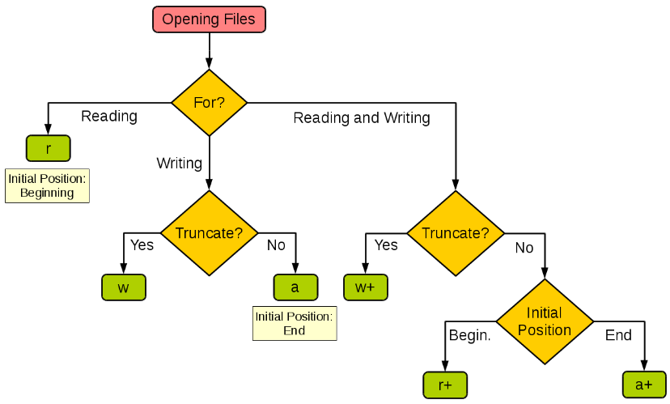

记录python学习中遇到的一些心得：

[TOC]

***

# 文件

>文件是数据的抽象和集合

- 文件是存储在辅助存储器上的数据序列
- 文件是数据存储的一种形式
- 文件展现形态：文本文件和二进制文件

>文本文件 vs. 二进制文件

- 文件文件和二进制文件只是文件的展示方式
- 本质上，所有文件都是二进制形式存储
- 形式上，所有文件采用两种方式展示

>文本文件
>

- 由单一特定编码组成的文件，如UTF-8编码
- 由于存在编码，也被看成是存储着的长字符串
- 适用于例如：.txt文件、.py文件等

>二进制文件

- 直接由比特0和1组成，没有统一字符编码
- 一般存在二进制0和1的组织结构，即文件格式
- 适用于例如：.png文件、.avi文件等



## 基本使用

### 文件打开和关闭

> 基本使用

```python
<变量名> = open(<文件名>, <打开模式>, encoding='utf-8')
文件句柄 文件路径和名称 文本 or 二进制
<变量名>.close()
```

> 打开模式

| 文件的打开模式 | 描述                                                    |
| -------------- | ------------------------------------------------------- |
| 'r'            | 只读模式，默认值，如果文件不存在，返回FileNotFoundError |
| 'w'            | 覆盖写模式，文件不存在则创建，存在则完全覆盖            |
| 'x'            | 创建写模式，文件不存在则创建，存在则返回FileExistsError |
| 'a'            | 追加写模式，文件不存在则创建，存在则在文件最后追加内容  |
| 'b'            | 二进制文件模式                                          |
| 't'            | 文本文件模式，默认值                                    |
| '+'            | 与r/w/x/a一同使用，在原功能基础上增加同时读写功能       |


> <font color=Da15816>示例</font>

```python
a = open("f.txt", "rt")
a.read(size)                  # - 一次读入，统一处理
a.readline(size)              # - 按数量读入，逐步处理
a.readlines(hint)             # - 一次读入，分行处理

a.write(s)
a.writelines(lines)
a.seek(offset)

f = open("f.txt")             # - 文本形式、只读模式、默认值
f = open("f.txt", "rt")       # - 文本形式、只读模式、同默认值
f = open("f.txt", "w")        # - 文本形式、覆盖写模式
f = open("f.txt", "a+")       # - 文本形式、追加写模式+ 读文件
f = open("f.txt", "x")        # - 文本形式、创建写模式
f = open("f.txt", "b")        # - 二进制形式、只读模式
f = open("f.txt", "wb")       # - 二进制形式、覆盖写模式
```


###  文件内容的读取

```python
# 读入全部内容，如果给出参数，读入前size长度
# <f>.read(size=-1)
>>>s = f.read(2)
中国

# 读入一行内容，如果给出参数，读入该行前size长度
# <f>.readline(size=-1)
>>>s = f.readline()
中国是一个伟大的国家！

# 读入文件所有行，以每行为元素形成列表
# 如果给出参数，读入前hint行
# <f>.readlines(hint=-1)
while True:
	lines = f.readlines(100000)
	if not lines:
		break
	for line in lines:
		pass # do something

```

### 数据的文件写入

```python
# 1）将嵌套列表或字典转为json格式数据
import json
f=open('a1.txt','w',encoding='utf-8')
dic={1:'张三',2:'李四'}
dic2={11:'张三三',2:'李思思'}
a=json.dumps(dic)
f.write(a+'\n')
b=json.dumps(dic2)
f.write(b+'\n')
f.close()

# 2)将文件中的列表或字典json字符串读取出来
import json
f=open('a1.txt','r',encoding='utf-8')
for i in f:
    print(json.loads(i))
f.close()

# 改变当前文件操作指针的位置，offset含义如下：
# 0 – 文件开头； 1 – 当前位置； 2 – 文件结尾
# seek（offset [,from]）方法改变当前文件的位置。Offset变量表示要移动的字节数。From变量指定开始移动字节的参考位置。
# 如果from被设为0，这意味着将文件的开头作为移动字节的参考位置。如果设为1，则使用当前的位置作为参考位置。如果它被设为2，那么该文件的末尾将作为参考位置。
>>>f.seek(0) #回到文件开头

# 查看指针位置
f.tell()

ls = ["中国", "法国", "美国"]s
fo.writelines(ls)
```

### File对象的属性

| 属性           | 描述                                                         |
| :------------- | :----------------------------------------------------------- |
| file.closed    | 返回true如果文件已被关闭，否则返回false。                    |
| file.mode      | 返回被打开文件的访问模式。                                   |
| file.name      | 返回文件的名称。                                             |
| file.softspace | 如果用print输出后，必须跟一个空格符，则返回false。否则返回true。 |

## 高阶使用

### 临时文件和目录

> [一日一技：在Python中创建临时文件用于记录临时数据](https://cloud.tencent.com/developer/article/1447734)
>
> [tempfile --- 生成临时文件和目录](https://docs.python.org/zh-cn/3.7/library/tempfile.html)

当我们在做数据分析的时候，可能会由于数据量过大导致内存不足。如果我们没有条件使用更高配置的电脑，也没有办法优化数据，那么我们可以先把计算的中间值存放在一个文本文件中。 这种方案虽然有效，但是中间数据写成的临时文件如果不清理，时间一长就会占用大量硬盘空间。当然你也可以每一次都覆盖临时文件，这样它虽然不会堆积，但当你的分析程序已经停止的时候，临时文件还在硬盘上占用空间。 

> tempfile 模块专门用于创建临时文件和临时目录
>
> 既可以在 UNIX 平台上运行良好，也可以在 Windows 平台上运行良好

### 入门示例

> ```python
> from tempfile import TemporaryFilewith TemporaryFile('w+t', encoding='utf-8') as f:    
>        # 生成中间数据    
>        f.write('中间数据')    
>        f.write('另一部分中间数据')
>    
>        # 其他计算过程
>    
>        # 下面开始读取临时文件    
>        f.seek(0)    
>        f.read()
> 
>        # 退出with上下文，临时文件自动被删除
> ```
>
>  由于临时文件被关闭就会被删除，所以需要实现同时读写文件，因此文件模式为 `w+t`
>
> 
>
> 使用 `TemporaryFile`，你没法知道这个临时文件叫做什么名字。
>
> 如果你想知道文件名，甚至想让另一个程序打开这个临时文件，那么你可以使用 `NamedTemporaryFile`： 
>
> ```python
> import redisfrom tempfile 
> import NamedTemporaryFile
> with NamedTemporaryFile('w+t') as f:    
>        # 把文件名通过某种方式传给其他程序    
>        client = redis.Redis()    
>        client.set('temp_file', f.name)    
>        # 后续操作
> ```
>
>  只要这个临时文件还没有被关闭，那么另一个程序就可以读取这个临时文件
>
> ```python
># 通过with语句创建临时目录
> with tempfile.TemporaryDirectory() as tmpdirname:
> 	print('创建临时目录', tmpdirname)
> ```

### 常用的函数

| tempfile 模块函数                                            | 功能描述                                                     |
| ------------------------------------------------------------ | ------------------------------------------------------------ |
| tempfile.TemporaryFile(mode='w+b', buffering=None, encoding=None, newline=None, suffix=None, prefix=None, dir=None) | 创建临时文件。返回一个类文件对象，也就是支持文件 I/O         |
| tempfile.NamedTemporaryFile(mode='w+b', buffering=None, encoding=None, newline=None, suffix=None, prefix=None, dir=None, delete=True) | 创建临时文件。功能与上一个函数的功能大致相同，只是它生成的临时文件在文件系统中有文件名 |
| tempfile.SpooledTemporaryFile(max_size=0, mode='w+b', buffering=None, encoding=None, newline=None, suffix=None, prefix=None, dir=None) | 创建临时文件。与 TemporaryFile 函数相比，当程序向该临时文件输出数据时，会先输出到内存中，直到超过 max_size 才会真正输出到物理磁盘中。 |
| tempfile.TemporaryDirectory(suffix=None, prefix=None, dir=None) | 生成临时目录                                                 |
| tempfile.gettempdir()                                        | 获取系统的临时目录                                           |
| tempfile.gettempdirb()                                       | 与 gettempdir() 相同，只是该函数返回字节串                   |
| tempfile.gettempprefix()                                     | 返回用于生成临时文件的前缀名                                 |
| tempfile.gettempprefixb()                                    | 与 gettempprefix() 相同，只是该函数返回字节串                |

> **提示**：表中有些函数包含很多参数，但这些参数都具有自己的默认值
>
> 因此如果没有特殊要求，可以不对其传参

tempfile 模块还提供了 `tempfile.mkstemp()` 和 `tempfile.mkdtemp()` 两个低级别的函数

上面介绍的 4 个用于创建临时文件和临时目录的函数都是高级别的函数，高级别的函数支持自动清理，而且可以与 with 语句一起使用

而这两个低级别的函数则不支持，因此一般推荐使用高级别的函数来创建临时文件和临时目录
此外，tempfile 模块还提供了 `tempfile.tempdir` 属性，通过对该属性赋值可以改变系统的临时目录

## 数据解压缩

### **gzip** 格式

> 读取压缩文件示例：

```python
import gzip
with gzip.open('/home/joe/file.txt.gz', 'rb') as f:
    file_content = f.read()
```

> 创建GZIP 文件示例：

```python
import gzip
content = b"Lots of content here"
with gzip.open('/home/joe/file.txt.gz', 'wb') as f:
    f.write(content)
```

> 使用 GZIP 压缩已有的文件示例：

```python
import gzip
import shutil
with open('/home/joe/file.txt', 'rb') as f_in:
    with gzip.open('/home/joe/file.txt.gz', 'wb') as f_out:
        shutil.copyfileobj(f_in, f_out)
```

> 使用 GZIP 压缩二进制字符串示例：

```python
import gzip
s_in = b"Lots of content here"
s_out = gzip.compress(s_in)
```

### ZIP格式


### tar格式

> 如何将整个 tar 归档提取到当前工作目录:

```python
import tarfile
tar = tarfile.open("sample.tar.gz")
tar.extractall()
tar.close()
```

> 如何通过 [`TarFile.extractall()`](https://docs.python.org/zh-cn/3.7/library/tarfile.html#tarfile.TarFile.extractall) 使用生成器函数而非列表来提取一个 tar 归档的子集:

```python
import os
import tarfile

def py_files(members):
    for tarinfo in members:
        if os.path.splitext(tarinfo.name)[1] == ".py":
            yield tarinfo

tar = tarfile.open("sample.tar.gz")
tar.extractall(members=py_files(tar))
tar.close()
```

> 如何基于一个文件名列表创建未压缩的 tar 归档:

```python
import tarfile
tar = tarfile.open("sample.tar", "w")
for name in ["foo", "bar", "quux"]:
    tar.add(name)
tar.close()
```

> 使用 [`with`](https://docs.python.org/zh-cn/3.7/reference/compound_stmts.html#with) 语句的同一个示例:

```python
import tarfile
with tarfile.open("sample.tar", "w") as tar:
    for name in ["foo", "bar", "quux"]:
        tar.add(name)
```

> 如何读取一个 gzip 压缩的 tar 归档并显示一些成员信息:

```python
import tarfile
tar = tarfile.open("sample.tar.gz", "r:gz")
for tarinfo in tar:
    print(tarinfo.name, "is", tarinfo.size, "bytes in size and is ", end="")
    if tarinfo.isreg():
        print("a regular file.")
    elif tarinfo.isdir():
        print("a directory.")
    else:
        print("something else.")
tar.close()
```

> 如何创建一个归档并使用 [`TarFile.add()`](https://docs.python.org/zh-cn/3.7/library/tarfile.html#tarfile.TarFile.add) 中的 *filter* 形参来重置用户信息:

```python
import tarfile
def reset(tarinfo):
    tarinfo.uid = tarinfo.gid = 0
    tarinfo.uname = tarinfo.gname = "root"
    return tarinfo
tar = tarfile.open("sample.tar.gz", "w:gz")
tar.add("foo", filter=reset)
tar.close()
```

# os库

## 基本概念

> os库提供通用的、基本的操作系统交互功能，是Python标准库
>
> 包含几百个函数，常用路径操作、进程管理、环境参数等几类

* 路径操作：os.path子库，处理文件路径及信息

* 进程管理：启动系统中其他程序

* 环境参数：获得系统软硬件信息等环境参数

## path子库

### 导入

```python
from os.path import join
from IPython.core.interactiveshell import InteractiveShell 
# InteractiveShell.ast_node_interactivity = "all" # 可同时输出多个结果
```

### 文件操作

> 判断是否是文件  filepath最后没有/ 默认取//

```python
filepath = '../res/file_op/folder/'
'is file' if os.path.isfile(filepath) else 'is folder'
'is dir' if os.path.isdir(filepath) else 'not dir'

'is folder'
'is dir
```

> 判断两个路径都指向相同的文件或目录

```python
# 如果两个路径都指向相同的文件或目录，则返回 True
os.path.samefile(path1, path2)
```

### 增删文件[夹]

> 创建文件夹

```python
# 2. 创建、删除文件与文件夹
newfolder = '../res/file_op/mkfolder/'
os.mkdir(newfolder) # 创建文件夹,不会递归创建不存在的父目录
os.makedirs(newfolder) # 父目录不存在，则递归创建父目录
```

> 删除文件夹

```python
os.rmdir(newfolder) # 如果要删除目录，请使用rmdir().
import shutil
shutil.rmtree(path)    # 递归删除文件夹
```

> 删除文件

```python
if os.path.exists(join(filepath,'file_0.txt')):
    os.remove(join(filepath,'file_0.txt')) # 删除文件
    # join('savepath', 'png/demo')   #正确
    # join('savepath', '/png/demo')  #错误
```

### 目录遍历

> [python中os.walk的用法详解](https://www.cnblogs.com/xiajq/p/11232574.html)

> 列出目录下的所有子目录

```python
path = '../res/file_op'
for dirpath, dirnames, filenames in os.walk(path):
    for dirname in dirnames:
        print(os.path.join(dirpath, dirname))
../res/file_op\folder
```

> 列出目录下的所有文件

```python
for dirpath, dirnames, filenames in os.walk(path):
    for filename in filenames:
        print(os.path.join(dirpath, filename))
../res/file_op\file_ico.png
../res/file_op\folder\file_1.txt  

filepath = '../res/file_op'
fileList = os.listdir(filepath) # 列出所有文件
for fl in fileList:
    print(fl)
file_1.txt
```

> 分割文件目录/文件名和后缀

```python
file_path = "D:/test/test.py"
(filepath, tempfilename) = os.path.split(file_path)
# 等价于 (filepath, tempfilename) = os.path.dirname(path),os.path.basename(path)
==> D:/test test.py
(filename, extension) = os.path.splitext(tempfilename)
==> test .py
```

### 目录操作

> 修改目录名称

```python
os.rename('d0/d10/d100', 'D100')    	# 会导致目录移动！
os.path.abspath(path)                   # 获取一个路径的完全路径
os.path.splitext(path)                  # 分离文件名和扩展名
os.path.normpath( "D://PYE//file.txt" ) # 归一化path的表示形式，统一用\\分隔路径
```

> 返回当前程序与文件之间的相对路径 (relative path)

```python
path = 'E:\\PycharmWS\\sj\\text-mining-framework'
os.getcwd() # 'E:\\PycharmWS\\sj\\text-mining-framework\\tests\\others'
In [3]: os.path.relpath(path)
Out[3]: '..\\..'
```

> 返回 path 的大小，以字节为单位，该文件不存在或不可访问时，抛出 OSError 异常

```python
os.path.getsize( "D:/PYE/file.txt" )    # 返回path对应文件的大小，以字节为单位
```

> 返回序列 paths 中每个路径名称的**最长共同有效子路径**

```python
# 如果 paths 同时包含绝对和相对路径名称或者如果 paths 为空则会引发 ValueError
os.path.commonpath(paths)
```

## 高阶文件操作

### 复制和删除

> 复制文件\[夹\]

```python
import shutil
# shutil.copy(srcfile, dstfile) : 复制srcfile文件，并命名为dstfile
shutil.copy('d0/file1.txt', 'd0/file2.txt')
# shutil.copy(srcfile, path) : 复制srcfile文件到path路径下
shutil.copy('d0/file1.txt', '..')     
# shutil.copytree(srcDir, dstDir) : 递归地复制srcDir目录，并命名为dstDir；dstDir不能是已经存在的！
shutil.copytree('d0/', 'D0')
```

> 移动文件\[夹\]

```python
# shutil.move(srcfile, dstfile) : 移动srcfile文件并命名为dstfile，相当于文件重命名
shutil.move('d0/file1.txt', 'd0/FILE1.txt')
# shutil.move(srcfile, path) ： 移动srcfile文件到path路径下
shutil.move('d0/file2.txt', '.')
# shutil.move(srcDir, dstDir) ： 移动srcDir目录(包括其子目录和文件)到dstDir目录下
shutil.move('d0', 'D0')
```

> 返回路径和最后一个文件名组成的元组

```python
# 返回路径和最后一个文件名组成的元组
_, filename = os.path.split(os.getcwd())
print(filename)
Out[7]: 'python'
```

###  磁盘使用统计

> 磁盘使用统计数据，形式为一个 [named tuple](https://docs.python.org/zh-cn/3.7/glossary.html#term-named-tuple)，其中包含 *total*, *used* 和 *free* 属性
>
> 分别表示总计、已使用和未使用空间的字节数。
>
> 在 Windows 上，*path* 必须是一个目录；在 Unix 上，它可以是一个文件或一个目录

```python
import shutil
shutil.disk_usage(path)
Out[19]: usage(total=223217709056, used=82961846272, free=140255862784)
```

## os库之环境参数

> 获取或改变系统环境信息

```python
# 修改当前程序操作的路径
>>>os.chdir("D:")

# 返回程序的当前路径
>>>os.getcwd()
'D:\\'
```

> 获取操作系统环境信息

```python
# 获得当前系统登录用户名称
>>>os.getlogin()
'hyc'

# 获得当前系统的CPU数量
>>>os.cpu_count()
8
```

> 获取操作系统环境信息

```python
# 获得n个字节长度的随机字符串，通常用于加解密运算
>>>os.urandom(10)
b'7\xbe\xf2!\xc1=\x01gL\xb3'
```

## 其他使用

> os库之进程管理

```python
# 执行程序或命令command
# 在Windows系统中，返回值为cmd的调用返回信息
import os
os.system("C:\\Windows\\System32\\calc.exe")
os.system("C:\\Windows\\System32\\mspaint.exe D:\\PYECourse\\grwordcloud.png")
```

> 查看剩余空间大小(ubuntu)

```python
def checkDis(path):
    import os
    hd = {}
    disk = os.statvfs(path)
    percent = (disk.f_blocks - disk.f_bfree) * 100 / \
                (disk.f_blocks - disk.f_bfree + disk.f_bavail) + 1
    return 100 - percent
```

