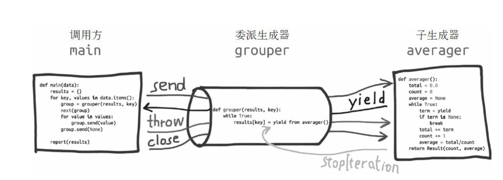

记录python学习中遇到的一些心得：

[TOC]

***

# python迭代对象

> 迭代是数据处理的基石。扫描内存中放不下的数据集时，我们要找到一种**惰性**获取数据项的方式，即按需一次获取一个数据项。这就是迭代器模式（Iterator pattern）。

> Python 2.2（2001 年）加入了 `yield` 关键字。这个关键字用于构建生成器（generator），其作用与迭代器一样。
>
> * 所有生成器都是迭代器，因为生成器完全实现了迭代器接口。
>* 迭代器用于从集合中取出元素；而生成器用于“凭空”生成元素。
> *  Python 社区中，大多数时候都把**迭代器**和**生成器**视作同一概念。
> 
> 内置的 `range()` 函数也返回一个类似生成器的对象，而以前则返回完整的列表。如果一定要让 `range()` 函数返回列表，那么必须明确指明（例如，`list(range(100))`）。


> **序列可以迭代的原因**：`iter`函数
>
> 解释器需要迭代对象 `x` 时，会自动调用 `iter(x)`。
>
> 内置的 `iter` 函数有以下作用。
> 
> * 检查对象是否实现了 `__iter__` 方法，如果实现了就调用它，获取一个迭代器。
>* 如果没有实现 `__iter__` 方法，但是实现了 `__getitem__` 方法，Python 会创建一个迭代器，尝试按顺序（从索引 0 开始）获取元素。
> * 如果尝试失败，Python 抛出 `TypeError` 异常，通常会提示“C object is not iterable”（C 对象不可迭代），其中 C 是目标对象所属的类。
>
> 任何 Python 序列都可迭代的原因是，它们都实现了 `__getitem__` 方法。
>
> * 鸭子类型（duck typing）的极端形式：不仅要实现特殊的 `__iter__` 方法，还要实现 `__getitem__` 方法，而且 `__getitem__` 方法的参数是从 `0` 开始的整数（`int`），这样才认为对象是可迭代的。
>* 白鹅类型（goose-typing）理论中，可迭代对象的定义简单一些，不过没那么灵活：如果实现了 `__iter__` 方法，那么就认为对象是可迭代的。
> 
>检查对象 `x` 能否迭代，最准确的方法是：调用 `iter(x)`函数，如果不可迭代，再处理 `TypeError` 异常。这比使用 `isinstance(x, abc.Iterable)` 更准确，因为 `iter(x)` 函数会考虑到遗留的 `__getitem__` 方法，而 `abc.Iterable` 类则不考虑。
> 
> 

## **可迭代的对象**

> 使用 `iter` 内置函数可以获取迭代器的对象。如果对象实现了能返回**迭代器**的 `__iter__` 方法，那么对象就是可迭代的。序列都可以迭代；实现了 `__getitem__`方法，而且其参数是从零开始的索引，这种对象也可以迭代。
>
> 遍历方式
>
> 下面是一个简单的 `for` 循环，迭代一个字符串。这里，字符串 `'ABC'` 是可迭代的对象。背后是有迭代器的，只不过我们看不到：
>
> ```python
> >>> s = 'ABC'
> >>> for char in s:
> ...     print(char)
> ...
> A
> B
> C
> 
> ```
>
> 如果没有 `for` 语句，不得不使用 `while` 循环模拟，要像下面这样写：
>
> ```python
> >>> s = 'ABC'
> >>> it = iter(s)  # ➊
> >>> while True:
> ...     try:
> ...         print(next(it))  # ➋
> ...     except StopIteration:  # ➌
> ...         del it  # ➍
> ...         break  # ➎
> ...
> A
> B
> C
> 
> ❶ 使用可迭代的对象构建迭代器 it。
> ❷ 不断在迭代器上调用 next 函数，获取下一个字符。
> ❸ 如果没有字符了，迭代器会抛出 StopIteration 异常。
> ❹ 释放对 it 的引用，即废弃迭代器对象。
> ❺ 退出循环。
> ```
>
> `StopIteration` 异常表明迭代器到头了。Python 语言内部会处理 `for` 循环和其他迭代上下文（如列表推导、元组拆包，等等）中的 `StopIteration` 异常。

<font color=07B8AD size=4>明确可迭代的对象和迭代器之间的关系：Python 从可迭代的对象中获取迭代器。</font>

## 迭代器

>标准的迭代器接口有两个方法。
>
>**\_\_next\_\_**: 返回下一个可用的元素，如果没有元素了，抛出 `StopIteration` 异常。
>
>**\_\_iter\_\_**: 返回 `self`，以便在应该使用可迭代对象的地方使用迭代器，例如在 `for` 循环中。
>
>
>
>`Iterator` 抽象基类实现 `__iter__` 方法的方式是返回实例本身（`return self`）。这样，在需要可迭代对象的地方可以使用迭代器。
>
>如果想再次迭代，要重新构建迭代器。
>
>因为迭代器只需 `__next__` 和 `__iter__` 两个方法，所以除了调用 `next()` 方法，以及捕获 `StopIteration` 异常之外，没有办法检查是否还有遗留的元素。
>
>所以传入迭代器无法还原已经耗尽的迭代器。
>
>迭代器是这样的对象：实现了无参数的 `__next__` 方法，返回序列中的下一个元素；如果没有元素了，那么抛出 `StopIteration` 异常。Python 中的迭代器还实现了 `__iter__` 方法，因此迭代器也**可以迭代**。
>
>使用迭代器模式实现 `Sentence` 类
>
>```python
>import re
>import reprlib
>RE_WORD = re.compile('\w+')
>
>class Sentence:
>    def __init__(self, text):
>        self.text = text
>        self.words = RE_WORD.findall(text)
>
>    def __repr__(self):
>        return 'Sentence(%s)' % reprlib.repr(self.text)
>
>    def __iter__(self):  ➊
>        return SentenceIterator(self.words)  ➋
>
>class SentenceIterator:
>    def __init__(self, words):
>        self.words = words  ➌
>        self.index = 0  ➍
>
>    def __next__(self):
>        try:
>            word = self.words[self.index]  ➎
>        except IndexError:
>            raise StopIteration()  ➏
>        self.index += 1  ➐
>        return word  ➑
>
>    def __iter__(self):  ➒
>        return self
>```
>
>对这个示例来说，其实没必要在 `SentenceIterator` 类中实现 `__iter__`方法，不过这么做是对的，因为迭代器应该实现 `__next__` 和 `__iter__` 两个方法，而且这么做能让迭代器通过 `issubclass(SentenceIterator, abc.Iterator)` 测试。
>
>* 可迭代的对象有个 `__iter__` 方法，每次都实例化一个新的迭代器；
>
>* 而迭代器要实现 `__next__` 方法，返回单个元素，此外还要实现 `__iter__` 方法，返回迭代器本身。
>
>为了“支持多种遍历”，必须能从同一个可迭代的实例中获取多个独立的迭代器，而且各个迭代器要能维护自身的内部状态，因此这一模式正确的实现方式是，每次调用 `iter(my_iterable)` 都新建一个独立的迭代器。这就是为什么这个示例需要定义 `SentenceIterator` 类。
>
>

## 可迭代的规约函数

> 接受一个可迭代的对象，然后返回单个结果。这些函数叫“归约”函数、“合拢”函数或“累加”函数。
>
> 对 `all` 和 `any` 函数来说，有一项重要的优化措施是 `reduce` 函数做不到的：这两个函数会短路（即一旦确定了结果就立即停止使用迭代器）。
>
> |   模块    |            函数             | 说明                                                         |
> | :-------: | :-------------------------: | :----------------------------------------------------------- |
> | （内置）  |           all(it)           | `it` 中的所有元素都为真值时返回 `True`，否则返回 False<br />`all([])` 返回 True |
> | （内置）  |           any(it)           | 只要 `it` 中有元素为真值就返回 `True`，否则返回 `False`<br />`any([])` 返回 False |
> | （内置）  | max(it, [key=,] [default=]) | 返回 `it` 中值最大的元素；*`key` 是排序函数，与 `sorted` 函数中的一样；如果可迭代的对象为空，返回 `default` |
> | （内置）  | min(it, [key=,] [default=]) | 返回 `it` 中值最小的元素；#`key` 是排序函数，与 `sorted` 函数中的一样；如果可迭代的对象为空，返回 `default` |
> | functools | reduce(func, it, [initial]) | 把前两个元素传给 `func`，然后把计算结果和第三个元素传给 `func`，以此类推，返回最后的结果；如果提供了 `initial`，把它当作第一个元素传入 |
> | （内置）  |      sum(it, start=0)       | `it` 中所有元素的总和，如果提供可选的 `start`，会把它加上（计算浮点数的加法时，可以使用 `math.fsum` 函数提高精度） |
>
> 在 Python 中迭代对象 `x` 时会调用 `iter(x)`。
>
> `iter` 函数还有一个鲜为人知的用法：传入两个参数，使用常规的函数或任何可调用的对象创建迭代器。这样使用时，第一个参数必须是可调用的对象，用于不断调用（没有参数），产出各个值；第二个值是哨符，这是个标记值，当可调用的对象返回这个值时，触发迭代器抛出 `StopIteration` 异常，而不产出哨符。

## 生成器

> 只要 Python 函数的定义体中有 `yield` 关键字，该函数就是生成器函数。
>
> 生成器函数会创建一个生成器对象，包装生成器函数的定义体。把生成器传给 `next(...)` 函数时，生成器函数会向前，执行函数定义体中的下一个 `yield` 语句，返回产出的值，并在函数定义体的当前位置暂停。
>
> 最终，函数的定义体返回时，外层的生成器对象会抛出 `StopIteration` 异常——这一点与迭代器协议一致。
>
> 如果一个类只是为了构建生成器而去实现 `__iter__` 方法，那还不如使用生成器函数。
>
> 惰性是好的特质，至少在编程语言和 API 中是如此。惰性实现是指尽可能延后生成值。这样做能节省内存，而且或许还可以避免做无用的处理。
>
> ```python
> import re
> import reprlib
> RE_WORD = re.compile('\w+')
> 
> class Sentence:
>     def __init__(self, text):
>         self.text = text  ➊
> 
>     def __repr__(self):
>         return 'Sentence(%s)' % reprlib.repr(self.text)
> 
>     def __iter__(self):
>         for match in RE_WORD.finditer(self.text):  ➋
>             yield match.group()  ➌
> ❶ 不再需要 words 列表。
> ❷ finditer 函数构建一个迭代器，包含 self.text 中匹配 RE_WORD 的单词，产出 MatchObject 实例。
> ❸ match.group() 方法从 MatchObject 实例中提取匹配正则表达式的具体文本
> ```
>
> 生成器表达式可以理解为列表推导的惰性版本：不会迫切地构建列表，而是返回一个生成器，按需惰性生成元素。也就是说，如果列表推导是制造列表的工厂，那么生成器表达式就是制造生成器的工厂。
>
> ```python
> import re
> import reprlib
> 
> RE_WORD = re.compile('\w+')
> 
> class Sentence:
>     def __init__(self, text):
>       self.text = text
> 
>     def __repr__(self):
>       return 'Sentence(%s)' % reprlib.repr(self.text)
> 
>     def __iter__(self):
>       return (match.group() for match in RE_WORD.finditer(self.text))
> ```
>
> 最终的效果一样：调用 `__iter__` 方法会得到一个生成器对象。
>
> 生成器表达式是语法糖：完全可以替换成生成器函数，不过有时使用生成器表达式更便利。
>
> * 生成器表达式是创建生成器的简洁句法，这样无需先定义函数再调用。
> * 生成器函数灵活得多，可以使用多个语句实现复杂的逻辑，也可以作为**协程**使用
> * 遇到简单的情况时，可以使用生成器表达式
> * 如果生成器表达式要分成多行写，我倾向于定义生成器函数，以便提高可读性
> * 如果函数或构造方法只有一个参数，传入生成器表达式时不用写一对调用函数的括号，再写一对括号围住生成器表达式，只写一对括号就行了，

> 第一方面是接口。Python 的迭代器协议定义了两个方法：`__next__` 和 `__iter__`。生成器对象实现了这两个方法，因此从这方面来看，所有生成器都是迭代器。
>
> 第二方面是实现方式。从这个角度来看，生成器这种 Python 语言结构可以使用两种方式编写：含有 `yield` 关键字的函数，或者生成器表达式。调用生成器函数或者执行生成器表达式得到的生成器对象属于语言内部的 `GeneratorType` 类型

> 这个代码看上去是没有问题的，但是当需要生成的数列数量非常大时，由于代码中将数字存储在 list 中，会导致巨大内存占用。能不能优化？
> 如果这个元素可以通过某种方式推算出来切可以进行循环操作，就避免了大的内存占用。只需要函数在循环时计算得下一个数字并返回，这样就不必创建完整的 list ，从而节省大量空间。在Python'中，这种一边循环一边计算的机制，称为生成器： generator 。

```python
# 生成器
class Fab(object):
   def __init__(self, max):
       self.max = max
       self.n, self.a, self.b = 0, 0, 1
 
   def __iter__(self):
       return self
 
   def next(self):
       if self.n < self.max:
           r = self.b
           self.a, self.b = self.b, self.a + self.b
           self.n = self.n + 1
           return r
       raise StopIteration()
Fab(6)

Out[56]: [1, 1, 2, 3, 5, 8]
上述代码通过类的形式将函数封装为一个可迭代对象。通过next方法在循环的时候每次去取一个数，只有在需要使用的时候才会生成，内存占用很小。但是，上述代码较为繁琐，在Python中，有一种语法糖能简化，那就是 yield 。
```

```python
# yield 语法糖
def fab(max):
    n, a, b = 0, 0, 1
    while n < max:
        yield b
        # print b
        a, b = b, a + b
        n = n + 1
fab(6)

Out[56]: [1, 1, 2, 3, 5, 8]
调用和 class 版的完全一致，也可以使用 next 方法等。简单的说， yield 的作用就是把一个函数变为一个 generator ，带有 yield 的函数不再是一个普通函数， Python 解释器会将器视为 generator 。在 for 循环执行时，每次循环都会执行 fab 函数内部的代码，执行到 yield 时。函数就返回一个迭代值，下次迭代时，就从 yield 的下一句继续执行。调用next也是同理。

当函数执行结束时，会抛出 StopIteration 异常，表示迭代完成。
```

## itertools模块

> [itertools --- 为高效循环而创建迭代器的函数](https://docs.python.org/zh-cn/3.7/library/itertools.html)
>
> [Python-进阶-itertools模块小结](http://wklken.me/posts/2013/08/20/python-extra-itertools.html)
>
> [itertools](https://wiki.jikexueyuan.com/project/explore-python/Standard-Modules/itertools.html)
>
> 迭代器的特点是：**惰性求值**（Lazy evaluation），即只有当迭代至某个值时，它才会被计算，这个特点使得迭代器特别适合于遍历大文件或无限集合等，因为我们不用一次性将它们存储在内存中。
>
> Python 内置的 itertools 模块包含了一系列用来产生不同类型迭代器的函数或类，这些函数的返回都是一个迭代器，我们可以通过 for 循环来遍历取值，也可以使用 `next()` 来取值。
>
> itertools 模块提供的迭代器函数有以下几种类型：
>
> - 无限迭代器：生成一个无限序列，比如自然数序列 `1, 2, 3, 4, ...`；
> - 有限迭代器：接收一个或多个序列（sequence）作为参数，进行组合、分组和过滤等；
> - 组合生成器：序列的排列、组合，求序列的笛卡儿积等；

### 无限迭代器

itertools 模块提供了三个函数（事实上，它们是类）用于生成一个无限序列迭代器：

- count(firstval=0, step=1)

  创建一个从 firstval (默认值为 0) 开始，以 step (默认值为 1) 为步长的的无限整数迭代器

- cycle(iterable)

  对 iterable 中的元素反复执行循环，返回迭代器

- repeat(object [,times]

  反复生成 object，如果给定 times，则重复次数为 times，否则为无限

**Infinite Iterators:**

|                           Iterator                           |   Arguments   |                    Results                     |                 Example                 |
| :----------------------------------------------------------: | :-----------: | :--------------------------------------------: | :-------------------------------------: |
| [`count()`](https://docs.python.org/2.7/library/itertools.html#itertools.count) | start, [step] |       start, start+step, start+2*step, …       |   `count(10) --> 10 11 12 13 14 ...`    |
| [`cycle()`](https://docs.python.org/2.7/library/itertools.html#itertools.cycle) |       p       |           p0, p1, … plast, p0, p1, …           | `cycle('ABCD') --> A B C D A B C D ...` |
| [`repeat()`](https://docs.python.org/2.7/library/itertools.html#itertools.repeat) |   elem [,n]   | elem, elem, elem, … endlessly or up to n times |      `repeat(10, 3) --> 10 10 10`       |

```python
import itertools
nums = itertools.count(start=2,step=3)
for i in nums:
    if i>15:
        break
    print(i)
Out[17]: 
2
5
8
11

[i for i in itertools.repeat(['a','b'],3)]
Out[18]: [['a', 'b'], ['a', 'b'], ['a', 'b']]
```

### 有限迭代器

itertools 模块提供了多个函数（类），接收一个或多个迭代对象作为参数，对它们进行组合、分组和过滤等：

- chain()
- compress()
- dropwhile()
- groupby()
- ifilter()
- ifilterfalse()
- islice()
- imap()
- starmap()
- tee()
- takewhile()
- izip()
- izip_longest()

**Iterators terminating on the shortest input sequence:**

|                           Iterator                           |          Arguments          |                   Results                    |                          Example                           |
| :----------------------------------------------------------: | :-------------------------: | :------------------------------------------: | :--------------------------------------------------------: |
| [`chain()`](https://docs.python.org/2.7/library/itertools.html#itertools.chain) |           p, q, …           |          p0, p1, … plast, q0, q1, …          |           `chain('ABC', 'DEF') --> A B C D E F`            |
| [`compress()`](https://docs.python.org/2.7/library/itertools.html#itertools.compress) |       data, selectors       |      (d[0] if s[0]), (d[1] if s[1]), …       |      `compress('ABCDEF', [1,0,1,0,1,1]) --> A C E F`       |
| [`dropwhile()`](https://docs.python.org/2.7/library/itertools.html#itertools.dropwhile) |          pred, seq          |  seq[n], seq[n+1], starting when pred fails  |     `dropwhile(lambda x: x<5, [1,4,6,4,1]) --> 6 4 1`      |
| [`groupby()`](https://docs.python.org/2.7/library/itertools.html#itertools.groupby) |     iterable[, keyfunc]     | sub-iterators grouped by value of keyfunc(v) |                                                            |
| [`ifilter()`](https://docs.python.org/2.7/library/itertools.html#itertools.ifilter) |          pred, seq          |   elements of seq where pred(elem) is true   |     `ifilter(lambda x: x%2, range(10)) --> 1 3 5 7 9`      |
| [`ifilterfalse()`](https://docs.python.org/2.7/library/itertools.html#itertools.ifilterfalse) |          pred, seq          |  elements of seq where pred(elem) is false   |   `ifilterfalse(lambda x: x%2, range(10)) --> 0 2 4 6 8`   |
| [`islice()`](https://docs.python.org/2.7/library/itertools.html#itertools.islice) | seq, [start,] stop [, step] |      elements from seq[start:stop:step]      |         `islice('ABCDEFG', 2, None) --> C D E F G`         |
| [`starmap()`](https://docs.python.org/2.7/library/itertools.html#itertools.starmap) |          func, seq          |       func(*seq[0]), func(*seq[1]), …        |    `starmap(pow, [(2,5), (3,2), (10,3)]) --> 32 9 1000`    |
| [`tee()`](https://docs.python.org/2.7/library/itertools.html#itertools.tee) |            it, n            |  it1, it2, … itn splits one iterator into n  |                                                            |
| [`takewhile()`](https://docs.python.org/2.7/library/itertools.html#itertools.takewhile) |          pred, seq          |       seq[0], seq[1], until pred fails       |      `takewhile(lambda x: x<5, [1,4,6,4,1]) --> 1 4`       |
| [`zip_longest()`](https://docs.python.org/2.7/library/itertools.html#itertools.izip_longest) |           p, q, …           |        (p[0], q[0]), (p[1], q[1]), …         | `zip_longest('ABCD', 'xy', fillvalue='-') --> Ax By C- D-` |

```python
[item for item in itertools.chain([1, 2, 3], ['a', 'b', 'c'])]
Out[19]: [1, 2, 3, 'a', 'b', 'c']
# 接收一个可迭代对象作为参数，返回一个迭代器
string = itertools.chain.from_iterable('ABCD')

# compress 可用于对数据进行筛选，当selectors的某个元素为true时，则保留data对应位置的元素，否则去除：
# compress(data, selectors)
list(compress('ABCDEF', [1, 1, 0, 1, 0, 1]))
Out[23]:['A', 'B', 'D', 'F']

# dropwhile(predicate, iterable)
# 其中，predicate 是函数，iterable 是可迭代对象。对于 iterable 中的元素，如果 predicate(item) 为 true，则丢弃该元素，否则返回该项及所有后续项。
>>> list(dropwhile(lambda x: x < 5, [1, 3, 6, 2, 1]))
[6, 2, 1]
>>>
>>> list(dropwhile(lambda x: x > 3, [2, 1, 6, 5, 4]))
[2, 1, 6, 5, 4]

# groupby(iterable[, keyfunc])
# 相邻相同元素分组
# 其中，iterable 是一个可迭代对象，keyfunc 是分组函数，用于对 iterable 的连续项进行分组，如果不指定，则默认对 iterable 中的连续相同项进行分组，返回一个 (key, sub-iterator) 的迭代器。
>>> for key, value_iter in groupby('aaabbbaaccd'):
...     print key, ':', list(value_iter)
...
a : ['a', 'a', 'a']
b : ['b', 'b', 'b']
a : ['a', 'a']
c : ['c', 'c']
d : ['d']

# ifilter(function or None, sequence)
# 将 iterable 中 function(item) 为 True 的元素组成一个迭代器返回，如果 function 是 None，则返回 iterable 中所有计算为 True 的项。
>>> list(ifilter(lambda x: x < 6, range(10)))
[0, 1, 2, 3, 4, 5]
>>>
>>> list(ifilter(None, [0, 1, 2, 0, 3, 4]))
[1, 2, 3, 4]

# ifilterfalse 的使用形式和 ifilter 类似，它将 iterable 中 function(item) 为 False 的元素组成一个迭代器返回，如果 function 是 None，则返回 iterable 中所有计算为 False 的项。
>>> list(ifilterfalse(lambda x: x < 6, range(10)))
[6, 7, 8, 9]
>>>
>>> list(ifilter(None, [0, 1, 2, 0, 3, 4]))
[0, 0]

# islice(iterable, [start,] stop [, step]) 
# 其中，iterable 是可迭代对象，start 是开始索引，stop 是结束索引，step 是步长，start 和 step 可选。
>>> list(islice([10, 6, 2, 8, 1, 3, 9], 5))
[10, 6, 2, 8, 1]
>>>
>>> list(islice(count(), 6))
[0, 1, 2, 3, 4, 5]
>>>
>>> list(islice(count(), 3, 10))
[3, 4, 5, 6, 7, 8, 9]
>>> list(islice(count(), 3, 10 ,2))
[3, 5, 7, 9]

# tee 用于从 iterable 创建 n 个独立的迭代器，以元组的形式返回，n 的默认值是 2。
iter1, iter2 = tee('abcde')
# n 默认为 2，创建两个独立的迭代器

# takewhile(predicate, iterable)
# 其中，predicate 是函数，iterable 是可迭代对象。对于 iterable 中的元素，如果 predicate(item) 为 true，则保留该元素，只要 predicate(item) 为 false，则立即停止迭代。
>>> list(takewhile(lambda x: x < 5, [1, 3, 6, 2, 1]))
[1, 3]
>>> list(takewhile(lambda x: x > 3, [2, 1, 6, 5, 4]))
[]

from itertools import zip_longest
[item for item in zip_longest('ABCD', 'xy')]
Out[41]: [('A', 'x'), ('B', 'y'), ('C', None), ('D', None)]
[item for item in zip_longest('ABCD', 'xy',fillvalue='-')]
Out[42]: [('A', 'x'), ('B', 'y'), ('C', '-'), ('D', '-')]
```

<font color=DarkOrange size=4>itertools.groupby用法</font>

```python
# 分组统计，并获取每组的具体元素
import re
from itertools import groupby
sentence = '我是 哈哈  一直在  我 三连击 陈飒飒  阿豆腐干   阿苏打水丢阿萨德'

res= itertools.groupby(sorted(re.sub(' +',' ',sentence).split(' '),key=len,reverse=True),len)
for k,v in res:
	print('%s->%s'%(k,list(v)))

8->['阿苏打水丢阿萨德']
4->['阿豆腐干']
3->['一直在', '三连击', '陈飒飒']
2->['我是', '哈哈']
1->['我']
```

<font color=DarkOrange size=4>itertools.tee用法</font>

> `itertools.tee`分裂出来的多个生成器不是线程安全的，不能在多线程里面运行，否则会导致报错。这里给出一个报错的例子：
>
> ```pyton
> import itertools
> import threading
> 
> 
> def generator():
>  for i in range(1000000):
>      yield i
> 
> g = generator()
> g_1, g_2 = itertools.tee(g, 2)
> 
> for x in [g_1, g_2]:
>  threading.Thread(target=sum, args=(x, )).start()
> ```
>

> 多线程安全版本
>
> ```python
> class ThreadingTee:
>  def __init__(self, tee_obj, lock):
>      self.tee_obj = tee_obj
>      self.lock = lock
> 
>  def __iter__(self):
>      return self
> 
>  def __next__(self):
>      with self.lock:
>          return next(self.tee_obj)
> 
>  def __copy__(self):
>      return KingnameTee(self.tee_obj.__copy__(), self.lock)
> 
> def threading_tee(iterable, n=2):
>  """tuple of n independent thread-safe iterators"""
>  lock = Lock()
>  return tuple(ThreadingTee(tee_obj, lock) for tee_obj in itertools.tee(iterable, n))
> ```
>


### 组合生成器

itertools 模块还提供了多个组合生成器函数，用于求序列的排列、组合等：

- product
- permutations
- combinations
- combinations_with_replacement

**Combinatoric generators:**

|                           Iterator                           |     Arguments      |                           Results                            |
| :----------------------------------------------------------: | :----------------: | :----------------------------------------------------------: |
| [`product()`](https://docs.python.org/2.7/library/itertools.html#itertools.product) | p, q, … [repeat=1] |      cartesian product, equivalent to a nested for-loop      |
| [`permutations()`](https://docs.python.org/2.7/library/itertools.html#itertools.permutations) |       p[, r]       | r-length tuples, all possible orderings, no repeated elements |
| [`combinations()`](https://docs.python.org/2.7/library/itertools.html#itertools.combinations) |        p, r        |    r-length tuples, in sorted order, no repeated elements    |
| [`combinations_with_replacement()`](https://docs.python.org/2.7/library/itertools.html#itertools.combinations_with_replacement) |        p, r        |   r-length tuples, in sorted order, with repeated elements   |
|                 `product('ABCD', repeat=2)`                  |                    |      `AA AB AC AD BA BB BC BD CA CB CC CD DA DB DC DD`       |
|                  `permutations('ABCD', 2)`                   |                    |            `AB AC AD BA BC BD CA CB CD DA DB DC`             |
|                  `combinations('ABCD', 2)`                   |                    |                     `AB AC AD BC BD CD`                      |
|          `combinations_with_replacement('ABCD', 2)`          |                    |               `AA AB AC AD BB BC BD CC CD DD`                |

````python
# product 用于求多个可迭代对象的笛卡尔积，它跟嵌套的 for 循环等价。它的一般使用形式如下：
# product(iter1, iter2, ... iterN, [repeat=1])
# 其中，repeat 是一个关键字参数，用于指定重复生成序列的次数，
>>> for item in product('ABCD', 'xy'):
...     print(item)
('A', 'x')
('A', 'y')
('B', 'x')
('B', 'y')
('C', 'x')
('C', 'y')
('D', 'x')
('D', 'y')
>>> list(product('ABC', repeat=2))
[('A', 'A'), ('A', 'B'), ('A', 'C'), ('B', 'A'), ('B', 'B'), ('B', 'C'), ('C', 'A'), ('C', 'B'), ('C', 'C')]

# permutations 用于生成一个排列，它的一般使用形式如下：
# permutations(iterable[, r])
# 其中，r 指定生成排列的元素的长度，如果不指定，则默认为可迭代对象的元素长度。
>>> list(permutations('ABC', 2))
[('A', 'B'), ('A', 'C'), ('B', 'A'), ('B', 'C'), ('C', 'A'), ('C', 'B')]
>>> list(permutations('ABC'))
[('A', 'B', 'C'), ('A', 'C', 'B'), ('B', 'A', 'C'), ('B', 'C', 'A'), ('C', 'A', 'B'), ('C', 'B', 'A')]

# combinations 用于求序列的组合，它的使用形式如下：
# combinations(iterable, r)
# 其中，r 指定生成组合的元素的长度。
>>> from itertools import combinations
>>> list(combinations('ABC', 2))
[('A', 'B'), ('A', 'C'), ('B', 'C')]

# combinations_with_replacement 和 combinations 类似，但它生成的组合包含自身元素。
>>> from itertools import combinations_with_replacement
>>> list(combinations_with_replacement('ABC', 2))
[('A', 'A'), ('A', 'B'), ('A', 'C'), ('B', 'B'), ('B', 'C'), ('C', 'C')]
````

### 使用现有扩展功能

```python
def take(n, iterable):
    "Return first n items of the iterable as a list"
    return list(islice(iterable, n))

def tabulate(function, start=0):
    "Return function(0), function(1), ..."
    return imap(function, count(start))

def consume(iterator, n):
    "Advance the iterator n-steps ahead. If n is none, consume entirely."
    # Use functions that consume iterators at C speed.
    if n is None:
        # feed the entire iterator into a zero-length deque
        collections.deque(iterator, maxlen=0)
    else:
        # advance to the empty slice starting at position n
        next(islice(iterator, n, n), None)

def nth(iterable, n, default=None):
    "Returns the nth item or a default value"
    return next(islice(iterable, n, None), default)

def quantify(iterable, pred=bool):
    "Count how many times the predicate is true"
    return sum(imap(pred, iterable))

def padnone(iterable):
    """Returns the sequence elements and then returns None indefinitely.

    Useful for emulating the behavior of the built-in map() function.
    """
    return chain(iterable, repeat(None))

def ncycles(iterable, n):
    "Returns the sequence elements n times"
    return chain.from_iterable(repeat(tuple(iterable), n))

def dotproduct(vec1, vec2):
    return sum(imap(operator.mul, vec1, vec2))

def flatten(listOfLists):
    "Flatten one level of nesting"
    return chain.from_iterable(listOfLists)

def repeatfunc(func, times=None, *args):
    """Repeat calls to func with specified arguments.

    Example:  repeatfunc(random.random)
    """
    if times is None:
        return starmap(func, repeat(args))
    return starmap(func, repeat(args, times))

def pairwise(iterable):
    "s -> (s0,s1), (s1,s2), (s2, s3), ..."
    a, b = tee(iterable)
    next(b, None)
    return izip(a, b)

def grouper(iterable, n, fillvalue=None):
    "Collect data into fixed-length chunks or blocks"
    # grouper('ABCDEFG', 3, 'x') --> ABC DEF Gxx
    args = [iter(iterable)] * n
    return izip_longest(fillvalue=fillvalue, *args)

def roundrobin(*iterables):
    "roundrobin('ABC', 'D', 'EF') --> A D E B F C"
    # Recipe credited to George Sakkis
    pending = len(iterables)
    nexts = cycle(iter(it).next for it in iterables)
    while pending:
        try:
            for next in nexts:
                yield next()
        except StopIteration:
            pending -= 1
            nexts = cycle(islice(nexts, pending))

def powerset(iterable):
    "powerset([1,2,3]) --> () (1,) (2,) (3,) (1,2) (1,3) (2,3) (1,2,3)"
    s = list(iterable)
    return chain.from_iterable(combinations(s, r) for r in range(len(s)+1))

def unique_everseen(iterable, key=None):
    "List unique elements, preserving order. Remember all elements ever seen."
    # unique_everseen('AAAABBBCCDAABBB') --> A B C D
    # unique_everseen('ABBCcAD', str.lower) --> A B C D
    seen = set()
    seen_add = seen.add
    if key is None:
        for element in ifilterfalse(seen.__contains__, iterable):
            seen_add(element)
            yield element
    else:
        for element in iterable:
            k = key(element)
            if k not in seen:
                seen_add(k)
                yield element

def unique_justseen(iterable, key=None):
    "List unique elements, preserving order. Remember only the element just seen."
    # unique_justseen('AAAABBBCCDAABBB') --> A B C D A B
    # unique_justseen('ABBCcAD', str.lower) --> A B C A D
    return imap(next, imap(itemgetter(1), groupby(iterable, key)))

def iter_except(func, exception, first=None):
    """ Call a function repeatedly until an exception is raised.

    Converts a call-until-exception interface to an iterator interface.
    Like __builtin__.iter(func, sentinel) but uses an exception instead
    of a sentinel to end the loop.

    Examples:
        bsddbiter = iter_except(db.next, bsddb.error, db.first)
        heapiter = iter_except(functools.partial(heappop, h), IndexError)
        dictiter = iter_except(d.popitem, KeyError)
        dequeiter = iter_except(d.popleft, IndexError)
        queueiter = iter_except(q.get_nowait, Queue.Empty)
        setiter = iter_except(s.pop, KeyError)

    """
    try:
        if first is not None:
            yield first()
        while 1:
            yield func()
    except exception:
        pass

def random_product(*args, **kwds):
    "Random selection from itertools.product(*args, **kwds)"
    pools = map(tuple, args) * kwds.get('repeat', 1)
    return tuple(random.choice(pool) for pool in pools)

def random_permutation(iterable, r=None):
    "Random selection from itertools.permutations(iterable, r)"
    pool = tuple(iterable)
    r = len(pool) if r is None else r
    return tuple(random.sample(pool, r))

def random_combination(iterable, r):
    "Random selection from itertools.combinations(iterable, r)"
    pool = tuple(iterable)
    n = len(pool)
    indices = sorted(random.sample(xrange(n), r))
    return tuple(pool[i] for i in indices)

def random_combination_with_replacement(iterable, r):
    "Random selection from itertools.combinations_with_replacement(iterable, r)"
    pool = tuple(iterable)
    n = len(pool)
    indices = sorted(random.randrange(n) for i in xrange(r))
    return tuple(pool[i] for i in indices)

def tee_lookahead(t, i):
    """Inspect the i-th upcomping value from a tee object
    while leaving the tee object at its current position.

    Raise an IndexError if the underlying iterator doesn't
    have enough values.

    """
    for value in islice(t.__copy__(), i, None):
        return value
    raise IndexError(i)
```

### 自定义扩展

```python
# 将序列按大小切分,更好的性能

from itertools import chain, islice
def chunks(iterable, size, format=iter):
    it = iter(iterable)
    while True:
        yield format(chain((it.next(),), islice(it, size - 1)))

>>> l = ["a", "b", "c", "d", "e", "f", "g"]
>>> for chunk in chunks(l, 3, tuple):...
        print chunk...
("a", "b", "c")
("d", "e", "f")
("g",)
```


# python协程

>1. [谈谈Python协程技术的演进谈谈Python协程技术的演进](https://www.freebuf.com/company-information/153421.html)
>2. [Python协程从入门到放弃到死亡到重生](https://www.jishuwen.com/d/2qPt)
>3. [Python协程的演化-从yield/send到async/await](https://blog.writeathink.cn/2018/03/12/asyncio/)
>
>协程的实现方式有很多,这里我们来列举三种基本方式
>	第一种 利用 yield 来实现协程
>	第二种 利用 greenlet 模块实现
>	第三种 利用 gevent 模块实现

简单来说，并行是指两个或者多个事件在同一时刻发生，通常是当系统有一个以上CPU或CPU核心时，才有可能并行。两个或者多个事件、线程并步抢占CPU资源。而并发是指两个或者多个事件在同一时间间隔内发生，在一定时间间隔内，有多个程序在执行，但在同一时刻，只有一个程序在执行。

## 生成器和协程

> 生成器和协程
> 从语法上讲，生成器是一个带yield语句的函数。协程，又称 微线程 ， 纤程 ，英文 Coroutine 。先看看协程的概念：
> 协程通过允许多个入口点在某些位置暂停和恢复执行来概括用于非抢占式多任务的子程序。
>
> 从某些角度来理解，协程其实就是一个可以暂停执行的函数，并且可以恢复继续执行。我们知道， yield 关键字已经可以暂停执行，如果在暂停后有方法把一些值发送回到暂停窒息的函数中，那么便就可以理解为协程。在Python PEP 342 中，添加了“把东西发回已经暂停的生成器中”的方法，这个方法就是 send() 。
>
> 生成器和协程都是通过 python 中 yield 的关键字实现的，不同的是，生成器只调用 next 来不断的生成数据，而协程会调用 next 和 send 来返回结果和接收参数。
>
> 与 `.__next__()` 方法一样，`.send()` 方法致使生成器前进到下一个 `yield` 语句。不过，`.send()` 方法还允许使用生成器的客户把数据发给自己，即不管传给 `.send()` 方法什么参数，那个参数都会成为生成器函数定义体中对应的 `yield` 表达式的值。也就是说，`.send()` 方法允许在客户代码和生成器之间双向交换数据。而 `.__next__()` 方法只允许客户从生成器中获取数据。
>
> Python 新引入的 `yield from` 句法允许生成器或协程把工作委托给第三方完成，这样就无需嵌套 `for` 循环作为变通了。
>
> 

```python
import random,time
def stupid_fib(n):
    index = 0
    a = 0
    b = 1
    while index < n:
        sleep_cnt = yield b
        print('let me think {0} secs'.format(sleep_cnt))
        time.sleep(sleep_cnt)
        a, b = b, a + b
        index += 1
print('-'*10 + 'test yield send' + '-'*10)
N = 5
sfib = stupid_fib(N)
fib_res = next(sfib)
while True:
    print(fib_res)
    try:
        fib_res = sfib.send(random.uniform(0, 0.5))
    except StopIteration:
        break
    
----------test yield send----------
1
let me think 0.2438615286011866 secs
1
let me think 0.027476256830278822 secs
2
let me think 0.09717699872403579 secs
3
let me think 0.017161862262742633 secs
5
let me think 0.3313821890336833 secs

```

>其中 next(sfib) 相当于 sfib.send(None) ,可以使得 sfib 运行至第一个 yield 处返回。后续将一个随机的秒数发送给 sfib ，作为当前中断的 yield 表达式的返回值。
>yield 表达式的作用包含了三个步骤：
>1、 向函数外抛出值
>2、 暂停，等待 next() 或 send() 恢复。
>3、 赋值，接受 send 发送过来的数据。
>需要注意的是，在使用 send(None) 或者 next() 预激生成器函数，并执行到第一个 yield 语句结束的位置时，实际程序只执行了1、2两步，程序返回了值，并暂停，并没有执行第三步去赋值。在后续的循环中，才会进行赋值。

> 生成器对象有 send 、throw 和 close 方法，这三个方法的作用分别是：
>
> * 发送数据给生成器并赋值给 yield 语句
> * 向生成器中抛入异常由生成器内部处理
> * 终止生成器
>
>  这三个方法使得生成器进化成协程

> 协程有四种存在状态：

- GEN_CREATED 创建完成，等待执行
- GEN_RUNNING 解释器正在执行（这个状态在下面的示例程序中无法看到）
- GEN_SUSPENDED 在 yield 表达式处暂停
- GEN_CLOSE 执行结束，生成器停止

可以使用 `inspect.getgeneratorstate` 方法查看协程的当前状态

```python
In [202]: import inspect

In [203]: def generator():
     ...:     i = '激活生成器'
     ...:     while True:
     ...:         try:
     ...:             value = yield i
     ...:         except ValueError:
     ...:             print('OVER')
     ...:         i = value
     ...:

In [204]: g = generator()  # 1

In [205]: inspect.getgeneratorstate(g)  # 2
Out[205]: 'GEN_CREATED'

In [206]: next(g)  # 3
Out[206]: '激活生成器'

In [207]: inspect.getgeneratorstate(g)
Out[207]: 'GEN_SUSPENDED'

In [208]: g.send('Hello Shiyanlou')  # 4
Out[208]: 'Hello Shiyanlou'

In [209]: g.throw(ValueError)  # 5
OVER
Out[209]: 'Hello Shiyanlou'

In [210]: g.close()  # 6

In [211]: inspect.getgeneratorstate(g)
Out[211]: 'GEN_CLOSED'
```

> 代码说明

1. 创建生成器

2. 查看生成器状态

3. 这步操作叫做预激生成器（或协程），这是必须做的。在生成器创建完成后，需要将其第一次运行到 yield 语句处暂停

4. 暂停状态的生成器可以使用 send 方法发送数据，此方法的参数就是 yield 表达式的值，也就是 yield 表达式等号前面的 value 变量的值变成 'Hello Shiyanlou'，继续向下执行完一次 while 循环，变量 i 被赋值，继续运行下一次循环，yield 表达式弹出变量 i

5. 向生成器抛入异常，异常会被 try except 捕获，作进一步处理

6. close 方法终止生成器，异常不会被抛出

因为生成器的调用方也就是程序员自己可以控制生成器的启动、暂停、终止，而且可以向生成器内部传入数据，所以这种生成器又叫做协程，generator 函数既可以叫做生成器函数，也可以叫协程函数，这是生成器向协程的过渡阶段。

## yield from

> 在 Python3.3 出现了 yield from 语法, yield from item 表达式从 item 中获得迭代器
>
>  yield from 可以代替 for 循环，使得代码更为精炼
>
>  yield from 后面需要加的是可迭代对象。
>
> * `yield from i` 完全代替了内层的 `for` 循环。而且代码读起来更顺畅，不过感觉更像是语法糖。
> * 除了代替循环之外，`yield from` 还会创建通道，把内层生成器直接与外层生成器的客户端联系起来。
> * 把生成器当成协程使用时，这个通道特别重要，不仅能为客户端代码生成值，还能使用客户端代码提供的值。

```python
# yield from
def first_gen():
    for c in "AB":
        yield c
    for i in range(0, 3):
        yield i
print(list(first_gen()))

def second_gen():
    yield from "AB"
    yield from range(0, 3)
print(list(second_gen()))

['A', 'B', 0, 1, 2]
['A', 'B', 0, 1, 2]
```

> 当 yiled from 后面加上一个生成器之后，就实现了生成的嵌套。实现生成器的嵌套，不一定要使用 yield from ，但它可以让我们避免让自己处理各种料想不到的异常。如果自己去实现，会加大编码的难度。
>
> yield from 的主要功能是打开双向通道，把最外层的调用与最内层的子生成器连接起来，这样二者就可以直接发送和产出值，还可以直接穿入异常。



> 委派生成器在 yied from 表达式处暂停时，调用方可以直接把数据发给子生成器，子生成器再把产出值发给调用方，子生成器返回之后，解释器会抛出 StopIteration 异常。
> 委托生成器的作用就是：在调用方与子生成器之间建立一个双向通道。
> **为什么一定要使用 yield from 语句呢**：在使用 yiled from 语句时，语句为我们已经处理了很多的异常

## yield from 获取返回值

> [python协程系列（三）——yield from原理详解](https://blog.csdn.net/qq_27825451/article/details/85244237?ops_request_misc=%25257B%252522request%25255Fid%252522%25253A%252522161362921316780274135975%252522%25252C%252522scm%252522%25253A%25252220140713.130102334.pc%25255Fblog.%252522%25257D&request_id=161362921316780274135975&biz_id=0&utm_medium=distribute.pc_search_result.none-task-blog-2~blog~first_rank_v1~rank_blog_v1-2-85244237.pc_v1_rank_blog_v1&utm_term=python%25E5%258D%258F%25E7%25A8%258B%25E7%25B3%25BB%25E5%2588%2597)
>
> 在使用yield生成器的时候，如果使用for语句去迭代生成器，则不会显式的出发StopIteration异常，而是自动捕获StopIteration异常，所以如果遇到return，只是会终止迭代，而不会触发异常，故而也就没办法获取return的值。如下： 
>
> ```python
> def my_generator():
>     for i in range(5):
>         if i==2:
>             return '我被迫中断了'
>         else:
>             yield i
>  
> def main(generator):
>     try:
>         for i in generator:  #不会显式触发异常，故而无法获取到return的值
>             print(i)
>     except StopIteration as exc:
>         print(exc.value)
>  
> g=my_generator()  #调用
> main(g)
> '''运行结果为：
> 0
> 1
> '''
> ```
>
> 从上面的例子可以看出，for迭代语句不会显式触发异常，故而无法获取到return的值，迭代到2的时候遇到return语句，隐式的触发了StopIteration异常，就终止迭代了，但是在程序中不会显示出来
>
> ```python
> def my_generator():
>     for i in range(5):
>         if i==2:
>             return '我被迫中断了'
>         else:
>             yield i
>  
> def main(generator):
>     try:
>         print(next(generator))   #每次迭代一个值，则会显式出发StopIteration
>         print(next(generator))
>         print(next(generator))
>         print(next(generator))
>         print(next(generator))
>     except StopIteration as exc:
>         print(exc.value)     #获取返回的值
>  
> g=my_generator()
> main(g)
> '''运行结果为：
> 0
> 1
> 我被迫中断了
> '''
> ```
>
>  现在我们使用yield from来完成上面的同样的功能： 
>
> ```python
> def my_generator():
>     for i in range(5):
>         if i==2:
>             return '我被迫中断了'
>         else:
>             yield i
>  
> def wrap_my_generator(generator):  #定义一个包装“生成器”的生成器，它的本质还是生成器
>     result=yield from generator    #自动触发StopIteration异常，并且将return的返回值赋值给yield from表达式的结果，即result
>     print(result)
>  
> def main(generator):
>     for j in generator:
>         print(j)
>  
> g=my_generator()
> wrap_g=wrap_my_generator(g)
> main(wrap_g)  #调用
> '''运行结果为：
> 0
> 1
> 我被迫中断了
> '''
> ```
>
>  从上面的比较可以看出，yield from具有以下几个特点：“调用方——>生成器函数(协程函数)”；“调用方——>生成器包装函数——>生成器函数(协程函数)”；return返回的值或者是StopIteration的value 属性的值变成 yield from 表达式的值，即上面的result。 

# greenlet 和 gevent


```python
# greenlet 和 gevent
greenlet 可以实现协程，不过每一次都要人为去指向下一个该执行的协程。 greenlet 可以从一个协程切换到任意其他协程，但必须保证 greenlet 的正常结束，在协程之间的任意切换很容易出现问题。 greelet 是 Stackless 发展来的 Cpython 扩展包， greelet 是底层实现了原生协程的C扩展库。
```

## greenlet

```python
# 使用 greenlet 实现的 生产者-消费者 模型：
# greenlet 的价值在于高性能的原生协程，且语义更加明确、显式切换，执行到 switch 时就切换程序
# 直接将函数包装成协程，可以保留原代码的风格


# 基于greenlet的生产者消费者协程
from greenlet import greenlet
import random
import time

def Producer():
    while True:
        item = random.randint(1, 10)
        print("生产<{}>中...".format(item))
        time.sleep(1)
        c.switch(item)  # 切换到消费者，并将item传入。

def Consumer():
    while True:
        item = p.switch()  # 切换到生产者。等待生产者传递参数item
        print("消费<{}>中..".format(item))

c = greenlet(Consumer)  # 将普通函数编程协程
p = greenlet(Producer)  # 同理
c.switch()  # 启动协程，Consumer先执行
"""
从consumer开始执行，执行到item=p.switch()时，程序切换到producer，并等待传参
producer得到执行权后，生成一个item,并往下执行代码
当producer执行到c.switch(item)时，程序携带传递的item切换到consumer,
consumer继续往下执行，直到下一次运行到p.switch时，交出执行权，切换到producer，重复以上过程
"""
```

## gevent

```python
# gevent
# gevent 是实现协程的第三方库，通过封装 greenlet ， epoll 回调编程模式，生成器协程实现。当遇到 IO 操作时，就自动切换到其他协程，等到 IO 操作完成，再在适当的时候切换回来继续执行。 gevent 会自动切换协程。就保证总有协程在执行，而不是等待 IO 。由于切换实在 IO 操作时自动完成。所以 gevent 需要修改 Python 的自带的一些保准库，这一过程在启动时通过 monkey patch 完成。
# gevent的价值在于它的使用基于epoll的libev来避开阻塞；使用基于gevent的高效协程，来切换执行
# 只在遇到阻塞的时候切换，没有轮询和线程开销。
"""
gevent: 通过greenlet实现协程，核心就是遇到IO操作，会自动切换到其他协程

"""
# 将python标准库中的一些阻塞操作变为非阻塞
from gevent import monkey;monkey.patch_all()
# 使用猴子补丁要写在第一行
import gevent

def test1():
    print("test1")
    gevent.sleep(0)  # 模拟耗时操作
    print("test11")

def test2():
    print("test2")
    gevent.sleep(0)  # 模拟耗时操作
    print("test22")

# g1 = gevent.spawn(test1)  # 将函数封装成协程，并启动
# g2 = gevent.spawn(test2)
# gevent.joinall([g1, g2])

"""
# joinall() 阻塞当前流程，执行给定的greenlet(列表中的对象),等待程序执行完
# spawn是启动协程，参数为函数名及其参数
test1
test2
test11
test22

代码执行test1,打印test1，遇到gevent.sleep(0)时切换程序，执行test2
test()执行，打印test2，执行到gevent.sleep(0)时切换程序
执行test1在gevent.sleep(0)后面的代码，直到再次遇到gevent时，切换程序
然后在test2中，继续执行gevent后的代码，直到遇到gevent时，再次切换
直到程序执行完毕
"""
```

# asyncio.coroutine

```python
# asyncio.coroutine
# 在 Python3.4 中加入了 asyncio 库，使得 Python 获得了事件循环的特性，但这个还是以生成器对象为基础, yield from 在 asyncio 模块中很常用。通过 asnyncio+生成器 ，我们可以实现这样一个异步的模型：

import asyncio

@asyncio.coroutine
def counttdown(number, n):
    while n > 0:
        print("T-minus", n, "({})".format(number))
        yield from asyncio.sleep(1)
        n -= 1

loop = asyncio.get_event_loop()
tasks = [
    asyncio.ensure_future(counttdown("A", 2)),
    asyncio.ensure_future(counttdown("B", 5)),
]
loop.run_until_complete(asyncio.wait(tasks))
loop.close()

【out】
Traceback (most recent call last):
  File "<ipython-input-2-cff1e6420e75>", line 15, in <module>
    loop.run_until_complete(asyncio.wait(tasks))
  File "S:\Anaconda3\lib\asyncio\base_events.py", line 555, in run_until_complete
    self.run_forever()
  File "S:\Anaconda3\lib\asyncio\base_events.py", line 510, in run_forever
    raise RuntimeError('This event loop is already running')
RuntimeError: This event loop is already running

T-minus 2 (A)
T-minus 5 (B)
T-minus 1 (A)
T-minus 4 (B)
T-minus 3 (B)
T-minus 2 (B)
T-minus 1 (B)

这里 asyncio.coroutine 装饰器是用来标记这个函数是一个协程，因为 asyncio 要求所有用作协程的生成器必须由 asyncio.coroutine 装饰。这段代码中，事件循环会启动两个 countdown() 协程，它们会一直执行，知道遇到 yield from asyncio.sleep() ，暂停执行，并将一个 async.Future 对象返回给事件循环。事件循环会监控这个 asyncio.Future 对象，一旦执行完成后，会将这个 Future 的执行结果返回给刚刚因为这个 Futur e暂停的协程，并且继续执行原协程。

event_loop 事件循环：程序开启一个无限的循环，程序员会把一些函数注册到事件循环上。当满足事件发生的时候，调用相应的协程函数。
coroutine 协程：协程对象，指一个使用async关键字定义的函数，它的调用不会立即执行函数，而是会返回一个协程对象。协程对象需要注册到事件循环，由事件循环调用。
task 任务：一个协程对象就是一个原生可以挂起的函数，任务则是对协程进一步封装，其中包含任务的各种状态。 
协程对象不能直接运行，在注册事件循环的时候，其实是 run_until_complete 方法将协程包装成一个任务（ task ）对象。 task 对象是 Future 的子类，保存了协程运行后的状态，用于未来获取协程的结果。
```

```python
在上面的代码中， asyncio.sleep 中，创建了一个 Futrure 对象，作为更内层的协程对象，通过 yield from 交给了事件循环，而 Future 是一个实现了 __iter__ 对象的生成器。
@coroutine
def sleep(delay, result=None, *, loop=None):
    """Coroutine that completes after a given time (in seconds)."""
    future = futures.Future(loop=loop)
    h = future._loop.call_later(delay,
                                future._set_result_unless_cancelled, result)
    try:
        return (yield from future)
    finally:
        h.cancel()

 class Future:
#blabla...
    def __iter__(self):
        if not self.done():
            self._blocking = True
            yield self  # This tells Task to wait for completion.
        assert self.done(), "yield from wasn't used with future"
        return self.result()  # May raise too.

# 当协程 yield from asyncio.sleep 时，事件循环其实是与 Future 对象建立了联系。程序运行结果如下：
T-minus 2 (A)
T-minus 5 (B)
T-minus 1 (A)
T-minus 4 (B)
T-minus 3 (B)
T-minus 2 (B)
T-minus 1 (B)
```

# async 和 await

```python
# async 和 await

在 Python3.5 中引入了 async 和 await ，可以将它们理解为 asyncio.coroutine / yield from 的完美替身， async/await 让协程表面上独立于生成器而存在，将细节隐藏于 asyncio 模块之下。使用 await 可以针对耗时的操作进行挂起，类似于生成器里的 yield 一样，使函数让出控制权。协程遇到 await ，事件循环挂起该协程，直到其他协程也挂起或者执行完毕，再进行下一个协程的执行。耗时的操作一般是一些 IO 操作，如网络请求，文件读取等。这里可以使用 asyncio.sleep 来进行模拟举例：

import asyncio
import time

now = lambda: time.time()

async def do_some_work(x):
    print('Waiting: ', x)

    await asyncio.sleep(x)
    return 'Done after {}s'.format(x)

start = now()

coroutine1 = do_some_work(1)
coroutine2 = do_some_work(2)
coroutine3 = do_some_work(4)

tasks = [
    asyncio.ensure_future(coroutine1),
    asyncio.ensure_future(coroutine2),
    asyncio.ensure_future(coroutine3)
]

loop = asyncio.get_event_loop()
loop.run_until_complete(asyncio.wait(tasks))

for task in tasks:
    print('Task ret: ', task.result())

print('TIME: ', now() - start)

Waiting:  1
Waiting:  2
Waiting:  4
Task ret:  Done after 1s
Task ret:  Done after 2s
Task ret:  Done after 4s
TIME:  4.003541946411133
```

```python
在 sleep 的时候，使用 await 让出控制权。当遇到阻塞调用的函数的时候，使用 await 方法将协程的控制权让出，以便 loop 调用其他的协程。

注意的区别是： await 接受的对象必须是一个 awaitable 的对象，所谓 awaitable 的对象，就是一个实现了 __await()__ 方法的对象，而且这个方法必须返回一个不是协程的迭代器。在 Python3.6 中， yield 和 await 也可以在同一个函数中使用，初次之外，也可以在列表推导等地方使用 async for 或 await 语法。

result = [i async for i in aiter() if i % 2]
result = [await func() for fun in funcs if await condition()]

async def test(x, y):
    for i in range(y):
        yield i
        await asyncio.sleep(x)
```

# 协程与异步

```python
# 协程与异步
与多线程编程不同的是，多个协程总是运行在同一个线程中，一旦其中的一个协程发生阻塞行为，进而所有的协程都无法继续运行。例如在我们进行爬虫编写时，习惯使用 requests 库，而这个库就是阻塞的。尝试使用协程的方式进行编写：

import asyncio
import requests
import time
 
start = time.time()
 
async def get(url):
    return requests.get(url)
 
async def request():
    url = 'http://127.0.0.1:5000'
    print('Waiting for', url)
    response = await get(url)
    print('Get response from', url, 'Result:', response.text)
 
tasks = [asyncio.ensure_future(request()) for _ in range(5)]
loop = asyncio.get_event_loop()
loop.run_until_complete(asyncio.wait(tasks))
 
end = time.time()
print('Cost time:', end - start)

Waiting for http://127.0.0.1:5000
Get response from http://127.0.0.1:5000 Result: Hello!
Waiting for http://127.0.0.1:5000
Get response from http://127.0.0.1:5000 Result: Hello!
Waiting for http://127.0.0.1:5000
Get response from http://127.0.0.1:5000 Result: Hello!
Waiting for http://127.0.0.1:5000
Get response from http://127.0.0.1:5000 Result: Hello!
Waiting for http://127.0.0.1:5000
Get response from http://127.0.0.1:5000 Result: Hello!
Cost time: 15.134317874908447
    
而不使用协程，使用普通方式，也是这个时间。为什么会这样呢，究其原因是 requests 并不支持异步操作。在运行时阻塞并未挂起。另外 await 后面所跟的对象必须是：一个原生 coroutine 对象，一个由 types.coroutine 装饰的生成器，这个生成器可以返回 coroutine 对象。而 requests 返回的对象不符合上述条件。为了程序运行不报错，上面代码在 await 时对 requsts 进行了一次 async 函数的包装，但是它并不是“原生的coroutine对象”，因此也就不能真正异步了。

可以通过使用实现了异步的 aiohttp 或者 Trip 库改写上述爬虫。
import asyncio
import time

import aiohttp

from spider_normal import targets, show_results

final_results = {}

async def get_content(url):
    async with aiohttp.ClientSession() as session:
        async with session.get(url) as resp:
            content = await resp.read()
            return len(content)

async def spider(url):
    length = await get_content(url)
    final_results[url] = length
    return True

def main():
    loop = asyncio.get_event_loop()
    cor = [spider(url) for url in targets]
    start_time = time.time()
    result = loop.run_until_complete(asyncio.gather(*cor))
    print("Use time: {:.2f}s".format(time.time() - start_time))
    show_results(final_results)
    print("loop result: ", result)

if __name__ == '__main__':
    main()
```

```cmd
# lightless @ LL-DESKTOP in C:\Users\lightless\Desktop [22:49:11] 
$ python .\spider_asyncio.py 
Use time: 2.23s 
Length:   227  URL:https://www.baidu.com/ 
Length:  11759 URL:https://www.zhihu.com/ 
Length:  40740 URL:https://lightless.me/archives/python-coroutine-from-start-to-boom.html 
Length: 150227 URL:https://github.com/aio-libs -engtn: LO1 
Length:  59391 URL:https://vww.python.org/dev/peps/pep-0380/ 
loop result: [True,True,True,True,True] 
# lightless @ LL-DESKTOP in C:\Users\lightless\Desktop [22:49:15] 
$ python .\spider_asyncio.py 
Use time: 1.62s 
Length:  11759 URL:https://www.zhihu.com/ 
Length:   227  URL:https://www.baidu.com/ 
Length:  40830 URL:https://lightless.me/archives/python-coroutine-from-start-to-boom.html 
Length:  59391 URL:https://ww.python.org/dev/peps/pep-0380/ 
Length: 150227 URL:https://github.com/aio-libs 
loop result: [True,True,True,True,True]
# lightless @ LL-DESKTOP in C:\Users\lightless\Desktop [22:49:20] 
$ python .\spider_asyncio.py 
Use time: 1.59s 
Length:  11759 URL:https://ww.zhihu.com/ 
Length:   227  URL:https://www.baidu.com/ 
Length:  40629 URL:https://lightless.me/archives/python-coroutine-from-start-to-boom.html 
Length:  59391 URL:https://ww.python.org/dev/peps/pep-0380/ 
Length: 150219 URL:https://github.com/aio-libs loop 
result: [True,True,True,True.True] 
# lightless @ LL-DESKToP in C:\Users\lightless\Desktop [22:49:23] 
$ python .\spider_asyncio.py 
Use time: 4 70s 
Length:   227 URL:https://www.baidu.com 
Length: 11759 URL:https://www.zhihu.com/ 
Lengtn: 59391 URL:https://www.python.org/dev/peps/pep-0380/ 
Length:150218 URL:https://github.com/aio-libs 
Length: 40740 URL:https://lightless.me/archives/python-coroutine-from-start-to-boom.html 
loop result: [True.True,True,True.True] 
# lightless @ LL-DESKTOP in C:\Users\lightless\Desktop [22:49:29] 
$ python .\spider_asyncio.py 
Use time: 1.85s 
Length:   227 URL:https://www.baidu.com/ 
Length: 11759 URL:https://www.zhihu.com/ 
Length: 40777 URL:https://lightless.me/archives/python-coroutine-from-start-to-boom.html 
Length: 59391 URL:https://www.python.org/dev/peps/pep-0380/ 
Length:150227 URL:httos://github.com/aio-libs
loop result:[True,True,True,True,True] 
# lightless @ LL-DESKTOP in C:\Users\lightless\Desktop [22:49:32]
```
