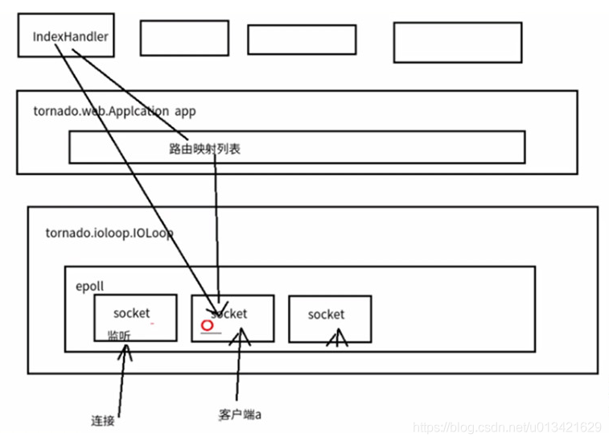

[TOC]

***

# 基础概念

> [python3 asyncio官方文档中文版](https://www.kancloud.cn/kindjeff/asyncio-zh/217022)
>
> [asyncio --- 异步 I/O](https://docs.python.org/zh-cn/3.7/library/asyncio.html#module-asyncio)
>
> [2小时学会python asyncio【花39大洋买的课程】](https://pythonav.com/wiki/detail/6/91/)
>
> [Python进程、线程和协程实战指归](https://zhuanlan.zhihu.com/p/335309471)
>
> [异步编程基本概念](https://blog.csdn.net/lu8000/article/details/45025987)
>
> [python---异步IO(asyncio)协程](https://www.cnblogs.com/ssyfj/p/9219360.html)
>
> [Python黑魔法 --- 异步IO(asyncio)协程](https://www.jianshu.com/p/b5e347b3a17c)
>
> [python协程系列（六）——asyncio的EventLoop以及Future详解](https://blog.csdn.net/qq_27825451/article/details/86292513)
>
> [python协程系列（七）——asyncio结合多线程解决阻塞问题以及timer模拟](https://blog.csdn.net/qq_27825451/article/details/86483493?ops_request_misc=%25257B%252522request%25255Fid%252522%25253A%252522161362921316780274135975%252522%25252C%252522scm%252522%25253A%25252220140713.130102334.pc%25255Fblog.%252522%25257D&request_id=161362921316780274135975&biz_id=0&utm_medium=distribute.pc_search_result.none-task-blog-2~blog~first_rank_v1~rank_blog_v1-6-86483493.pc_v1_rank_blog_v1&utm_term=python%25E5%258D%258F%25E7%25A8%258B%25E7%25B3%25BB%25E5%2588%2597)
>
> [asyncio —— 异步I/O、事件循环、协程和任务](https://www.kancloud.cn/kindjeff/asyncio-zh/217022)
>
> [python协程与异步协程](https://blog.csdn.net/asd529735325/article/details/81335419)
>
> [[进阶]-Python3 异步编程详解（史上最全篇）](https://blog.csdn.net/lu8000/article/details/45025987)
>
> [python多线程、多进程、协程的使用](https://www.cnblogs.com/lingwang3/p/6753388.html)
>
> [Python异步IO之协程(一): 从yield from到async的使用](https://www.cnblogs.com/liugp/p/11072823.html)
>
> [python异步编程模块asyncio学习(一)](https://mp.weixin.qq.com/s?__biz=MzU0NDQ2OTkzNw==&mid=100000571&idx=1&sn=e84d0337c34b3b2874df2c974b7f6f3b&chksm=7b7ae5e54c0d6cf3b2b2dc5ca4e791953fea1eb5a79f2c01d9c5cc7c2b65ccabd774a274261b#rd)
>
> [python异步编程模块asyncio学习(二)](https://zhuanlan.zhihu.com/p/66050624)
>
> [Python中协程异步IO（asyncio）详解](https://zhuanlan.zhihu.com/p/59621713)
>
> [理解 Python 中的异步编程](https://github.com/xitu/gold-miner/blob/master/TODO/understanding-asynchronous-programming-in-python.md)
>
> [Python异步编程模块asyncio学习 !此模块非常之重要!](https://github.com/xitu/gold-miner/blob/master/TODO/understanding-asynchronous-programming-in-python.md)
>
> [带你简单了解python协程和异步](https://www.cnblogs.com/lateink/p/7523011.html)

  

## 进程、线程和协程

> 多进程适合在CPU 密集型操作(CPU操作指令比较多，如科学计算，位数多的浮点运算)
>
> 多线程适合在IO 密集型操作(读写数据操作较多的，比如爬虫)
>
> * 线程是并发，进程是并行；进程之间相互独立，是系统分配资源的最小单位，同一个进程中的所有线程共享资源，进程拥有自己的内存空间，所以进程间数据不共享，开销大。
>
> * 线程：调度执行的最小单位，也叫执行路径，不能独立存在，依赖进程的存在而存在，一个进程至少有一个线程，叫主线程，多个线程共享内存（数据共享和全局变量），因此提升程序的运行效率。
>
> * 协程：用户态的轻量级线程，调度有用户控制，拥有自己的寄存器上下文和栈，切换基本没有内核切换的开销，切换灵活。

### 进程

> **进程最大优势是可以充分例用计算资源**
>
> 使用进程处理**计算密集型**任务：因为不同的进程可以运行的不同CPU的不同的核上。假如一台计算机的CPU共有16核，则可以启动16个或更多个进程来并行处理任务
> 使用单个线程或两个线程的时候，耗时大约30+秒，改用两个进程后，耗时17.786秒，差不多快了一倍。如果使用4个进程（前提是运行的代码的计算机至少有4个CPU核）的话，速度还能提高一倍。对于计算密集型的任务，使用多进程并行处理是**有效的提速手段**。通常，**进程数量选择CPU核数的整倍数**。
> **线程间通信**可以使用**队列、互斥锁、信号量、事件和条件等多种同步方式**，同样的，这些手段也可以应用在进程间。此外，multiprocessing 模块还提供了管道和共享内存等进程间通信的手段。
>
> **进程池**：使用多进程并行处理任务时，处理效率和进程数量并不总是成正比。当进程数量超过一定限度后，完成任务所需时间反而会延长。进程池提供了一个保持合理进程数量的方案，但合理进程数量需要根据硬件状况及运行状况来确定，通常设置为 CPU 的核数。
> multiprocessing.Pool(n) 可创建 n 个进程的进程池供用户调用。如果进程池任务不满，则新的进程请求会被立即执行；如果进程池任务已满，则新的请求将等待至有可用进程时才被执行。
>
> **向进程池提交任务有以下两种方式**：
>
> * apply_async(func[, args[, kwds[, callback]]]) ：非阻塞式提交。即使进程池已满，也会接受新的任务，不会阻塞主进程。新任务将处于等待状态
> * apply(func[, args[, kwds]]) ：阻塞式提交。若进程池已满，则主进程阻塞，直至有空闲进程可以使用

### 线程

> **线程的最大意义在于并行**
> 使用线程处理**IO密集型**任务：对于IO密集型（本例仅测试网络IO，没有磁盘IO）的任务，适量的线程可以在一定程度上提高处理速度。随着线程数量的增加，速度的提升不再明显。
> 使用线程处理**计算密集型**任务
> 对一张千万级像素的照片做低端增强，借助于NumPy的广播和矢量化计算，耗时0.38秒钟；单线程逐像素处理的话，耗时相当于NumPy的100倍；启用多线程的话，速度不仅没有加快，反倒是比单线程更慢。
>
> 这说明，对于**计算密集型**的任务来说，**多线程并不能提高处理速度**，相反，因为要创建和管理线程，处理速度会更慢一些。
> **线程池**：尽管多线程可以并行处理多个任务，但开启线程不仅花费时间，也需要占用系统资源。因此，线程数量不是越多越快，而是要保持在合理的水平上。线程池可以让我们用固定数量的线程完成比线程数量多得多的任务


### 协程

#### 概念

> 线程常用于多任务并行。对于可以切分的IO密集型任务，将切分的每一小块任务分配给一个线程，可以显著提高处理速度。而协程，无论有多少个，都被**限定在一个线程内执行**，因此，协程又被称为**微线程**。
>
> * 从**宏观**上看，**线程**任务和**协程**任务都是**并行**的
> * 从**微观**上看，**线程**任务是分时**切片轮流执行**的，这种切换是系统自动完成的，无需程序员干预；而**协程**则是根据任务特点，在任务阻塞时将**控制权**交给其他协程，这个权力**交接的时机和位置**，由**程序员指定**。
> * 参与协程管理的每一个任务，必须存在阻塞的可能，且阻塞条件会被其它任务破坏，从而得以在阻塞解除后继续执行。
>
> 尽管协程**难以驾驭**，但是由于是在**一个线程内**运行，**免除**了线程或进程的**切换开销**，因而协程的**运行效率高**，在特定场合下仍然被广泛使用。

#### 协程演进史

> [谈谈Python协程技术的演进](https://zhuanlan.zhihu.com/p/30275154)

> 1. Py2时代，Python并不支持协程，仅可通过yield实现部分的协程功能
>
> 2. 另外可以通过**gevent等第三方库**实现协程，gevent最好玩的，莫过于monkey_patch(猴子补丁)
> 3. Py3.4开始，Python内置**asyncio标准库**，正式**原生支持协程**。asyncio的异步操作，需要在协程中通过yield from完成，协程函数则需要使用@asyncio.coroutine装饰器
> 4. 为了更贴近人类思维，Py3.5引入了**新的语法async和await**，可以让协程的代码稍微易懂一点点
>
> 本质上，async就是@asyncio.coroutine，替换为await就是yield from，换个马甲，看起来就顺眼多了。

### 多线程和协程关系

#### 使用场景

>如果是 **I/O 密集型**，且 **I/O 请求比较耗时**的话，使用**协程**
>
>如果是 **I/O 密集型**，且 **I/O 请求比较快**的话，使用**多线程**
>
>如果是 **计算 密集型**，考虑可以使用多核 CPU，使用**多进程**

#### 异同点比较

>**共同点**：都是并发操作，多线程同一时间点只能有一个线程在执行，协程同一时间点只能有一个任务在执行；
>
>**不同点**：多线程，是在I/O阻塞时通过切换线程来达到并发的效果，在什么情况下做线程切换是由操作系统来决定的，开发者不用操心，但会造成竞争条件 (race condition) 
>
>* 协程，只有一个线程，在I/O阻塞时通过在线程内切换任务来达到并发的效果，在什么情况下做任务切换是开发者决定的，不会有竞争条件 (race condition) 的情况；
>
>* 多线程的线程切换比协程的任务切换开销更大；
>
>* 对于开发者而言，多线程并发的代码比协程并发的更容易书写，一般情况下协程并发的处理效率比多线程并发更高。
>
>**ps**：[对第一点和第二点补充](https://www.zhihu.com/question/440212832/answer/1687877241)
>
>* 对于io阻塞的操作，协程相较于线程，能更精确的获取（或者释放）对资源的控制权
>* 这是因为用户层相较于语言层，用户层能更好的感知特定操作的时机
>* 对于非io阻塞的操作，线程相较于协程，能更公平的分配对资源的控制权
>* 这是因为语言层相较于用户层，语言层能更好的感知到多个线程的运行状态，并在掌握更多信息的前提下（线程运行的字节码和时长），进行更加合理的GIL的获取和释放

## 阻塞和非阻塞

###  阻塞

> * 程序未得到所需计算资源时被挂起的状态
> * 程序在等待某个操作完成期间，自身无法继续干别的事情，称程序在该操作上是阻塞的
> * 常见的阻塞形式有：网络I/O阻塞、磁盘I/O阻塞、用户输入阻塞等
>
> 阻塞是无处不在的，包括CPU切换上下文时，所有的进程都无法真正干事情，它们也会被阻塞（如果是多核CPU则正在执行上下文切换操作的核不可被利用）

### 非阻塞

> * 程序在等待某操作过程中，自身不被阻塞，可以继续运行干别的事情，则称该程序在该操作上是非阻塞的
> * 非阻塞并**不是**在任何程序级别、任何情况下都可以存在的
> * 仅当程序封装的级别可以囊括独立的子程序单元时，它才可能存在非阻塞状态
>
> 非阻塞的存在是因为阻塞存在，正因为某个操作阻塞导致的耗时与效率低下，我们才要把它变成非阻塞的

## 异步和同步

### 同步

> - 不同程序单元为了完成某个任务，在执行过程中需靠某种通信方式以**协调一致**，称这些程序单元是同步执行的
> - 例如购物系统中更新商品库存，需要用“行锁”作为通信信号，让不同的更新请求强制排队顺序执行，那更新库存的操作是同步的
> - 简言之，**同步意味着有序**

### 异步

> - 为完成某个任务，不同程序单元之间**过程中无需通信协调**，也能完成任务的方式
> - 不相关的程序单元之间可以是异步的
> - 例如，爬虫下载网页。调度程序调用下载程序后，即可调度其他任务，而无需与该下载任务保持通信以协调行为。不同网页的下载、保存等操作都是无关的，也无需相互通知协调。这些异步操作的完成时刻并不确定
> - 简言之，**异步意味着无序**
>
> 当一个异步过程调用发出后，调用者在没有得到结果之前，就可以继续执行后续操作。
>
> 当这个调用完成后，**一般通过状态、通知和回调来通知调用者**。
>
> 对于异步调用，调用的返回并不受调用者控制。
>
> 对于通知调用者的三种方式，具体如下：
>
> * **状态**：即监听被调用者的状态(轮询)，调用者需要每隔一定时间**检查**一次，效率会很低
> * **通知**：当被调用者执行完成后，发出**通知告知调用者**，无需消耗太多性能
>
> * **回调**：与通知类似，当被调用者执行完成后，会调用调用者提供的**回调函数**

## 并行和并发

### 并发(多线程)

>**任务特点**：IO密集型任务：任务包含频繁的、持续的网络IO和磁盘IO
>
>单个CPU（也可以多个CPU）将多个线程中的每个线程（多个进程中的每个进程）按时间分为一个一个的时间片，每一个时刻只执行某个线程（进程）的时间片，时间片过期后转而执行下一个线程（进程）的时间片
>
>- 并发描述的是程序的组织结构。指程序要被设计成多个可独立执行的子任务。
>- 以利用有限的计算机资源使多个任务可以被实时或近实时执行为目的。
>
>并发提供了一种程序组织结构方式，让问题的解决方案可以并行执行，
>
>**注：并发宏观上看起来像是并行但是微观上并不能做到并行**

### 并行(多进程)

>**任务特点**：计算密集型任务：任务包含大量计算，CPU占用率高
>
>当有多个CPU或者是多核CPU时才有可能实现并行，并行就是多个线程或者多个进程同时运行
>
>- 并行描述的是程序的执行状态。指多个任务同时被执行。
>- 以利用富余计算资源（多核CPU）加速完成多个任务为目的。

### 组合分析

> [同步阻塞、同步非阻塞，异步阻塞、异步非阻塞](https://blog.csdn.net/qq_27825451/article/details/86162597?ops_request_misc=%25257B%252522request%25255Fid%252522%25253A%252522161362921316780274135975%252522%25252C%252522scm%252522%25253A%25252220140713.130102334.pc%25255Fblog.%252522%25257D&request_id=161362921316780274135975&biz_id=0&utm_medium=distribute.pc_search_result.none-task-blog-2~blog~first_rank_v1~rank_blog_v1-3-86162597.pc_v1_rank_blog_v1&utm_term=python%25E5%258D%258F%25E7%25A8%258B%25E7%25B3%25BB%25E5%2588%2597)
>
> 举个简单的例子来描述这四种情况，老张要做两件事，用水壶烧开水，看电视，两件事情即两个任务，两个函数。
> **同步阻塞：**老张把水壶放到火上，就坐在那里等水开，开了之后我再去看电视。（）
>
> **同步非阻塞：**老张把水壶放到火上，去客厅看电视，时不时去厨房看看水开没有。（同步非阻塞）
>
> 老张还是觉得自己有点傻，于是变高端了，买了把会响笛的那种水壶。水开之后，能大声发出嘀~~~~的噪音。
>
> **异步阻塞：**老张把响水壶放到火上，然后就坐在旁边等着听那个烧开的提示音。（异步阻塞）
>
> **异步非阻塞：**老张把响水壶放到火上，去客厅看电视，水壶响之前不再去看它了，响了再去拿壶。（异步非阻塞）
>
> ***
>
> 乍一看，这“同步阻塞、意不阻塞”似乎没有什么区别，但实际上是有区别的，所谓同步异步，指的是消息通知的机制。区别在哪里呢？
>
> 在这个例子中同步异步只是对于水壶而言。在使用普通水壶的时候，我要自己主动去观察水是不是烧开了，自己主动去获取烧开的这个结果，即所谓的同步；但是在响水壶的时候，我不需要再管水烧到什么程度了，因为只要水烧开了，那个滴滴的噪声就会通知我的，即所谓的异步。
>
> 他们的相同点是，在烧水的过程中，老王啥也没干，即“阻塞”。
>
> **四种总结——同步/异步与阻塞/非阻塞**
>
> **同步阻塞形式：**效率是最低的。拿上面的例子来说，在烧水的过程中，什么别的事都不做。
>
> **同步非阻塞形式：**实际上是效率低下的。因为老王需要不断的在看电视与烧水之间来回跑动，看一下电视，又要去看一下水烧开               没有，这样来回跑很多次，在程序中，程序需要在这两种不同的行为之间来回的切换，效率可想而知是低下的。
>
> **异步阻塞形式：**异步操作是可以被阻塞住的，只不过它不是在处理消息时阻塞，而是在等待消息通知时被阻塞。
>
> 这个效率其实跟同步阻塞差不多的。
>
> **异步非阻塞形式：**效率更高。因为老王把水烧好之后就不用管了，可以安安心心去看电视，不用来回奔波看水烧开了没，因为            水烧开了会有提示告诉他水烧好了，这样效率岂不是更高。
>
> 那有没有更好的办法？当然有，如果老王还有一个帮手老张，让老王自己看电视、同时老张去烧开水，这样岂不是更好？这就是所谓的并行。
>
> **并发/并行、同步/异步、阻塞/非阻塞**
>
> 并发/并行：即能够开启多个任务，多个任务交替执行为并发，多个任务同时执行为并行
>
> 同步/异步：关注的是消息通知的机制，主动等候消息则为同步、被动听消息则为异步
>
> 阻塞/非阻塞：关注的是等候消息的过程中有没有干其他事。
>
> **总结：**上面的几组概念，时刻穿插的，并没有完全的等价关系，所以经常有人说，异步就是非阻塞，同步就是阻塞，并发就是非阻塞、并行就是非阻塞，这些说法都是不完全准确地。

## 概念总结

> - **并行**是为了利用多核加速多任务完成的进度
> - **并发**是为了让独立的子任务都有机会被尽快执行，但不一定能加速整体进度
> - **非阻塞**是为了提高程序整体执行效率
> - **异步**是高效地组织非阻塞任务的方式
>
> 要支持并发，必须拆分为多任务，不同任务相对而言才有阻塞/非阻塞、同步/异步
>
> 所以，并发、异步、非阻塞三个词总是如影随形


# 异步编程

## 协程多种实现方式

> [python协程的多种实现方式](https://blog.csdn.net/wf134/article/details/78553181)

> 在Python中有多种方式可以实现协程，例如：
>
> - greenlet，是一个第三方模块，用于实现协程代码（Gevent协程就是基于greenlet实现）
> - yield，生成器，借助生成器的特点也可以实现协程代码
> - asyncio，在Python3.4中引入的模块用于编写协程代码
> - async & awiat，Python3.5中引入的关键字，结合asyncio模块可以更方便的编写协程代码
>
> 目前主流使用是Python官方推荐的 asyncio 模块和 async&await 关键字的方式
>
> 例如：在tonado、sanic、fastapi、django3 中均已支持

## 任务类型

> * **计算密集型**任务：任务包含大量计算，CPU占用率高
> * **IO密集型**任务：任务包含频繁的、持续的网络IO和磁盘IO
> * **混合型**任务：既有计算也有IO

## 协程状态

协程函数相比于一般的函数来说，我们可以将协程包装成任务Task，任务Task就在于可以跟踪它的状态，我就知道它具体执行到哪一步了

一般来说，协程函数具有4种状态：

> * Pending：创建future的时候，task为pending
> * Running：事件循环调用执行的时候当然就是running
> * Done：调用完毕自然就是done
> * Cacelled：停止事件循环，就需要先把task取消，即为cancelled

## greenlet库

 greentlet是一个第三方模块，需要提前安装 `pip3 install greenlet`才能使用。 

```python
from greenlet import greenlet
def func1():
    print(1)        # 第1步：输出 1
    gr2.switch()    # 第3步：切换到 func2 函数
    print(2)        # 第6步：输出 2
    gr2.switch()    # 第7步：切换到 func2 函数，从上一次执行的位置继续向后执行
def func2():
    print(3)        # 第4步：输出 3
    gr1.switch()    # 第5步：切换到 func1 函数，从上一次执行的位置继续向后执行
    print(4)        # 第8步：输出 4
gr1 = greenlet(func1)
gr2 = greenlet(func2)
gr1.switch() # 第1步：去执行 func1 函数
```

 注意：switch中也可以传递参数用于在切换执行时相互传递值。 

## yield关键字

 基于Python的生成器的yield和yield form关键字实现协程代码。 

```python
def func1():
    yield 1
    yield from func2()
    yield 2
def func2():
    yield 3
    yield 4
f1 = func1()
for item in f1:
    print(item)
```

 注意：yield form关键字是在Python3.3中引入的。 

##  asyncio 标准库 

### 入门示例

> asyncio模块

在Python3.4之前官方未提供协程的类库，一般大家都是使用greenlet等其他来实现

在Python3.4发布后官方正式支持协程，即：asyncio模块

```python
import asyncio

@asyncio.coroutine
def func1():
    print(1)
    yield from asyncio.sleep(2)  # 遇到IO耗时操作，自动化切换到tasks中的其他任务
    print(2)
    
@asyncio.coroutine
def func2():
    print(3)
    yield from asyncio.sleep(2) # 遇到IO耗时操作，自动化切换到tasks中的其他任务
    print(4)

tasks = [asyncio.ensure_future( func1() ),
         asyncio.ensure_future( func2() )]
loop = asyncio.get_event_loop()
loop.run_until_complete(asyncio.wait(tasks))
```

注意：基于asyncio模块实现的协程比之前的要厉害，内部集成了遇到IO耗时操作**自动切换**的功能 

> async & awit 关键字

async & awit 关键字在Python3.5版本中正式引入，让代码可以更加简便

Python3.8之后 `@asyncio.coroutine` 装饰器就会被移除，推荐使用async & awit 关键字实现协程代码

```python
import asyncio

async def func1():
    print(1)
    await asyncio.sleep(2)
    print(2)
    
async def func2():
    print(3)
    await asyncio.sleep(2)
    print(4)
    
tasks = [asyncio.ensure_future( func1() ),
         asyncio.ensure_future( func2() )]
loop = asyncio.get_event_loop()
loop.run_until_complete(asyncio.wait(tasks))
```

### 进阶示例

**用代码实现下载 `url_list` 中的图片** 

> 同步编程实现 

```python
"""
下载图片使用第三方模块requests，请提前安装：pip3 install requests
"""
import requests

def download_image(url):
    print("开始下载:",url)
    
    # 发送网络请求，下载图片
    response = requests.get(url)
    print("下载完成")
    
    # 图片保存到本地文件
    file_name = url.rsplit('_')[-1]
    with open(file_name, mode='wb') as file_object:
        file_object.write(response.content)
        
if __name__ == '__main__':
    url_list = [
        'https://www3.autoimg.cn/newsdfs/g26/M02/35/A9/120x90_0_autohomecar__ChsEe12AXQ6AOOH_AAFocMs8nzU621.jpg',
        'https://www2.autoimg.cn/newsdfs/g30/M01/3C/E2/120x90_0_autohomecar__ChcCSV2BBICAUntfAADjJFd6800429.jpg',
        'https://www3.autoimg.cn/newsdfs/g26/M0B/3C/65/120x90_0_autohomecar__ChcCP12BFCmAIO83AAGq7vK0sGY193.jpg'
    ]
    for item in url_list:
        download_image(item)
```

> 基于协程的异步编程实现

```python
#!/usr/bin/env Python
# -- coding: utf-8 --

"""
@version: v1.0
@author: huangyc
@file: asyncio_test_http.py
@Description: 下载图片使用第三方模块aiohttp，请提前安装：pip3 install aiohttp
@time: 2021/2/19 9:23
"""

import aiohttp
import asyncio


async def fetch(session, url):
    print("发送请求：", url)
    async with session.get(url, verify_ssl=False) as response:
        content = await response.content.read()
        file_name = url.rsplit('_')[-1]
        with open(file_name, mode='wb') as file_object:
            file_object.write(content)


async def main():
    async with aiohttp.ClientSession() as session:
        url_list = [
            'https://www3.autoimg.cn/newsdfs/g26/M02/35/A9/120x90_0_autohomecar__ChsEe12AXQ6AOOH_AAFocMs8nzU621.jpg',
            'https://www2.autoimg.cn/newsdfs/g30/M01/3C/E2/120x90_0_autohomecar__ChcCSV2BBICAUntfAADjJFd6800429.jpg',
            'https://www3.autoimg.cn/newsdfs/g26/M0B/3C/65/120x90_0_autohomecar__ChcCP12BFCmAIO83AAGq7vK0sGY193.jpg'
        ]
        tasks = [asyncio.create_task(fetch(session, url)) for url in url_list]
        await asyncio.wait(tasks)


if __name__ == '__main__':
    asyncio.run(main())

```

> 上述两种的执行对比之后会发现，`基于协程的异步编程` 要比 `同步编程`的效率高了很多

- 同步编程，按照顺序逐一排队执行，如果图片下载时间为2分钟，那么全部执行完则需要6分钟。
- 异步编程，几乎同时发出了3个下载任务的请求（遇到IO请求自动切换去发送其他任务请求），如果图片下载时间为2分钟，那么全部执行完毕也大概需要2分钟左右就可以了。

> 第三方模块不支持协程方式异步编程

```python
import asyncio
import requests

async def download_image(url):
    # 发送网络请求，下载图片（遇到网络下载图片的IO请求，自动化切换到其他任务）
    print("开始下载:", url)
    loop = asyncio.get_event_loop()
    # requests模块默认不支持异步操作，所以就使用线程池来配合实现了。
    future = loop.run_in_executor(None, requests.get, url)
    response = await future
    print('下载完成')
    # 图片保存到本地文件
    file_name = url.rsplit('_')[-1]
    with open(file_name, mode='wb') as file_object:
        file_object.write(response.content)

if __name__ == '__main__':
    url_list = [
        'https://www3.autoimg.cn/newsdfs/g26/M02/35/A9/120x90_0_autohomecar__ChsEe12AXQ6AOOH_AAFocMs8nzU621.jpg',
        'https://www2.autoimg.cn/newsdfs/g30/M01/3C/E2/120x90_0_autohomecar__ChcCSV2BBICAUntfAADjJFd6800429.jpg',
        'https://www3.autoimg.cn/newsdfs/g26/M0B/3C/65/120x90_0_autohomecar__ChcCP12BFCmAIO83AAGq7vK0sGY193.jpg'
    ]
    tasks = [download_image(url) for url in url_list]
    loop = asyncio.get_event_loop()
    loop.run_until_complete(asyncio.wait(tasks))
```

### 核心概念

> [python协程系列（五）——asyncio的核心概念与基本架构](https://blog.csdn.net/qq_27825451/article/details/86218230?ops_request_misc=%25257B%252522request%25255Fid%252522%25253A%252522161362921316780274135975%252522%25252C%252522scm%252522%25253A%25252220140713.130102334.pc%25255Fblog.%252522%25257D&request_id=161362921316780274135975&biz_id=0&utm_medium=distribute.pc_search_result.none-task-blog-2~blog~first_rank_v1~rank_blog_v1-4-86218230.pc_v1_rank_blog_v1&utm_term=python%25E5%258D%258F%25E7%25A8%258B%25E7%25B3%25BB%25E5%2588%2597)

#### 协程函数和对象

**协程函数**：定义形式为 [`async def fun()`](https://docs.python.org/zh-cn/3.8/reference/compound_stmts.html#async-def) 的函数

在 Python 3.4 中，asyncio 模块出现，此时创建协程函数须使用 asyncio.coroutine 装饰器标记

此前的包含 yield from 语句的函数既可以称作生成器函数也可以称作协程函数

为了突出协程的重要性，现在使用 asyncio.coroutine 装饰器的函数就是真正的协程函数了

**协程对象**：调用 *协程函数* 所返回的对象

> 即协程函数的运行结果为协程对象，协程对象需要包装成任务注入到事件循环，由事件循环调用

怎么判断一个函数是不是协程？

通过asyncio.iscoroutine（obj）和 asyncio.iscoroutinefunction(*func*)加以判断，返回true，则是

```python
# 定义一个协程函数
async def func():
    pass
# 调用协程函数，返回一个协程对象
result = func()
```

**注意**：调用协程函数时，函数内部代码不会执行，只是会返回一个协程对象

要执行协程函数的内部代码，需要 `事件循环` 和 `协程对象` 配合才能实现

```python
import asyncio
async def func():
    print("协程内部代码")
    
# 调用协程函数，返回一个协程对象。
result = func()

# 方式一
# loop = asyncio.get_event_loop() # 创建一个事件循环
# loop.run_until_complete(result) # 将协程当做任务提交到事件循环的任务列表中，协程执行完成之后终止。

# 方式二
# 本质上方式一是一样的，内部先 创建事件循环 然后执行 run_until_complete，一个简便的写法。
# asyncio.run 函数在 Python 3.7 中加入 asyncio 模块，
asyncio.run(result)
```

> 这个过程可以简单理解为：

1. 将`协程`当做任务添加到 `事件循环` 的任务列表
2. 然后事件循环检测列表中的`协程`是否 已准备就绪（默认可理解为就绪状态）
3. 如果准备就绪则执行其内部代码

#### Task 对象

> *Tasks* are used to schedule coroutines *concurrently*.
>
> When a coroutine is wrapped into a *Task* with functions like [`asyncio.create_task()`](https://docs.python.org/3.8/library/asyncio-task.html#asyncio.create_task) the coroutine is automatically scheduled to run soon。

将协程对象作为参数创建任务，任务是对协程对象的封装，其中包含任务的各种状态，是一个可以挂起的函数

协程不是线程安全，这样可以让协程加入事件循环中等待被调度执行

异步编程最重要的就是对异步操作状态的把控

**(1) 创建任务（两种方法）**：

> * task = asyncio.create_task(coro())  # 这是3.7版本新添加的(**建议**)
> * task = asyncio.ensure_future(coro()) #  Python 3.7 之前，可以使用低层级的函数
> * 也可以使用：loop.create_future()或loop.create_task(coro) (**不建议手动实例化** Task 对象)

本质上是将协程对象封装成task对象，并将协程立即加入事件循环，同时追踪协程的状态

```python
import asyncio

async def func():
    print(1)
    await asyncio.sleep(2)
    print(2)
    return "返回值"

async def main():
    print("main开始")
    # 创建协程，将协程封装到Task对象中并添加到事件循环的任务列表中，等待事件循环去执行（默认是就绪状态）。
    # 在调用
    task_list = [asyncio.create_task(func(), name="n1"),
                 asyncio.create_task(func(), name="n2")]
    print("main结束")
    # 当执行某协程遇到IO操作时，会自动化切换执行其他任务。
    # 此处的await是等待所有协程执行完毕，并将所有协程的返回值保存到done
    # 如果设置了timeout值，则意味着此处最多等待的秒，完成的协程返回值写入到done中，未完成则写到pending中。
    done, pending = await asyncio.wait(task_list, timeout=None)
    print(done, pending)
    
asyncio.run(main())
```

注意：`asyncio.wait` 源码内部会对列表中的每个协程执行ensure_future从而封装为Task对象，所以在和wait配合使用时task_list的值为`[func(),func()]` 也是可以的。 

或者：

```python
import asyncio

async def func():
    print("执行协程函数内部代码")
    # 遇到IO操作挂起当前协程（任务），等IO操作完成之后再继续往下执行。当前协程挂起时，事件循环可以去执行其他协程（任务）。
    response = await asyncio.sleep(2)
    print("IO请求结束，结果为：", response)
    
coroutine_list = [func(), func()]
# 错误：coroutine_list = [ asyncio.create_task(func()), asyncio.create_task(func()) ]  
# 此处不能直接 asyncio.create_task，因为将Task立即加入到事件循环的任务列表，
# 但此时事件循环还未创建，所以会报错。
# 使用asyncio.wait将列表封装为一个协程，并调用asyncio.run实现执行两个协程
# asyncio.wait内部会对列表中的每个协程执行ensure_future，封装为Task对象。
done,pending = asyncio.run( asyncio.wait(coroutine_list) )
```

**(2) 获取某一个任务的方法**：

> * 返回在某一个指定的loop中，当前正在运行的任务，如果没有任务正在运行，则返回None，如果loop为None，则默认为在当前的事件循环中获取
> * task=asyncio.current_task(*loop=None*)
> * 返回某一个loop中还没有结束的任务
> * asyncio.all_tasks(*loop=None*)

**(3) Task类常见的一些使用函数**

> * **cancel()**： 最好是使用他会出发CancelledError异常，所以需要取消的协程函数里面的代码最好在try-except语句块中进行，这样方便触发异常，打印相关信息，但是Task.cancel()没有办法保证任务一定会取消，而Future.cancel()是可以保证任务一定取消的 
> * **done()**：当一个被包装得协程既没有触发异常、也没有被取消的时候，意味着它是done的，返回true
> * **result()**：
>
>   * 返回任务的执行结果，当任务被正常执行完毕，则返回结果；
>   * 当任务被取消了，调用这个方法，会触发CancelledError异常；
>   * 当任务返回的结果是无用的时候，则调用这个方法会触发InvalidStateError；
>   * 当任务出发了一个异常而中断，调用这个方法还会再次触发这个使程序中断的异常。
> * **exception()**：
>   * 返回任务的异常信息，触发了什么异常，就返回什么异常
>   * 如果任务是正常执行的无异常，则返回None
>   *  当任务被取消了，调用这个方法会触发CancelledError异常
>   *  当任务没有做完，调用这个方法会触发InvalidStateError异常 
> *  还有一些不常用的方法：
>   *  `add_done_callback`(*callback*, ***, *context=None*) 
>   *  `remove_done_callback`(*callback*) 
>   *  `get_stack`(***, *limit=None*) 
>   *  `print_stack`(***, *limit=None*, *file=None*) 
>   *  `all_tasks`(*loop=None*)，这是一个类方法 
>   *  `current_task`(*loop=None*)，这是一个类方法 
> * 
>

#### asyncio.Future对象

> *A* `Future`*is a special* **low-level** *awaitable object that represents an* **eventual result** *of an asynchronous operation.* 
>
> asyncio中的Future对象是一个相对更偏向底层的可对象，通常我们不会直接用到这个对象，而是直接使用Task对象来完成任务的并和状态的追踪
>
> Task 是 Futrue的子类，和task上没有本质上的区别，没有必要去用Future，用Task就可以了
>
> Future为我们提供了异步编程中的 最终结果 的处理（Task类也具备状态处理的功能）

当一个Future对象被等待的时候，协程会一直等待，直到Future已经运算完毕 

asyncio中的Future类是模仿concurrent.futures.Future类而设计的

**示例1：**

```python
async def main():
    # 获取当前事件循环
    loop = asyncio.get_running_loop()
    
    # # 创建一个任务（Future对象），这个任务什么都不干。
    fut = loop.create_future()
    
    # 等待任务最终结果（Future对象），没有结果则会一直等下去。
    await fut
    
asyncio.run(main())
```

**示例2：**

```python
import asyncio

async def set_after(fut):
    await asyncio.sleep(2)
    fut.set_result("666") # 通常是不会这样设置的，这里只是演示

async def main():
    # 获取当前事件循环
    loop = asyncio.get_running_loop()
    
    # 创建一个任务（Future对象），没绑定任何行为，则这个任务永远不知道什么时候结束。
    fut = loop.create_future()
    
    # 创建一个任务（Task对象），绑定了set_after函数，函数内部在2s之后，会给fut赋值。
    # 即手动设置future任务的最终结果，那么fut就可以结束了。
    await loop.create_task(set_after(fut))
    
    # 等待 Future对象获取 最终结果，否则一直等下去
    data = await fut
    print(data)

asyncio.run(main())
```

Future对象本身函数进行绑定，所以想要让事件循环获取Future的结果，则需要手动设置

而Task对象继承了Future对象，其实就对Future进行扩展，他可以实现在对应绑定的函数执行完成之后，自动执行`set_result`，从而实现自动结束

虽然，平时使用的是Task对象，但对于结果的处理本质是基于Future对象来实现的

**扩展**：支持 `await 对象`语 法的对象课成为可等待对象，所以 `协程对象`、`Task对象`、`Future对象` 都可以被成为可等待对象。

> asyncio中关于Future的几个方法

* asyncio.isfuture(obj)：判断一个对象是不是Future，注意python中一切皆对象哦，包括函数，当obj是下面几种情况时返回true
  * asyncio.Future的实例对象
  * asyncio.Task的实例对象
  * 一个具有 _asyncio_future_blocking属性的对象

* asyncio.ensure_future(obj, ***, loop=None)。将一个obj包装成Future

* asyncio.wrap_future(future, ***, loop=None)

将[`concurrent.futures.Future`](https://docs.python.org/3/library/concurrent.futures.html#concurrent.futures.Future)对象包装成一个 [`asyncio.Future`](https://docs.python.org/3/library/asyncio-future.html#asyncio.Future) 对象。

> Future对象的常用方法

* result()：返回Future执行的结果返回值
  * 如果Future被执行完成，如果使用set_result()方法设置了一个结果，那个设置的value就会被返回；
  * 如果Future被执行完成，如果使用set_exception()方法设置了一个异常，那么使用这个方法也会触发异常；
  * 如果Future被取消了，那么使用这个方法会触发CancelledError异常；
  * 如果Future的结果不可用或者是不可达，那么使用这个方法也会触发InvalidStateError异常；
* set_result(result)：标记Future已经执行完毕，并且设置它的返回值。
* set_exception(exception)：标记Future已经执行完毕，并且触发一个异常。
* done()：如果Future1执行完毕，则返回 `True` 。
* cancelled()：判断任务是否取消。
* add_done_callback(callback, ***, context=None)：在Future完成之后，给它添加一个回调方法，这个方法就相当于是loop.call_soon()方法，如果要回调带有关键字参数的函数，也需要使用partial方法哦。
* remove_done_callback(*callback*)
* cancel()
* exception()
* get_loop()：返回Future所绑定的事件循环


#### futures.Future对象

在Python的`concurrent.futures`模块中也有一个Future对象，这个对象是基于线程池和进程池实现异步操作时使用的对象。 

```python
import time
from concurrent.futures import Future
from concurrent.futures.thread import ThreadPoolExecutor
from concurrent.futures.process import ProcessPoolExecutor

def func(value):
    time.sleep(1)
    print(value)
    
pool = ThreadPoolExecutor(max_workers=5)
# 或 pool = ProcessPoolExecutor(max_workers=5)

for i in range(10):
    fut = pool.submit(func, i)
    print(fut)
```

两个Future对象是不同的，他们是为不同的应用场景而设计

例如：`concurrent.futures.Future`不支持await语法 等

> 官方提示两对象之间不同：

- unlike asyncio Futures, [`concurrent.futures.Future`](https://docs.python.org/3.8/library/concurrent.futures.html#concurrent.futures.Future) instances cannot be awaited.
- [`asyncio.Future.result()`](https://docs.python.org/3.8/library/asyncio-future.html#asyncio.Future.result) and [`asyncio.Future.exception()`](https://docs.python.org/3.8/library/asyncio-future.html#asyncio.Future.exception) do not accept the *timeout* argument.
- [`asyncio.Future.result()`](https://docs.python.org/3.8/library/asyncio-future.html#asyncio.Future.result) and [`asyncio.Future.exception()`](https://docs.python.org/3.8/library/asyncio-future.html#asyncio.Future.exception) raise an [`InvalidStateError`](https://docs.python.org/3.8/library/asyncio-exceptions.html#asyncio.InvalidStateError) exception when the Future is not *done*.
- Callbacks registered with [`asyncio.Future.add_done_callback()`](https://docs.python.org/3.8/library/asyncio-future.html#asyncio.Future.add_done_callback) are not called immediately. They are scheduled with [`loop.call_soon()`](https://docs.python.org/3.8/library/asyncio-eventloop.html#asyncio.loop.call_soon) instead.
- asyncio Future is not compatible with the [`concurrent.futures.wait()`](https://docs.python.org/3.8/library/concurrent.futures.html#concurrent.futures.wait) and [`concurrent.futures.as_completed()`](https://docs.python.org/3.8/library/concurrent.futures.html#concurrent.futures.as_completed) functions.

在Python提供了一个将`futures.Future` 对象包装成`asyncio.Future`对象的函数 `asynic.wrap_future`

> 为什么python会提供这种功能？

一般在程序开发中我们要么统一使用 asycio 的协程实现异步操作、要么都使用进程池和线程池实现异步操作

但**如果 `协程的异步`和 `进程池/线程池的异步` 混搭时，那么就会用到此功能了**

```python
import time
import asyncio
import concurrent.futures

def func1():
    # 某个耗时操作
    time.sleep(2)
    return "defaulf pool"

async def main():
    loop = asyncio.get_running_loop()

    # 1. Run in the default loop's executor ( 默认ThreadPoolExecutor )
    # 第一步：内部会先调用 ThreadPoolExecutor 的 submit 方法去线程池中申请一个线程去执行func1函数，并返回一个concurrent.futures.Future对象
    # 第二步：调用asyncio.wrap_future将concurrent.futures.Future对象包装为asycio.Future对象。
    # 因为concurrent.futures.Future对象不支持await语法，所以需要包装为 asycio.Future对象 才能使用。
    fut = loop.run_in_executor(None, func1)
    result = await fut
    print('default thread pool', result)
    
    # # 2. Run in a custom thread pool:
    # with concurrent.futures.ThreadPoolExecutor() as pool:
    #     result = await loop.run_in_executor(pool, func1)
    #     print('custom thread pool', result)

    # 3. Run in a custom process pool:
    # with concurrent.futures.ProcessPoolExecutor() as pool:
    #     result = await loop.run_in_executor(pool, func1)
    #     print('custom process pool', result)

asyncio.run(main())
```

> 应用场景：
>
> 当项目以协程式的异步编程开发时，如果要使用一个第三方模块
>
> 而第三方模块不支持协程方式异步编程时，就需要用到这个功能

```python
import asyncio
import requests

async def download_image(url):
    # 发送网络请求，下载图片（遇到网络下载图片的IO请求，自动化切换到其他任务）
    print("开始下载:", url)
    loop = asyncio.get_event_loop()
    # requests模块默认不支持异步操作，所以就使用线程池来配合实现了。
    future = loop.run_in_executor(None, requests.get, url)
    response = await future
    print('下载完成')
    # 图片保存到本地文件
    file_name = url.rsplit('_')[-1]
    with open(file_name, mode='wb') as file_object:
        file_object.write(response.content)

if __name__ == '__main__':
    url_list = [
        'https://www3.autoimg.cn/newsdfs/g26/M02/35/A9/120x90_0_autohomecar__ChsEe12AXQ6AOOH_AAFocMs8nzU621.jpg',
        'https://www2.autoimg.cn/newsdfs/g30/M01/3C/E2/120x90_0_autohomecar__ChcCSV2BBICAUntfAADjJFd6800429.jpg',
        'https://www3.autoimg.cn/newsdfs/g26/M0B/3C/65/120x90_0_autohomecar__ChcCP12BFCmAIO83AAGq7vK0sGY193.jpg'
    ]
    tasks = [download_image(url) for url in url_list]
    loop = asyncio.get_event_loop()
    loop.run_until_complete(asyncio.wait(tasks))

```

这个方法返回一个 [`asyncio.Future`](https://docs.python.org/zh-cn/3.7/library/asyncio-future.html#asyncio.Future) 对象

使用 [`functools.partial()`](https://docs.python.org/zh-cn/3.7/library/functools.html#functools.partial) [传递关键字参数](https://docs.python.org/zh-cn/3.7/library/asyncio-eventloop.html#asyncio-pass-keywords) 给 *func* 

`asyncio.``wrap_future`(*future*, ***, *loop=None*)

将一个 [`concurrent.futures.Future`](https://docs.python.org/zh-cn/3.7/library/concurrent.futures.html#concurrent.futures.Future) 对象封装到 [`asyncio.Future`](https://docs.python.org/zh-cn/3.7/library/asyncio-future.html#asyncio.Future) 对象中

#### async/await 关键字

python3.5 用于定义协程的关键字，async定义一个协程，await用于挂起阻塞的异步调用接口 

await是一个只能在协程函数中使用的关键字，用于遇到IO操作时挂起 当前协程(任务)，当前协程(任务)挂起过程中 事件循环可以去执行其他的协程(任务)，当前协程IO处理完成时，可以再次切换回来执行await之后的代码 

```python
import asyncio

async def others():
    print("start")
    await asyncio.sleep(2)
    print('end')
    return '返回值'

async def func():
    print("执行协程函数内部代码")
    # 遇到IO操作挂起当前协程（任务），等IO操作完成之后再继续往下执行。当前协程挂起时，事件循环可以去执行其他协程（任务）。
    response1 = await others()
    print("IO请求结束，结果为：", response1)
    response2 = await others()
    print("IO请求结束，结果为：", response2)
    
asyncio.run( func() )
```

事件循环的任务列表中只有一个任务，所以在IO等待时无法演示切换到其他任务效果

在程序想要创建多个任务对象，需要使用Task对象来实现

> 可暂停等待的对象： 有三类对象是可等待的，即 **coroutines**, **Tasks**, and **Futures**

* **coroutine**：本质上就是一个函数，一前面的生成器yield和yield from为基础，不再赘述

* **Tasks**: 任务，顾名思义，就是要完成某件事情，其实就是对协程函数进一步的封装

* **Future**：它是一个“更底层”的概念，他代表一个一步操作的最终结果，因为一步操作一般用于耗时操作，结果不会立即得到，会在“将来”得到异步运行的结果，故而命名为Future

三者的关系，coroutine可以自动封装成task，而Task是Future的子类


#### event_loop 事件循环

> [python Event_loop(事件循环)](https://www.cnblogs.com/xiaozx/p/10639875.html)
>
> [Python 协程与事件循环](https://www.cnblogs.com/rgbit/p/10539520.html)

程序开启一个无限循环，把一些函数注册到事件循环上，当满足事件发生的时候，调用相应的协程函数

```python
任务列表 = [ 任务1, 任务2, 任务3,... ]
while True:
    可执行的任务列表，已完成的任务列表 = 去任务列表中检查所有的任务，将'可执行'和'已完成'的任务返回
    for 就绪任务 in 已准备就绪的任务列表:
        执行已就绪的任务
    for 已完成的任务 in 已完成的任务列表:
        在任务列表中移除 已完成的任务
    如果 任务列表 中的任务都已完成，则终止循环
```

> 将多线程比喻为工厂里的多个车间，那么协程就是一个车间内的多台机器。

* 在线程级程序中，一台机器开始工作，车间内的其它机器不能同时工作，需要等上一台机器停止，但其它车间内的机器可以同时启动，这样就可以显著提高工作效率。
* 在协程程序中，一个车间内的不同机器可以同时运转，启动机器、暂停运转、延时启动、停止机器等操作都可以人为设置

事件循环能够控制任务运行流程，也就是任务的调用方

协程函数，不是像普通函数那样直接调用运行的，必须添加到事件循环中，然后由事件循环去运行，单独运行协程函数是不会有结果的

```python
import time
import asyncio

async def say_after_time(delay,what):
        await asyncio.sleep(delay)
        print(what)
 
async def main():
        print(f"开始时间为： {time.time()}")
        await say_after_time(1,"hello")
        await say_after_time(2,"world")
        print(f"结束时间为： {time.time()}")
 
loop=asyncio.get_event_loop()    #创建事件循环对象
#loop=asyncio.new_event_loop()   #与上面等价，创建新的事件循环
loop.run_until_complete(main())  #通过事件循环对象运行协程函数
loop.close()
```

**(1) 获取事件循环对象的几种方式**：

> 下面几种方式可以用来获取、设置、创建事件循环对象loop
>
> `loop=asyncio.get_running_loop`() 返回（获取）在当前线程中正在运行的事件循环，如果没有正在运行的事件循环，则会显示错误；它是python3.7中新添加的
>
> `loop=asyncio.get_event_loop`() 获得一个事件循环，如果当前线程还没有事件循环，则创建一个新的事件循环loop；
>
> `loop=asyncio.set_event_loop`(*loop*) 设置一个事件循环为当前线程的事件循环；
>
> `loop=asyncio.new_event_loop`() 创建一个新的事件循环

**(2) 通过事件循环运行协程函数的两种方式**：

> * 创建事件循环对象loop，即asyncio.get_event_loop()，通过事件循环运行协程函数
> * 直接通过asyncio.run(function_name)运行协程函数
>
> 需要注意的是，首先run函数是python3.7版本新添加的，前面的版本是没有的；
>
> 其次，这个run函数**总是会创建一个新的事件循环并在run结束之后关闭事件循环**
>
> 所以，如果在同一个线程中已经有了一个事件循环，则不能再使用这个函数了，因为同一个线程不能有两个事件循环，而且这个run函数不能同时运行两次，因为他已经创建一个了
>
> 即同一个线程中是不允许有多个事件循环loop的
>

**(3) 运行和停止事件循环**：

> * loop.run_until_complete(future)。运行事件循环，直到future运行结束
>
> * loop.run_forever()。在python3.7中已经取消了，表示事件循环会一直运行，直到遇到stop。
>
> * loop.stop()。停止事件循环
>
> * loop.is_running()。如果事件循环依然在运行，则返回True
>
> * loop.is_closed()。如果事件循环已经close，则返回True
>
> * loop.close()。关闭事件循环

**(4) 创建Future和Task**

> * loop.create_future(coroutine) ，返回future对象
>
> * loop.create_task(*corootine*) ，返回task对象
>
> * loop.set_task_factory(*factory*)
>
> * loop.get_task_factory()

**(5) 事件循环的时钟**

> loop.time()。可以这么理解，事件循环内部也维护着一个时钟，可以查看事件循环现在运行的时间点是多少，就像普通的time.time()类似，它返回的是一个浮点数值
>
> ```python
> import asyncio 
>  
> async def hello1(a,b):
>     print('准备做加法运算')
>     await asyncio.sleep(3)
>     return a+b
>  
> loop=asyncio.get_event_loop()
> t1=loop.time()  #开始时间
> print(t1)
> loop.run_until_complete(hello1(3,4))
> t2=loop.time()  #结束时间
> print(t2)
> print(t2-t1)    #时间间隔
> '''运行结果为：
> 28525.671
> 准备做加法运算
> 28528.703
> 3.0320000000028813
> '''
> ```

**(6) 计划执行回调函数(CallBacks)**

>* loop.call_later(*delay*, *callback*, **args*, *context=None*)
>
>  首先简单的说一下它的含义，就是事件循环在delay多长时间之后才执行callback函数，它的返回值是asyncio.TimerHandle类的一个实例对象。
>
>* loop.call_at(*when*, *callback*, **args*, *context=None*)
>
>  即在某一个时刻进行调用计划的回调函数，第一个参数不再是delay而是when，表示一个绝对的时间点，结合前面的loop.time使用，它的使用方法和call_later()很类似。它的返回值是asyncio.TimerHandle类的一个实例对象。
>
>* loop.call_soon(*callback*, **args*, *context=None*)
>
>  在下一个迭代的时间循环中立刻调用回调函数，用法同上面。它的返回值是asyncio.Handle类的一个实例对象。
>
>* loop.call_soon_threadsafe(*callback*, **args*, *context=None*)
>
>  这是call_soon()函数的线程安全版本，计划回调函数必须在另一个线程中使用。
>
>**需要注意的是：**上面的几个回调函数都只使用了“位置参数”哦，asyncio中，大部分的计划回调函数都不支持“关键字参数”，如果是想要使用关键字参数，则推荐使用functools.aprtial()对方法进一步包装
>
>**总结注意事项：**
>
>* CallBack函数只能够定义为同步方法，不能够定义为async方法，及不能使用async和@asyncio.coroutine修饰；
>
>* 每一个CallBack方法只会调用一次，如果在同一个时刻有另个CallBack方法需要调用，则他们的执行顺序是不确定的；
>
>* 注意使用functools.partial（）去修饰带有关键字参数的CallBack方法；
>
>* 如何理解？对于一般的异步函数，我们需要将它放在时间循环里面，然后通过事件循环去循环调用它，而因为CallBack并不是异步函数，它是定义为普通的同步方法，所以不能够放在时间循环里面，但是如果我依然想要让事件循环去执行它怎么办呢？那就不放进事件循环，直接让事件循环“立即、稍后、在什么时候”去执行它不就行了嘛，call的含义就是“执行”。

#### 消息队列

> [rabbitmq和redis用作消息队列的区别](https://www.cnblogs.com/kangao/p/11156180.html)


### 基本使用

#### 协程入门例子

```python
import time
import asyncio

def main():
    start = time.time()

    @asyncio.coroutine  # 1
    def do_some_work():  # 2
        print('Start coroutine')
        time.sleep(0.1)  # 3
        print('This is a coroutine')

    loop = asyncio.get_event_loop()  # 4
    coroutine = do_some_work()  # 5

    loop.run_until_complete(coroutine)  # 6

    end = time.time()
    print('运行耗时：{:.4f}'.format(end - start))  # 7

main()


In [53]: one()
Start coroutine
This is a coroutine
运行耗时：0.1062
```

> 代码说明：
>
> 1、使用协程装饰器创建协程函数
>
> 2、协程函数
>
> 3、模拟 IO 操作
>
> 4、创建事件循环。每个线程中只能有一个事件循环，get_event_loop 方法会获取当前已经存在的事件循环，如果当前线程中没有，新建一个
>
> 5、调用协程函数获取协程对象
>
> 6、将协程对象注入到事件循环，协程的运行由事件循环控制。事件循环的 run_until_complete 方法会阻塞运行，直到任务全部完成。协程对象作为 run_until_complete 方法的参数，loop 会自动将协程对象包装成任务来运行。后面我们会讲到多个任务注入事件循环的情况
>
> 7、打印程序运行耗时

#### 协程对象运行

协程对象不能直接运行，必须放入事件循环中或者由 yield from 语句调用

将协程对象注入事件循环的时候，其实是 run_until_complete 方法将协程包装成了一个任务（task）对象，任务对象保存了协程运行后的状态，用于未来获取协程的结果

```python
import time
import asyncio

def main():
    start = time.time()

    @asyncio.coroutine
    def do_some_work():
        print('Start coroutine')
        time.sleep(0.1)
        print('This is a coroutine')

    loop = asyncio.get_event_loop()
    coroutine = do_some_work()
    task = loop.create_task(coroutine)  # 1
    print('task 是不是 asyncio.Task 的实例?', isinstance(task, asyncio.Task))  # 2
    print('Task state:', task._state)  # 3
    loop.run_until_complete(task)  # 4
    print('Task state:', task._state)

    end = time.time()
    print('运行耗时：{:.4f}'.format(end - start))

main()

task 是不是 asyncio.Task 的实例? True
Task state: PENDING
Start coroutine
This is a coroutine
Task state: FINISHED
运行耗时：0.1052
```

> 代码说明：
>
> 1、事件循环的 create_task 方法可以创建任务，另外 asyncio.ensure_future 方法也可以创建任务，参数须为协程对象
>
> 2、task 是 asyncio.Task 类的实例，为什么要使用协程对象创建任务？因为在这个过程中 asyncio.Task 做了一些工作，包括预激协程、协程运行中遇到某些异常时的处理
>
> 3、task 对象的 _state 属性保存当前任务的运行状态，任务的运行状态有 PENDING 和 FINISHED 两种
>
> 4、将任务注入事件循环，阻塞运行

> 在 Python 3.5 中新增了 async / await 关键字用来定义协程函数
>
> 这两个关键字是一个组合，其作用等同于 asyncio.coroutine 装饰器和 yield from 语句。此后协程与生成器就彻底泾渭分明了


####  结果获取

> 通过result获取

```python
import asyncio

async def hello1(a, b):
    print("Hello world 01 begin")
    await asyncio.sleep(3)  # 模拟耗时任务3秒
    print("Hello again 01 end")
    return a + b

coroutine = hello1(10, 5)
loop = asyncio.get_event_loop()  # 第一步：创建事件循环
task = asyncio.ensure_future(coroutine)  # 第二步:将多个协程函数包装成任务列表
loop.run_until_complete(task)  # 第三步：通过事件循环运行
print('-------------------------------------')
print(task.result())
loop.close()

'''运行结果为
Hello world 01 begin
Hello again 01 end
-------------------------------------
15
'''
```

> 回调绑定

有了 asyncio / await 关键字，我们继续学习 asyncio 模块的基本功能。

假如协程包含一个 IO 操作（这几乎是肯定的），等它处理完数据后，我们希望得到通知，以便下一步数据处理。这一需求可以通过向 future 对象中添加回调来实现。那么什么是 future 对象？task 对象就是 future 对象，我们可以这样认为，因为 asyncio.Task 是 asyncio.Future 的子类。也就是说，task 对象可以添加回调函数。回调函数的最后一个参数是 future 或 task 对象，通过该对象可以获取协程返回值。如果回调需要多个参数，可以通过偏函数导入。

简言之，一个任务完成后需要捎带运行的代码可以放到回调函数中。修改上一个程序如下：

```python
In [64]: def three():
    ...:     start = time.time()
    ...:
    ...:     # @asyncio.coroutine
    ...:     async def corowork():      # 1
    ...:         print('[corowork] Start coroutine')
    ...:         time.sleep(0.1)
    ...:         print('[corowork] This is a coroutine')
    ...:
    ...:     def callback(name, task):  # 2 
    ...:         print('[callback] Hello {}'.format(name))
    ...:         print('[callback] coroutine state: {}'.format(task._state))
    ...:
    ...:     loop = asyncio.get_event_loop()
    ...:     coroutine = corowork()
    ...:     task = loop.create_task(coroutine)
    ...:     task.add_done_callback(functools.partial(callback, 'Shiyanlou'))  # 3
    ...:     loop.run_until_complete(task)
    ...:
    ...:     end = time.time()
    ...:     print('运行耗时：{:.4f}'.format(end - start))
    ...:

In [65]: import functools

In [66]: three()
[corowork] Start coroutine
[corowork] This is a coroutine
[callback] Hello Shiyanlou
[callback] coroutine state: FINISHED
运行耗时：0.1051
```

> 代码说明：
>
> 1、使用 async 关键字替代 asyncio.coroutine 装饰器创建协程函数
>
> 2、回调函数，协程终止后需要顺便运行的代码写入这里，回调函数的参数有要求，最后一个位置参数须为 task 对象
>
> 3、task 对象的 add_done_callback 方法可以添加回调函数，注意参数必须是回调函数，这个方法不能传入回调函数的参数，这一点需要通过 functools 模块的 partial 方法解决，将回调函数和其参数 name 作为 partial 方法的参数，此方法的返回值就是偏函数，偏函数可作为 task.add_done_callback 方法的参数


#### 异步迭代器

> 什么是异步迭代器

实现了 [`__aiter__()`](https://docs.python.org/zh-cn/3.8/reference/datamodel.html#object.__aiter__) 和 [`__anext__()`](https://docs.python.org/zh-cn/3.8/reference/datamodel.html#object.__anext__) 方法的对象。`__anext__` 必须返回一个 [awaitable](https://docs.python.org/zh-cn/3.8/glossary.html#term-awaitable) 对象。[`async for`](https://docs.python.org/zh-cn/3.8/reference/compound_stmts.html#async-for) 会处理异步迭代器的 [`__anext__()`](https://docs.python.org/zh-cn/3.8/reference/datamodel.html#object.__anext__) 方法所返回的可等待对象，直到其引发一个 [`StopAsyncIteration`](https://docs.python.org/zh-cn/3.8/library/exceptions.html#StopAsyncIteration) 异常。由 [**PEP 492**](https://www.python.org/dev/peps/pep-0492) 引入。

> 什么是异步可迭代对象

可在 [`async for`](https://docs.python.org/zh-cn/3.8/reference/compound_stmts.html#async-for) 语句中被使用的对象。必须通过它的 [`__aiter__()`](https://docs.python.org/zh-cn/3.8/reference/datamodel.html#object.__aiter__) 方法返回一个 [asynchronous iterator](https://docs.python.org/zh-cn/3.8/glossary.html#term-asynchronous-iterator)。由 [**PEP 492**](https://www.python.org/dev/peps/pep-0492) 引入。

```python
import asyncio
class Reader(object):
    """ 自定义异步迭代器（同时也是异步可迭代对象） """
    def __init__(self):
        self.count = 0
    async def readline(self):
        # await asyncio.sleep(1)
        self.count += 1
        if self.count == 100:
            return None
        return self.count
    def __aiter__(self):
        return self
    async def __anext__(self):
        val = await self.readline()
        if val == None:
            raise StopAsyncIteration
        return val
async def func():
    # 创建异步可迭代对象
    async_iter = Reader()
    # async for 必须要放在async def函数内，否则语法错误。
    async for item in async_iter:
        print(item)
asyncio.run(func())
```

异步迭代器其实没什么太大的作用，只是支持了async for语法而已

#### 异步上下文管理器

此种对象通过定义 [`__aenter__()`](https://docs.python.org/zh-cn/3.8/reference/datamodel.html#object.__aenter__) 和 [`__aexit__()`](https://docs.python.org/zh-cn/3.8/reference/datamodel.html#object.__aexit__) 方法来对 [`async with`](https://docs.python.org/zh-cn/3.8/reference/compound_stmts.html#async-with) 语句中的环境进行控制。由 [**PEP 492**](https://www.python.org/dev/peps/pep-0492) 引入

```python
import asyncio
class AsyncContextManager:
    def __init__(self):
        self.conn = None
    async def do_something(self):
        # 异步操作数据库
        return 666
    async def __aenter__(self):
        # 异步链接数据库
        self.conn = await asyncio.sleep(1)
        return self
    async def __aexit__(self, exc_type, exc, tb):
        # 异步关闭数据库链接
        await asyncio.sleep(1)
async def func():
    async with AsyncContextManager() as f:
        result = await f.do_something()
        print(result)
asyncio.run(func())
```

异步上下文管理器还是比较有用的，平时在开发过程中 打开、处理、关闭 操作时，就可以用这种方式来处理

### 进阶使用

#### uvloop

> uvloop是 asyncio 中的事件循环的替代方案，替换后可以使得asyncio性能提高
>
> uvloop实现了asyncio.AbstractEventLoop接口，这意味着它提供了asyncio事件循环的直接替换 
>
> 事实上，uvloop要比nodejs、gevent等其他python异步框架至少要快2倍，性能可以比肩Go语言
>
> 安装uvloop: `pip3 install uvloop`

在项目中想要使用uvloop替换asyncio的事件循环也非常简单，只要在代码中这么做就行

```python
import asyncio
import uvloop
asyncio.set_event_loop_policy(uvloop.EventLoopPolicy())
# 编写asyncio的代码，与之前写的代码一致。
# 内部的事件循环自动化会变为uvloop
asyncio.run(...)
```

**注意**：知名的asgi uvicorn内部就是使用的uvloop的事件循环 

> uvloop用Cython编写，并建立在libuv之上。
>
> libuv是nodejs使用的高性能，多平台异步I/O库。由于nodejs的普及和流行，libuv既快速又稳定。
>
> uvloop实现所有异步事件循环API。高级Python对象包装了低级libuv结构和函数。继承用于保持代码DRY并确保任何手动内存管理与libuv原语的寿命保持同步。

> asyncio附带下列内置策略:

- *class* `asyncio.``DefaultEventLoopPolicy`

  默认asyncio策略。在Unix和Windows平台上都使用 [`SelectorEventLoop`](https://docs.python.org/zh-cn/3.7/library/asyncio-eventloop.html#asyncio.SelectorEventLoop) 

  不需要手动安装默认策略，asyncio已配置成自动使用默认策略。

- *class* `asyncio.``WindowsProactorEventLoopPolicy`

  使用 [`ProactorEventLoop`](https://docs.python.org/zh-cn/3.7/library/asyncio-eventloop.html#asyncio.ProactorEventLoop) 事件循环实现的另一种事件循环策略，[可用性](https://docs.python.org/zh-cn/3.7/library/intro.html#availability): Windows

#### 自定义策略

> 要实现一个新的事件循环策略，建议子类化 [`DefaultEventLoopPolicy`](https://docs.python.org/zh-cn/3.7/library/asyncio-policy.html#asyncio.DefaultEventLoopPolicy) 并重写需要定制行为的方法

```python
class MyEventLoopPolicy(asyncio.DefaultEventLoopPolicy):

    def get_event_loop(self):
        """Get the event loop.
        This may be None or an instance of EventLoop.
        """
        loop = super().get_event_loop()
        # Do something with loop ...
        return loop

asyncio.set_event_loop_policy(MyEventLoopPolicy())
```


#### 异步Redis

> 当通过python去操作redis时，链接、设置值、获取值 这些都涉及网络IO请求
>
> 使用asycio异步的方式可以在IO等待时去做一些其他任务，从而提升性能
>
> 安装Python异步操作redis模块：`pip3 install aioredis`

> 示例1：异步操作redis

```python
#!/usr/bin/env python
# -*- coding:utf-8 -*-
import asyncio
import aioredis
async def execute(address, password):
    print("开始执行", address)
    # 网络IO操作：创建redis连接
    redis = await aioredis.create_redis(address, password=password)
    # 网络IO操作：在redis中设置哈希值car，内部在设三个键值对，即： redis = { car:{key1:1,key2:2,key3:3}}
    await redis.hmset_dict('car', key1=1, key2=2, key3=3)
    # 网络IO操作：去redis中获取值
    result = await redis.hgetall('car', encoding='utf-8')
    print(result)
    redis.close()
    # 网络IO操作：关闭redis连接
    await redis.wait_closed()
    print("结束", address)
asyncio.run(execute('redis://47.93.4.198:6379', "root!2345"))
```


>示例2：连接多个redis做操作（遇到IO会切换其他任务，提供了性能）

```python
import asyncio
import aioredis
async def execute(address, password):
    print("开始执行", address)
    # 网络IO操作：先去连接 47.93.4.197:6379，遇到IO则自动切换任务，去连接47.93.4.198:6379
    redis = await aioredis.create_redis_pool(address, password=password)
    # 网络IO操作：遇到IO会自动切换任务
    await redis.hmset_dict('car', key1=1, key2=2, key3=3)
    # 网络IO操作：遇到IO会自动切换任务
    result = await redis.hgetall('car', encoding='utf-8')
    print(result)
    redis.close()
    # 网络IO操作：遇到IO会自动切换任务
    await redis.wait_closed()
    print("结束", address)
task_list = [
    execute('redis://47.93.4.197:6379', "root!2345"),
    execute('redis://47.93.4.198:6379', "root!2345")
]
asyncio.run(asyncio.wait(task_list))
```

 更多redis操作参考[aioredis官网](https://aioredis.readthedocs.io/en/v1.3.0/start.html)


#### 异步MySQL

> 当通过python去操作MySQL时，连接、执行SQL、关闭都涉及网络IO请求
>
> 使用asycio异步的方式可以在IO等待时去做一些其他任务，从而提升性能
>
> 安装Python异步操作mysql模块：`pip3 install aiomysql`

> 示例1：

```python
import asyncio
import aiomysql
async def execute():
    # 网络IO操作：连接MySQL
    conn = await aiomysql.connect(host='127.0.0.1', port=3306, user='root', password='123', db='mysql', )
    # 网络IO操作：创建CURSOR
    cur = await conn.cursor()
    # 网络IO操作：执行SQL
    await cur.execute("SELECT Host,User FROM user")
    # 网络IO操作：获取SQL结果
    result = await cur.fetchall()
    print(result)
    # 网络IO操作：关闭链接
    await cur.close()
    conn.close()
asyncio.run(execute())
```


> 示例2：

```python
#!/usr/bin/env python
# -*- coding:utf-8 -*-
import asyncio
import aiomysql
async def execute(host, password):
    print("开始", host)
    # 网络IO操作：先去连接 47.93.40.197，遇到IO则自动切换任务，去连接47.93.40.198:6379
    conn = await aiomysql.connect(host=host, port=3306, user='root', password=password, db='mysql')
    # 网络IO操作：遇到IO会自动切换任务
    cur = await conn.cursor()
    # 网络IO操作：遇到IO会自动切换任务
    await cur.execute("SELECT Host,User FROM user")
    # 网络IO操作：遇到IO会自动切换任务
    result = await cur.fetchall()
    print(result)
    # 网络IO操作：遇到IO会自动切换任务
    await cur.close()
    conn.close()
    print("结束", host)
task_list = [
    execute('47.93.40.197', "root!2345"),
    execute('47.93.40.197', "root!2345")
]
asyncio.run(asyncio.wait(task_list))
```


#### FastAPI框架

> FastAPI是一款用于构建API的高性能web框架，框架基于Python3.6+的 `type hints`搭建
>
> 接下里的异步示例以`FastAPI`和`uvicorn`来讲解（uvicorn是一个支持异步的asgi）
>
> **安装FastAPI web 框架**：`pip3 install fastapi`
>
> **安装uvicorn**：`pip3 install uvicorn`
>
> 本质上为web提供socket server的支持的asgi（一般支持异步称asgi、不支持异步称wsgi）

> 示例：

```python
#!/usr/bin/env python
# -*- coding:utf-8 -*-
import asyncio
import uvicorn
import aioredis
from aioredis import Redis
from fastapi import FastAPI
app = FastAPI()
REDIS_POOL = aioredis.ConnectionsPool('redis://47.193.14.198:6379', password="root123", minsize=1, maxsize=10)
@app.get("/")
def index():
    """ 普通操作接口 """
    return {"message": "Hello World"}
@app.get("/red")
async def red():
    """ 异步操作接口 """
    print("请求来了")
    await asyncio.sleep(3)
    # 连接池获取一个连接
    conn = await REDIS_POOL.acquire()
    redis = Redis(conn)
    # 设置值
    await redis.hmset_dict('car', key1=1, key2=2, key3=3)
    # 读取值
    result = await redis.hgetall('car', encoding='utf-8')
    print(result)
    # 连接归还连接池
    REDIS_POOL.release(conn)
    return result
if __name__ == '__main__':
    uvicorn.run("luffy:app", host="127.0.0.1", port=5000, log_level="info")
```

在有多个用户并发请求的情况下，异步方式来编写的接口可以在IO等待过程中去处理其他的请求，提供性能。

例如：同时有两个用户并发来向接口 `http://127.0.0.1:5000/red` 发送请求，服务端只有一个线程，同一时刻只有一个请求被处理。 异步处理可以提供并发是因为：当视图函数在处理第一个请求时，第二个请求此时是等待被处理的状态，当第一个请求遇到IO等待时，会自动切换去接收并处理第二个请求，当遇到IO时自动化切换至其他请求，一旦有请求IO执行完毕，则会再次回到指定请求向下继续执行其功能代码。


> 基于上下文管理，来实现自动化管理的案例

> 示例1：redis

```python
#!/usr/bin/env python
# -*- coding:utf-8 -*-
import asyncio
import uvicorn
import aioredis
from aioredis import Redis
from fastapi import FastAPI
app = FastAPI()
REDIS_POOL = aioredis.ConnectionsPool('redis://47.193.14.198:6379', password="root123", minsize=1, maxsize=10)
@app.get("/")
def index():
    """ 普通操作接口 """
    return {"message": "Hello World"}
@app.get("/red")
async def red():
    """ 异步操作接口 """
    print("请求来了")
    async with REDIS_POOL.get() as conn:
        redis = Redis(conn)
        # 设置值
        await redis.hmset_dict('car', key1=1, key2=2, key3=3)
        # 读取值
        result = await redis.hgetall('car', encoding='utf-8')
        print(result)
    return result
if __name__ == '__main__':
    uvicorn.run("fast3:app", host="127.0.0.1", port=5000, log_level="info")
```


> 示例2：mysql

```python
#!/usr/bin/env python
# -*- coding:utf-8 -*-
import asyncio
import uvicorn
from fastapi import FastAPI
import aiomysql
app = FastAPI()
# 创建数据库连接池
pool = aiomysql.Pool(host='127.0.0.1', port=3306, user='root', password='123', db='mysql',
                     minsize=1, maxsize=10, echo=False, pool_recycle=-1, loop=asyncio.get_event_loop())
@app.get("/red")
async def red():
    """ 异步操作接口 """
    # 去数据库连接池申请链接
    async with pool.acquire() as conn:
        async with conn.cursor() as cur:
            # 网络IO操作：执行SQL
            await cur.execute("SELECT Host,User FROM user")
            # 网络IO操作：获取SQL结果
            result = await cur.fetchall()
            print(result)
            # 网络IO操作：关闭链接
    return {"result": "ok"}
if __name__ == '__main__':
    uvicorn.run("fast2:app", host="127.0.0.1", port=5000, log_level="info")
```

#### 爬虫

> 在编写爬虫应用时，需要通过网络IO去请求目标数据，这种情况适合使用异步编程来提升性能
>
> 接下来我们使用支持异步编程的aiohttp模块来实现
>
> 安装aiohttp模块: `pip3 install aiohttp`

> 示例：

```python
import aiohttp
import asyncio
async def fetch(session, url):
    print("发送请求：", url)
    async with session.get(url, verify_ssl=False) as response:
        text = await response.text()
        print("得到结果：", url, len(text))
async def main():
    async with aiohttp.ClientSession() as session:
        url_list = [
            'https://python.org',
            'https://www.baidu.com',
            'https://www.pythonav.com'
        ]
        tasks = [asyncio.create_task(fetch(session, url)) for url in url_list]
        await asyncio.wait(tasks)
if __name__ == '__main__':
    asyncio.run(main())
```


### 多任务

> 实际项目中，往往有多个协程创建多个任务对象，同时在一个 loop 里运行
>
> 为了把多个协程交给 loop，需要借助 asyncio.gather 方法
>
> 任务的 result 方法可以获得对应的协程函数的 return 值

```python
In [67]: def four():
    ...:     start = time.time()
    ...:
    ...:     async def corowork(name, t):
    ...:         print('[corowork] Start coroutine', name)
    ...:         await asyncio.sleep(t)                  # 1
    ...:         print('[corowork] Stop coroutine', name)
    ...:         return 'Coroutine {} OK'.format(name)   # 2
    ...:
    ...:     loop = asyncio.get_event_loop()
    ...:     coroutine1 = corowork('ONE', 3)             # 3
    ...:     coroutine2 = corowork('TWO', 1)             # 3
    ...:     task1 = loop.create_task(coroutine1)        # 4
    ...:     task2 = loop.create_task(coroutine2)        # 4
    ...:     gather = asyncio.gather(task1, task2)       # 5
    ...:     loop.run_until_complete(gather)             # 6
    ...:     print('[task1] ', task1.result())           # 7
    ...:     print('[task2] ', task2.result())           # 7
    ...:
    ...:     end = time.time()
    ...:     print('运行耗时：{:.4f}'.format(end - start))

In [68]: four()
[corowork] Start coroutine ONE
[corowork] Start coroutine TWO
[corowork] Stop coroutine TWO
[corowork] Stop coroutine ONE
[task1]  Coroutine ONE OK
[task2]  Coroutine TWO OK
运行耗时：3.0070
```

> 代码说明：
>
> 1、await 关键字等同于 Python 3.4 中的 yield from 语句，后面接协程对象。asyncio.sleep 方法的返回值为协程对象，这一步为阻塞运行。asyncio.sleep 与 time.sleep 是不同的，前者阻塞当前协程，即 corowork 函数的运行，而 time.sleep 会阻塞整个线程，所以这里必须用前者，阻塞当前协程，CPU 可以在线程内的其它协程中执行
>
> 2、协程函数的 return 值可以在协程运行结束后保存到对应的 task 对象的 result 方法中
>
> 3、创建两个协程对象，在协程内部分别阻塞 3 秒和 1 秒
>
> 4、创建两个任务对象
>
> 5、将任务对象作为参数，asyncio.gather 方法创建任务收集器。注意，asyncio.gather 方法中参数的顺序决定了协程的启动顺序
>
> 6、将任务收集器作为参数传入事件循环的 run_until_complete 方法，阻塞运行，直到全部任务完成
>
> 7、任务结束后，事件循环停止，打印任务的 result 方法返回值，即协程函数的 return 值
>
> 到这一步，大家应该可以看得出，上面的代码已经是异步编程的结构了，在事件循环内部，两个协程是交替运行完成的。简单叙述一下程序协程部分的运行过程：
>
> -> 首先运行 task1
>
> -> 打印 [corowork] Start coroutine ONE
>
> -> 遇到 asyncio.sleep 阻塞
>
> -> 释放 CPU 转到 task2 中执行
>
> -> 打印 [corowork] Start coroutine TWO
>
> -> 再次遇到 asyncio.sleep 阻塞
>
> -> 这次没有其它协程可以运行了，只能等阻塞结束
>
> -> task2 的阻塞时间较短，阻塞 1 秒后先结束，打印 [corowork] Stop coroutine TWO
>
> -> 又过了 2 秒，阻塞 3 秒的 task1 也结束了阻塞，打印 [corowork] Stop coroutine ONE
>
> -> 至此两个任务全部完成，事件循环停止
>
> -> 打印两个任务的 result
>
> -> 打印程序运行时间
>
> -> 程序全部结束

**需要额外说明的几点：**

1、多数情况下无需调用 task 的 add_done_callback 方法，可以直接把回调函数中的代码写入 await 语句后面，协程是可以暂停和恢复的

2、多数情况下同样无需调用 task 的 result 方法获取协程函数的 return 值，因为事件循环的 run_until_complete 方法的返回值就是协程函数的 return 值。修改上文 # 6 、7 的代码如下：

```python
result = loop.run_until_complete(gather)
print(result)
```

再次运行结果为：

```python
In [73]: four()
[corowork] Start coroutine ONE
[corowork] Start coroutine TWO
[corowork] Stop coroutine TWO
[corowork] Stop coroutine ONE
['Coroutine ONE OK', 'Coroutine TWO OK']  # 变量 result 的值
运行耗时：3.0045
```

3、事件循环有一个 stop 方法用来停止循环和一个 close 方法用来关闭循环。以上示例中都没有调用 loop.close 方法，似乎并没有什么问题。所以到底要不要调用 loop.close 呢？简单来说，loop 只要不关闭，就还可以再次运行 run_until_complete 方法，关闭后则不可运行。有人会建议调用 loop.close，彻底清理 loop 对象防止误用，其实多数情况下根本没有这个必要。

4、asyncio 模块提供了 asyncio.gather 和 asyncio.wait 两个任务收集方法，它们的作用相同，都是将协程任务按顺序排定，再将返回值作为参数加入到事件循环中。前者在上文已经用到，后者与前者的区别是它可以获取任务的执行状态（PENING & FINISHED），当有一些特别的需求例如在某些情况下取消任务，可以使用 asyncio.wait 方法。

#### 多任务实现方式 

> **使用gather同时注册多个任务，实现并发**

`awaitable asyncio.gather(**aws*, *loop=None*, *return_exceptions=False*)`

注意事项：gather的返回值是它所绑定的所有任务的执行结果，而且顺序是不变的，即返回的result的顺序和绑定的顺序是保持一致的。

除此之外，它是awaitable的，所以，如果需要获取多个任务的返回值，既然是awaitable的，就需要将它放在一个函数里面，所以我们引入一个包装多个任务的入口main，这也是python3.7的思想

```python
import asyncio
import time
 
async def hello1(a,b):
    print("Hello world 01 begin")
    await asyncio.sleep(3)  #模拟耗时任务3秒
    print("Hello again 01 end")
    return a+b
 
async def hello2(a,b):
    print("Hello world 02 begin")
    await asyncio.sleep(2)   #模拟耗时任务2秒
    print("Hello again 02 end")
    return a-b
 
async def hello3(a,b):
    print("Hello world 03 begin")
    await asyncio.sleep(4)   #模拟耗时任务4秒
    print("Hello again 03 end")
    return a*b
 
async def main():  #封装多任务的入口函数
    task1=asyncio.ensure_future(hello1(10,5))
    task2=asyncio.ensure_future(hello2(10,5))
    task3=asyncio.ensure_future(hello3(10,5))
    results=await asyncio.gather(task1,task2,task3)   
    for result in results:    #通过迭代获取函数的结果，每一个元素就是相对应的任务的返回值，顺序都没变
        print(result)
 
loop = asyncio.get_event_loop()               
loop.run_until_complete(main())
loop.close()                                 
 
'''运行结果为：
Hello world 01 begin
Hello world 02 begin
Hello world 03 begin
Hello again 02 end
Hello again 01 end
Hello again 03 end
15
5
50
'''
```

> **使用wait可以同时注册多个任务，实现并发**

`await asyncio.wait(aws, *, loop=None, timeout=None, return_when=ALL_COMPLETED)`

它与gather不同的地方是他的参数是集合类型，而且他的返回类型是这样一个形式，即 (done, pending).

返回dones是已经完成的任务，pending是未完成的任务，都是集合类型，不同的是每一个元素不再是返回值，而是某一个task

相同的是它依然也是awaitable的，故而也需要定义在一个异步函数main（）中，如下：

```python
#前面的代码和上面一样
async def main():  #封装多任务的入口函数
    task1=asyncio.ensure_future(hello1(10,5))
    task2=asyncio.ensure_future(hello2(10,5))
    task3=asyncio.ensure_future(hello3(10,5))
    done,pending=await asyncio.wait([task1,task2,task3])   
    for done_task in done:
        print(done_task.result())  #这里返回的是一个任务，不是直接的返回值，故而需要使用result函数进行获取
 
loop = asyncio.get_event_loop()               
loop.run_until_complete(main())
loop.close()  
 
#运行结果也一样
```

> **使用as_completed可以同时注册多个任务，实现并发**

这个方法使用的比较少，与前面的两个gather和wait不同的是，它不是awaitable。

> **主调方获取任务的运行结果**

```python
async def main():  #封装多任务的入口函数
    task1=asyncio.ensure_future(hello1(10,5))
    task2=asyncio.ensure_future(hello2(10,5))
    task3=asyncio.ensure_future(hello3(10,5))

    return await asyncio.gather(task1,task2,task3)  #不在这里获取结果，只是返回

loop = asyncio.get_event_loop()               
results=loop.run_until_complete(main())  #在这里再获取返回函数值,然后迭代获取
for result in results:
    print(result)
loop.close()     

#y运行结果同上   
```

 或者是如下： 

```python
async def main():  #封装多任务的入口函数
    task1=asyncio.ensure_future(hello1(10,5))
    task2=asyncio.ensure_future(hello2(10,5))
    task3=asyncio.ensure_future(hello3(10,5))
 
    return await asyncio.wait([task1,task2,task3])  #不在这里获取结果，只是返回
 
loop = asyncio.get_event_loop()               
done,pending=loop.run_until_complete(main())  #在这里再获取返回函数值,然后迭代获取
for done_task in done:
    print(done_task.result())
loop.close()
```


#### 协程锁

按照字面意思来看，asyncio.lock 应该叫做异步 IO 锁，之所以叫协程锁，是因为它通常使用在子协程中，其作用是将协程内部的一段代码锁住，直到这段代码运行完毕解锁

> 协程锁的固定用法是使用 async with 创建协程锁的上下文环境，将代码块写入其中

举例说明，将以下代码写入 async_lock.py 文件：

```python
import asyncio

l = []
lock = asyncio.Lock()   # 协程锁

async def work(name):
    print('lalalalalalalala')     # 打印此信息是为了测试协程锁的控制范围
    # 这里加个锁，第一次调用该协程，运行到这个语句块，上锁
    # 当语句块结束后解锁，开锁前该语句块不可被运行第二次
    # 如果上锁后有其它任务调用了这个协程函数，运行到这步会被阻塞，直至解锁
    # with 是普通上下文管理器关键字，async with 是异步上下文管理器关键字
    # 能够使用 with 关键字的对象须有 __enter__ 和 __exit__ 方法
    # 能够使用 async with 关键字的对象须有 __aenter__ 和 __aexit__ 方法
    # async with 会自动运行 lock 的 __aenter__ 方法，该方法会调用 acquire 方法上锁
    # 在语句块结束时自动运行 __aexit__ 方法，该方法会调用 release 方法解锁
    # 这和 with 一样，都是简化 try ... finally 语句
    async with lock:
        print('{} start'.format(name))  # 头一次运行该协程时打印
        if 'x' in l:                    # 如果判断成功
            return name                 # 直接返回结束协程，不再向下执行
        await asyncio.sleep(0); print('----------')  # 阻塞 0 秒，切换协程
        l.append('x')
        print('{} end'.format(name))
        return name

async def one():
    name = await work('one')
    print('{} ok'.format(name))

async def two():
    name = await work('two')
    print('{} ok'.format(name))

def main():
    loop = asyncio.get_event_loop()
    tasks = asyncio.wait([one(), two()])
    loop.run_until_complete(tasks)

if __name__ == '__main__':
    main()
```

运行程序如下：

```python
$ python3 async_lock.py
lalalalalalalala
one start
lalalalalalalala
----------
one end
one ok
two start
two ok
```


### API索引

#### 高级API索引

> [高级API索引](https://docs.python.org/zh-cn/3.7/library/asyncio-api-index.html)

> 任务

运行异步程序，创建Task对象，等待多件事运行超时的公共集

| [`run()`](https://docs.python.org/zh-cn/3.7/library/asyncio-task.html#asyncio.run) | 创建事件循环，运行一个协程，关闭事件循环。 |
| ------------------------------------------------------------ | ------------------------------------------ |
| [`create_task()`](https://docs.python.org/zh-cn/3.7/library/asyncio-task.html#asyncio.create_task) | 启动一个asyncio的Task对象。                |
| `await` [`sleep()`](https://docs.python.org/zh-cn/3.7/library/asyncio-task.html#asyncio.sleep) | 休眠几秒。                                 |
| `await` [`gather()`](https://docs.python.org/zh-cn/3.7/library/asyncio-task.html#asyncio.gather) | 并发执行所有事件的调度和等待。             |
| `await` [`wait_for()`](https://docs.python.org/zh-cn/3.7/library/asyncio-task.html#asyncio.wait_for) | 有超时控制的运行。                         |
| `await` [`shield()`](https://docs.python.org/zh-cn/3.7/library/asyncio-task.html#asyncio.shield) | 屏蔽取消操作                               |
| `await` [`wait()`](https://docs.python.org/zh-cn/3.7/library/asyncio-task.html#asyncio.wait) | 完成情况的监控器                           |
| [`current_task()`](https://docs.python.org/zh-cn/3.7/library/asyncio-task.html#asyncio.current_task) | 返回当前Task对象                           |
| [`all_tasks()`](https://docs.python.org/zh-cn/3.7/library/asyncio-task.html#asyncio.all_tasks) | 返回事件循环中所有的task对象。             |
| [`Task`](https://docs.python.org/zh-cn/3.7/library/asyncio-task.html#asyncio.Task) | Task对象                                   |
| [`run_coroutine_threadsafe()`](https://docs.python.org/zh-cn/3.7/library/asyncio-task.html#asyncio.run_coroutine_threadsafe) | 从其他OS线程中调度一个协程。               |
| `for in` [`as_completed()`](https://docs.python.org/zh-cn/3.7/library/asyncio-task.html#asyncio.as_completed) | 用 `for` 循环监控完成情况。                |

例子

- [使用 asyncio.gather() 并行运行](https://docs.python.org/zh-cn/3.7/library/asyncio-task.html#asyncio-example-gather)
- [使用 asyncio.wait_for() 强制超时](https://docs.python.org/zh-cn/3.7/library/asyncio-task.html#asyncio-example-waitfor)
- [撤销协程](https://docs.python.org/zh-cn/3.7/library/asyncio-task.html#asyncio-example-task-cancel)
- [asyncio.sleep() 的用法](https://docs.python.org/zh-cn/3.7/library/asyncio-task.html#asyncio-example-sleep)
- 请主要参阅 [协程与任务文档](https://docs.python.org/zh-cn/3.7/library/asyncio-task.html#coroutine)

> 同步

能被用于Task对象集的，类似线程的同步基元组件

| [`Lock`](https://docs.python.org/zh-cn/3.7/library/asyncio-sync.html#asyncio.Lock) | 互斥锁。       |
| ------------------------------------------------------------ | -------------- |
| [`Event`](https://docs.python.org/zh-cn/3.7/library/asyncio-sync.html#asyncio.Event) | 事件对象。     |
| [`Condition`](https://docs.python.org/zh-cn/3.7/library/asyncio-sync.html#asyncio.Condition) | 条件对象       |
| [`Semaphore`](https://docs.python.org/zh-cn/3.7/library/asyncio-sync.html#asyncio.Semaphore) | 信号量         |
| [`BoundedSemaphore`](https://docs.python.org/zh-cn/3.7/library/asyncio-sync.html#asyncio.BoundedSemaphore) | 有界的信号量。 |

例子

- [asyncio.Event 的用法](https://docs.python.org/zh-cn/3.7/library/asyncio-sync.html#asyncio-example-sync-event)
- 请参阅asyncio文档 [synchronization primitives](https://docs.python.org/zh-cn/3.7/library/asyncio-sync.html#asyncio-sync)

> 异常

| [`asyncio.TimeoutError`](https://docs.python.org/zh-cn/3.7/library/asyncio-exceptions.html#asyncio.TimeoutError) | 类似 [`wait_for()`](https://docs.python.org/zh-cn/3.7/library/asyncio-task.html#asyncio.wait_for) 等函数在超时时候被引发。请注意 `asyncio.TimeoutError` 与内建异常 [`TimeoutError`](https://docs.python.org/zh-cn/3.7/library/exceptions.html#TimeoutError) 无关。 |
| ------------------------------------------------------------ | ------------------------------------------------------------ |
| [`asyncio.CancelledError`](https://docs.python.org/zh-cn/3.7/library/asyncio-exceptions.html#asyncio.CancelledError) | 当一个Task对象被取消的时候被引发。请参阅 [`Task.cancel()`](https://docs.python.org/zh-cn/3.7/library/asyncio-task.html#asyncio.Task.cancel)。 |

例子

- [在取消请求发生的运行代码中如何处理CancelledError异常](https://docs.python.org/zh-cn/3.7/library/asyncio-task.html#asyncio-example-task-cancel)
- 请参阅完整的 [asyncio 专用异常](https://docs.python.org/zh-cn/3.7/library/asyncio-exceptions.html#asyncio-exceptions) 列表

#### 底层API索引

> [底层API索引](https://docs.python.org/zh-cn/3.7/library/asyncio-llapi-index.html)

> 获取事件循环

| [`asyncio.get_running_loop()`](https://docs.python.org/zh-cn/3.7/library/asyncio-eventloop.html#asyncio.get_running_loop) | 获取当前运行的事件循环 **首选** 函数。   |
| ------------------------------------------------------------ | ---------------------------------------- |
| [`asyncio.get_event_loop()`](https://docs.python.org/zh-cn/3.7/library/asyncio-eventloop.html#asyncio.get_event_loop) | 获得一个事件循环实例(当前或通过策略)。   |
| [`asyncio.set_event_loop()`](https://docs.python.org/zh-cn/3.7/library/asyncio-eventloop.html#asyncio.set_event_loop) | 通过当前策略将事件循环设置当前事件循环。 |
| [`asyncio.new_event_loop()`](https://docs.python.org/zh-cn/3.7/library/asyncio-eventloop.html#asyncio.new_event_loop) | 创建一个新的事件循环。                   |

例子

- [使用asyncio.get_running_loop()](https://docs.python.org/zh-cn/3.7/library/asyncio-future.html#asyncio-example-future)。

> 生命周期

| [`loop.run_until_complete()`](https://docs.python.org/zh-cn/3.7/library/asyncio-eventloop.html#asyncio.loop.run_until_complete) | 运行一个期程/任务/可等待对象直到完成。  |
| ------------------------------------------------------------ | --------------------------------------- |
| [`loop.run_forever()`](https://docs.python.org/zh-cn/3.7/library/asyncio-eventloop.html#asyncio.loop.run_forever) | 一直运行事件循环。                      |
| [`loop.stop()`](https://docs.python.org/zh-cn/3.7/library/asyncio-eventloop.html#asyncio.loop.stop) | 停止事件循环。                          |
| [`loop.close()`](https://docs.python.org/zh-cn/3.7/library/asyncio-eventloop.html#asyncio.loop.close) | 关闭事件循环。                          |
| [`loop.is_running()`](https://docs.python.org/zh-cn/3.7/library/asyncio-eventloop.html#asyncio.loop.is_running) | 返回 `True` ， 如果事件循环正在运行。   |
| [`loop.is_closed()`](https://docs.python.org/zh-cn/3.7/library/asyncio-eventloop.html#asyncio.loop.is_closed) | 返回 `True` ，如果事件循环已经被关闭 。 |
| `await` [`loop.shutdown_asyncgens()`](https://docs.python.org/zh-cn/3.7/library/asyncio-eventloop.html#asyncio.loop.shutdown_asyncgens) | 关闭异步生成器。                        |

> 调试

| [`loop.set_debug()`](https://docs.python.org/zh-cn/3.7/library/asyncio-eventloop.html#asyncio.loop.set_debug) | 开启或禁用调试模式。 |
| ------------------------------------------------------------ | -------------------- |
| [`loop.get_debug()`](https://docs.python.org/zh-cn/3.7/library/asyncio-eventloop.html#asyncio.loop.get_debug) | 获取当前测试模式。   |

> 调度回调函数

| [`loop.call_soon()`](https://docs.python.org/zh-cn/3.7/library/asyncio-eventloop.html#asyncio.loop.call_soon) | 尽快调用回调。                                               |
| ------------------------------------------------------------ | ------------------------------------------------------------ |
| [`loop.call_soon_threadsafe()`](https://docs.python.org/zh-cn/3.7/library/asyncio-eventloop.html#asyncio.loop.call_soon_threadsafe) | [`loop.call_soon()`](https://docs.python.org/zh-cn/3.7/library/asyncio-eventloop.html#asyncio.loop.call_soon) 方法线程安全的变体。 |
| [`loop.call_later()`](https://docs.python.org/zh-cn/3.7/library/asyncio-eventloop.html#asyncio.loop.call_later) | 在给定时间 *之后* 调用回调函数。                             |
| [`loop.call_at()`](https://docs.python.org/zh-cn/3.7/library/asyncio-eventloop.html#asyncio.loop.call_at) | 在 *指定* 时间调用回调函数。                                 |

> 线程/进程池

| `await` [`loop.run_in_executor()`](https://docs.python.org/zh-cn/3.7/library/asyncio-eventloop.html#asyncio.loop.run_in_executor) | 在 [`concurrent.futures`](https://docs.python.org/zh-cn/3.7/library/concurrent.futures.html#module-concurrent.futures) 执行器中运行一个独占CPU或其它阻塞函数。 |
| ------------------------------------------------------------ | ------------------------------------------------------------ |
| [`loop.set_default_executor()`](https://docs.python.org/zh-cn/3.7/library/asyncio-eventloop.html#asyncio.loop.set_default_executor) | 设置 [`loop.run_in_executor()`](https://docs.python.org/zh-cn/3.7/library/asyncio-eventloop.html#asyncio.loop.run_in_executor) 默认执行器。 |

> 任务与期程

| [`loop.create_future()`](https://docs.python.org/zh-cn/3.7/library/asyncio-eventloop.html#asyncio.loop.create_future) | 创建一个 [`Future`](https://docs.python.org/zh-cn/3.7/library/asyncio-future.html#asyncio.Future) 对象。 |
| ------------------------------------------------------------ | ------------------------------------------------------------ |
| [`loop.create_task()`](https://docs.python.org/zh-cn/3.7/library/asyncio-eventloop.html#asyncio.loop.create_task) | 将协程当作 [`Task`](https://docs.python.org/zh-cn/3.7/library/asyncio-task.html#asyncio.Task) 一样调度。 |
| [`loop.set_task_factory()`](https://docs.python.org/zh-cn/3.7/library/asyncio-eventloop.html#asyncio.loop.set_task_factory) | 设置 [`loop.create_task()`](https://docs.python.org/zh-cn/3.7/library/asyncio-eventloop.html#asyncio.loop.create_task) 使用的工厂，它将用来创建 [`Tasks`](https://docs.python.org/zh-cn/3.7/library/asyncio-task.html#asyncio.Task) 。 |
| [`loop.get_task_factory()`](https://docs.python.org/zh-cn/3.7/library/asyncio-eventloop.html#asyncio.loop.get_task_factory) | 获取 [`loop.create_task()`](https://docs.python.org/zh-cn/3.7/library/asyncio-eventloop.html#asyncio.loop.create_task) 使用的工厂，它用来创建 [`Tasks`](https://docs.python.org/zh-cn/3.7/library/asyncio-task.html#asyncio.Task) 。 |

> 错误处理

| [`loop.call_exception_handler()`](https://docs.python.org/zh-cn/3.7/library/asyncio-eventloop.html#asyncio.loop.call_exception_handler) | 调用异常处理器。         |
| ------------------------------------------------------------ | ------------------------ |
| [`loop.set_exception_handler()`](https://docs.python.org/zh-cn/3.7/library/asyncio-eventloop.html#asyncio.loop.set_exception_handler) | 设置一个新的异常处理器。 |
| [`loop.get_exception_handler()`](https://docs.python.org/zh-cn/3.7/library/asyncio-eventloop.html#asyncio.loop.get_exception_handler) | 获取当前异常处理器。     |
| [`loop.default_exception_handler()`](https://docs.python.org/zh-cn/3.7/library/asyncio-eventloop.html#asyncio.loop.default_exception_handler) | 默认异常处理器实现。     |

例子

- [使用 asyncio.get_event_loop() 和 loop.run_forever()](https://docs.python.org/zh-cn/3.7/library/asyncio-eventloop.html#asyncio-example-lowlevel-helloworld).
- [使用 loop.call_later()](https://docs.python.org/zh-cn/3.7/library/asyncio-eventloop.html#asyncio-example-call-later).
- 使用 `loop.create_connection()` 实现 [echo客户端](https://docs.python.org/zh-cn/3.7/library/asyncio-protocol.html#asyncio-example-tcp-echo-client-protocol).
- 使用 `loop.create_connection()` 去 [链接socket](https://docs.python.org/zh-cn/3.7/library/asyncio-protocol.html#asyncio-example-create-connection).
- [使用add_reader()监听FD(文件描述符)的读取事件](https://docs.python.org/zh-cn/3.7/library/asyncio-eventloop.html#asyncio-example-watch-fd).
- [使用loop.add_signal_handler()](https://docs.python.org/zh-cn/3.7/library/asyncio-eventloop.html#asyncio-example-unix-signals).
- [使用loop.add_signal_handler()](https://docs.python.org/zh-cn/3.7/library/asyncio-protocol.html#asyncio-example-subprocess-proto)。


### asyncio与gevent比较

> **Python中asyncio与gevent有什么区别?**
>
> asycio 需要自己在代码中让出CPU，控制权在自己手上
>
> gevent 用会替换标准库，你以为调用的是标准库的方法实际已经被替换成gevent自己的实现，遇到阻塞调用，gevent会自动让出CPU
>
> 像不像手动挡和自动挡的区别·····
>
> gevent是第三方库，通过greenlet实现协程，其基本思路是：
>
> 当一个greenlet遇到IO操作时，就自动切换到其他的greenlet，等到IO操作完成，再在适当的时候切换回来继续执行。
>
> asyncio是Python 3.4版本引入的标准库，直接内置了对异步IO的支持，不需要第三方的支持，
>
> [asyncio的编程模型就是一个消息循环](https://www.zhihu.com/question/352297946/answer/872808274)。我们从asyncio模块中直接获取一个EventLoop的引用，然后把需要执行的协程扔到EventLoop中执行，就实现了异步IO。很多异步io操作这两个库都可以用，只是他们在不同场景下的效率和易用性可能有区别，当然这个得进行深入的测试和研究，单就现在普通的场景来说，区别并不大。
>
> gevent 是补丁，asyncio 是 python 3 原生；都能做到 异步 IO。如果现在写异步IO程序，应该用 asyncio。
>
> gevent 需要 patch，个人感觉不洁癖
>
> 比如有些时候不需要patch，或者自己实现的东西和patch冲突就麻烦了
>
> asyncio 系统自带，官方无忧
>
> python 3.5即可，3.7更多改进
>
> 前期：async await 一入门思维有点绕，gevent程序员一开始比较习惯；
>
> 后期：由于 async 和 await 关键字，asyncio 才是所见即所得！gevent入口去掉第一个spawn就是普通函数差不多了。
>
> 处理blocking，asyncio 是 run_in_executor 好用，gevent 是 ThreadPool，不好用。
>
> 警告或错误提示，asyncio提前到编译阶段，gevent只能运行阶段
>
> 启动：asyncio提供run_until_complete，gevent 是 join（spawn）；
>
> 同时启动多个：asyncio 用 asyncio.wait 包装 或 gather，gevent 是 joinall
>
> 未来：官方既然出了 asyncio，感觉gevent 将会过时。


# web框架

> [【python 异步框架tornado】Tornado原理理解及应用场景](https://blog.csdn.net/u013421629/article/details/101293065)

## 基础知识

python中常见的web框架主要包括了flask、django、tornado

> 那么这些漂亮的框架的应用场景是什么呢？

* 要性能，Tornado 首选
* 要开发速度，Django 和Flask 都行

> 区别是：

* Flask 把许多功能交给第三方库去完成了，因此Flask 更为灵活

* Django适合初学者或者小团队的快速开发，适合做管理类、博客类网站、功能复杂需求多的网站

* Tornado适合高度定制，适合访问量大，异步情况多的网站。也可以用于定制api服务

### WSGI协议

1. 中国有三家有名的通信运营商，分别是移动、联通和电信，这三家通信商的手机号是可以跨平台拨打的，假设三家通信商负责通信的协议不同且无法互通，用移动的手机号就无法给联通电信的手机打电话，为了方便通信就需要一个统一的规范
2. WSGI协议的角色就是这个统一的规范，是描述webserver如何与web application通信的规范，要实现WSGI协议，就必须同时实现web server和webapplication，目前常见的有Tornado、Flask和Django
3. WSGI是个同步模型，不支持非阻塞的请求方式，Tornado默认是不推荐使用WSGI的，如果在Tornado中使用WSGI，将无法使用Tornado的异步非阻塞的处理方式，相应的异步接口也就无法使用，性能方面也就大打折扣，这个也是Tornado性能如此优越的原因
4. django这类框架，采用WSGI协议与服务器对接的，而这类服务器通常是基于多线程/多进程的，也就是说每有一个网络请求，服务器都会有一个线程/进程进行处理

### epoll技术

epoll是Linux内核为处理bai大批量文件描述du符而作了改zhi进的poll，是Linux下多路复用daoIO接口zhuanselect/poll的增强shu本，它能显著提高程序权在大量并发连接中只有少量活跃的情况下的系统CPU利用率。

另一点原因就是获取事件的时候，它无须遍历整个被侦听的描述符集，只要遍历那些被内核IO事件异步唤醒而加入Ready队列的描述符集合就行了。

epoll除了提供select/poll那种IO事件的水平触发（Level Triggered）外，还提供了边缘触发（Edge Triggered），这就使得用户空间程序有可能缓存IO状态，减少epoll_wait/epoll_pwait的调用，提高应用程序效率。

## 异步框架tornado

### 逻辑流程

> [【python 异步框架tornado】Tornado原理理解及应用场景](https://blog.csdn.net/u013421629/article/details/101293065)
>
> [Epoll原理解析](https://blog.csdn.net/armlinuxww/article/details/92803381)

分析下`Torando.ioloop.IOLoop.current().start()`代码上

* Torando.ioloop是Tornado的核心模块ioloop模块

* IOLoop是ioloop模块的一个类

* current()是IOLoop类的一个方法，结果是返回一个当前线程的IOLoop的实例

* start()也是IOLoop的方法，调用后开启循环

```python
# -*- encoding=utf-8 -*-
import tornado.ioloop
import tornado.web

class IndexHandler(tornado.web.RequestHandler):
    def get(self):
        self.write("Hello, world")

def make_app():
    return tornado.web.Application([(r"/", IndexHandler),])

if __name__ == "__main__":
    app = make_app()
    app.listen(8888)
    tornado.ioloop.IOLoop.current().start()
```

整体的流程如下图所示：

  

> 1. 首先Tornado需要建立监听，会创建一个socket用于监听，如果有客户端A请求建立连接之后，Tornado会基于原先的socket新创建一个包含客户端A连接的有关信息的socket(分配新的监听端口)，用于监听和客户端A的请求。此时对Tornado来说就有两个socket需要进行监控，原先的socket继续用来监听建立新连接，新的socket用于和客户端A进行通信，假如没有epoll技术的话，Tornado需要自己去循环询问哪个socket有新的请求。
> 2. 有了epoll技术，Tornado只需要把所有的socket丢给epoll，epoll作为管家帮忙监控，然后Torando.ioloop.IOLoop.current().start()开启循环，不断的去询问epoll是否有请求需要处理，这就是ioloop所做的工作，也是Tornado的核心部分。
> 3. 当有客户端进行请求，epoll就发现有socket可处理，当ioloop再次询问epoll时，epoll就把需要处理的socket交由Tornado处理
> 4. Tornado对请求进行处理，取出报文，从报文中获取请求路径，然后从tornado.web.Applcation里配置的路由映射中把请求路径映射成对应的处理类，如上图IndexHandler就是处理类。
> 5. 处理类处理完成后，生成响应，将响应内容封装成http报文，通过请求时建立的连接（尚未中断）将响应内容返回给客户端。
> 6. 当有多个请求同时发生，Tornado会按顺序挨个处理。

> 看了上面的流程，假如Tornado在处理一个非常耗时的请求时，后面的请求是不是就会被卡死呢？答案是肯定的，所以提到了Tornado的另一个特性—异步处理，当一个请求特别耗时，Tornado就把它丢在那处理，然后继续处理下一个请求，确保后面的请求不会被卡死。
>
> Tornado异步：原生Tornado框架提供异步网络库IOLoop和IOStream以及异步协程库tornado.gen(必须使用Tornado的web框架和HTTP服务器，否则异步接口可能无法使用)，方便用户通过更直接的方法实现异步编程，而不是回调的方式，官方推荐yield协程方式完成异步。(异步是Tornado重要且核心部分，期待下篇技术好文重点介绍)。
>
> 通过上面所讲，基本上已经对Tornado的整个处理流程了解了，总结一下Tornado之所以能同时处理大量连接的原因：
>
> * 利用高效的epoll技术处理请求，单线程/单进程同时处理大量连接
>
> * 没使用传统的wsgi协议，而是利用Tornado自己的web框架和http服务形成了一整套WSGI方案进行处理
>
> * 异步处理方式，Tornado提供了异步接口可供调用

### 对比其它框架

ornado 除了web框架之外，数据库或者其他几乎都是阻塞的 

Tornado自身可以写出非阻塞的代码，但是连数据库，想用ORM的时候却不行，所以也不是特别方便。

因此很多人选择使用Flask或者是Django

> Django优缺：

* 重量级web框架，功能大而全，注重高效开发 

* 内置管理后台 内置封装完善的ORM操作 

* session功能 

* 后台管理 

* 缺陷：高耦合 

> Tornado优缺：

* 轻量级web框架，功能少而精，注重性能优越 HTTP服务器 

* 异步编程 

* WebSocket 

* 缺陷：入门门槛较高 

#### 关键知识点

* tornado的基础web框架模块RequestHandler封装了请求和响应。
* Application核心应用类，类似于flask的app，是和服务器对接的接口，保存了路由信息
* listen方法绑定端口创建http服务器实例，但并未监听，与socket的listen不同/ 

#### Tornado的优缺

> 优势

轻量级web框架

异步非阻塞IO处理方式

出色的抗负载能力

优异的处理性能，不依赖多进程/多线程，一定程度上解决C10K问题

WSGI全栈替代产品，推荐同时使用其web框架和HTTP服务器 


# 分布式系统

## 分布式任务队列

### huey

> [使用python的分布式任务队列huey实现任务的异步化](https://blog.51cto.com/rfyiamcool/1549871)


### Celery

> [什么是celery框架](https://blog.csdn.net/weixin_43131679/article/details/82988801)
>
> [使用Celery踩过的坑](https://www.jianshu.com/p/9e422d9f1ce2)
>
> [Celery 分布式任务队列入门](https://www.cnblogs.com/chenice/p/6918435.html)
>
> [面试必问的CELERY，你了解多少？](https://www.cnblogs.com/xinzhihao/p/10919062.html)

> 简介

* celery是一个任务分发系统
* 目的：利用后端待命的无数worker实现一系列任务的快速处理
* 业务模式：生产者消费者模型
* 可以选择Broker:
  * RabbitMQ
  * Redis
  * other brokers


## web框架

> [Python 四大主流 Web 编程框架](https://www.cnblogs.com/an-wen/p/11330834.html)
>
> [web三大主流框架](https://www.cnblogs.com/sq1995liu/p/12668614.html)

 同步框架：Django、Flask；异步框架：Tornado、Sanic 

 关系型数据库：MySQL、PostgreSQL、Oracle；非关系型数据库：Redis、Mongo 

### 企业级Django

> Django于2003年诞生于美国堪萨斯（Kansas）州，最初用来制作在线新闻Web站点，于2005年加入了BSD许可证家族，成为开源网络框架
>
> Django根据比利时的爵士音乐家Django Reinhardt命名，作者这样命名Django意味着Django能优雅地演奏（开发）功能丰富的乐曲（Web应用）

它是当前Python世界里最负盛名且最成熟的网络框架

最初用来制作在线新闻的Web站点，目前已发展为应用最广泛的Python网络框架

Django的各模块之间结合得比较紧密，所以在功能强大的同时又是一个相对封闭的系统，但是其健全的在线文档及开发社区，使开发者在遇到问题时能找到解决方法。

> 框架特点

* **功能最完整**：Django定义了服务发布、路由映射、模板编程、数据处理的一整套功能

* **模块间紧密耦合**：开发者需要学习Django自己定义的这一整套技术

* **完善的文档**：广泛的应用和完善的在线文档，开发者遇到问题时可以搜索在线文档寻求解决方案
* **集成数据访问组件**：Django的Model层自带数据库ORM组件，无须学习其他数据库访问技术（dbi、SQLAlchemy等）
* **强大的URL映射技术**：Django使用正则表达式管理URL映射，给开发者带来了极高的灵活性
* **后台管理系统自动生成**：简单的几行配置和代码就可以实现完整的后台数据管理Web控制台
* **错误信息完整**：提供非常完整的错误信息帮助开发者定位问题，比如缺少xxx组件的配置引用等

> Django是遵循MVC架构的Web开发框架，其主要由以下几部分组成

* **管理工具（Management）**：一套内置的创建站点、迁移数据、维护静态文件的命令工具
* **模型（Model）**：提供数据访问接口和模块，包括数据字段、元数据、数据关系等的定义及操作
* **视图（View）**：Django的视图层封装了HTTP Request和Response的一系列操作和数据流，其主要功能包括URL映射机制、绑定模板等
* **模板（Template）**：是一套Django自己的页面渲染模板语言，用若干内置的tags和filters定义页面的生成方
* **表单（Form）**：通过内置的数据类型和控件生成HTML表单
* **管理站（Admin）**：通过声明需要管理的Model，快速生成后台数据管理网站


### 高并发Tornado

> Tornado是使用Python编写的一个强大的可扩展的Web服务器
>
> 它在处理高网络流量时表现得足够强健，却在创建和编写时有着足够的轻量级，并能够被用在大量的应用和工具中
>
> Tornado作为FriendFeed网站的基础框架，于2009年9月10日发布，目前已经获得了很多社区的支持，并且在一系列不同的场合中得到应用
>
> 除FriendFeed和Facebook外，还有很多公司在生产上转向Tornado，包括Quora、Turntable.fm、Bit.ly、Hipmunk及MyYearbook等。

> 相对于其他Python网络框架，Tornado有如下特点。

* **完备的Web框架：**与Django、Flask等一样，Tornado也提供了URL路由映射、Request上下文、基于模板的页面渲染技术等开发Web应用的必备工具
* **高效的网络库**，性能与Twisted、Gevent等底层Python框架相媲美：**提供了异步I/O支持、超时事件处理。这使得Tornado除了可以作为Web应用服务器框架，还可以用来做爬虫应用、物联网关、游戏服务器等后台应用
* **高效HTTPClient**：除了服务器端框架，Tornado还提供了基于异步框架的HTTP客户端
* **高效的内部HTTP服务器**：虽然其他Python网络框架（Django、Flask）也提供了内部HTTP服务器，但它们的HTTP服务器由于性能原因只能用于测试环境。而Tornado的HTTP服务器与Tornado异步调用紧密结合，可以直接用于生产环境
* **完备的WebSocket支持：**WebSocket是HTML5的一种新标准，实现了浏览器与服务器之间的双向实时通信

因为Tornado的上述特点，Tornado常被用作大型站点的接口服务框架，而不像Django那样着眼于建立完整的大型网站，蛀牙关注Tornado的异步及协程编程、身份认证框架、独特的非WSGI部署方式。


### 快速建站Flask

> Flask是Python Web框架族里比较年轻的一个，于2010年出现，这使得它吸收了其他框架的优点，并且把自己的主要领域定义在了微小项目上。
>
> 同时，它是可扩展的，Flask让开发者自己选择用什么数据库插件存储他们的数据。
>
> 很多功能简单但性能卓越的网站就是基于Flask框架而搭建的，比如http://httpbin.org/就是一个功能简单但性能强大的HTTP测试项目。
>
> Flask是一个面向简单需求和小型应用的微框架。

> 相对于其他Python语言的Web框架而言，Flask的特点可以归结如下。

* **内置开发服务器和调试器**：

  网络程序调试是在将编制好的网站投入实际运行前，用手工或编译程序等方法进行测试，修正语法错误和逻辑错误的过程。有经验的开发者都知道，这是保证网站系统能够正式应用的必要步骤。
  Flask 自带的开发服务器使开发者在调试程序时无须再安装其他任何网络服务器，比如Tomcat、JBoss、Apache等。Flask默认处于调试状态，使得运行中的任何错误会同时向两个目标发送信息：一个是Python Console，即启动Python程序的控制台；另一个是HTTP客户端，即Flask开发服务器将调试信息传递给了客户端。

* **与Python单元测试功能无缝衔接**：
  单元测试是对最小软件开发单元的测试，其重点测试程序的内部结构，主要采用白盒测试方法，由开发人员负责。单元测试的主要目标是保证函数在给定的输入状态下，能够得到预想的输出，在不符合要求时能够提醒开发人员进行检查。
  Flask提供了一个与Python自带的单元测试框架unitest无缝衔接的测试接口，即Flask对象的test_client()函数。通过test_client()函数，测试程序可以模拟进行HTTP访问的客户端来调用Flask路由处理函数，并且获取函数的输出来进行自定义的验证。

* **使用Jinja2模板**
  将HTML页面与后台应用程序联系起来一直是网站程序框架的一个重要目标。Flask通过使用Jinja2模板技术解决了这个问题。Jinja2是一个非常灵活的HTML模板技术，它是从Django模板发展而来的，但是比Django模板使用起来更加自由且更加高效。Jinja2模板使用配制的语义系统，提供灵活的模板继承技术，自动抗击XSS跨站攻击并且易于调试。

* **完全兼容WSGI 1.0标准**
  WSGI（Web Server Gateway Interface）具有很强的伸缩性且能运行于多线程或多进程环境下，因为Python线程全局锁的存在，使得WSGI的这个特性至关重要。WSGI已经是Python界的一个主要标准，各种大型网路服务器对其都有良好的支持。WSGI位于Web应用程序与Web服务器之间，与WSGI完全兼容使得Flask能够配置到各种大型网络服务器中。

* **基于Unicode编码**
  Flask是完全基于Unicode的。这对制作非纯ASCII字符集的网站来说非常方便。HTTP本身是基于字节的，也就是说任何编码格式都可以在HTTP中传输。但是，HTTP要求在HTTP Head中显式地声明在本次传输中所应用的编码格式。在默认情况下，Flask会自动添加一个UTF-8编码格式的HTTP Head，使程序员无须担心编码的问题。


### 自定义协议Twisted

> 以上讲到的3个Python Web框架都是围绕着应用层HTTP展开的，而Twisted是一个例外。
>
> Twisted是一个用Python语言编写的事件驱动的网络框架
>
> 对于追求服务器程序性能的应用，Twisted框架是一个很好的选择。

Twisted是一个有着10多年历史的开源事件驱动框架。Twisted支持很多种协议，包括传输层的UDP、TCP、TLS，以及应用层的HTTP、FTP等。对于所有这些协议，Twisted提供了客户端和服务器方面的开发工具。

Twisted框架的历史悠久，其主要发行版本都以Python 2为基础，最新的版本为基于Python 2.7的Twisted-15.4.0。Twisted社区正在开发基于Python 3的版本，但目前为止尚没有基于Python 3的Twisted稳定发行版。

Twisted是一个高性能的编程框架。在不同的操作系统平台上，Twisted利用不同的底层技术实现了高效能通信。在Windows中，Twisted的实现基于I/O完成端口（IOCP，Input/Output Completion Port）技术，它保证了底层高效地将I/O事件通知给框架及应用程序；在Linux中，Twisted的实现基于epoll技术，epoll是Linux下多路复用I/O接口select/poll的增强版本，它能显著提高程序在大量并发连接中只有少量活跃的情况下的系统CPU利用率。
在开发方法上，Twisted引导程序员使用异步编程模型。Twisted提供了丰富的Defer、Threading等特性来支持异步编程。

## 消息队列

### RabbitMQ

> [Python消息队列（RabbitMQ）](https://www.cnblogs.com/dongxiaodong/p/10495941.html)


### Redis

> [Python学习之Redis交互详解](https://zhuanlan.zhihu.com/p/43330030)


# 相关疑问

## 多线程存在意义

> [多线程存在意义](https://www.zhihu.com/question/440212832)

## 协程常见问题

> 很多个协程一起运行有创建新的线程吗？

协程运行时，都是在一个线程中运行的，没有创建新的线程。如下 

```python
import asyncio
import time
import threading
 
a=time.time()
 
async def hello1():
    print(f"Hello world 01 begin,my thread is:{threading.currentThread()}")
    await asyncio.sleep(3)
    print("Hello again 01 end")
 
async def hello2():
    print(f"Hello world 02 begin,my thread is:{threading.currentThread()}")
    await asyncio.sleep(2)
    print("Hello again 02 end")
 
async def hello3():
    print(f"Hello world 03 begin,my thread is:{threading.currentThread()}")
    await asyncio.sleep(1)
    print("Hello again 03 end")
 
loop = asyncio.get_event_loop()
tasks = [hello1(), hello2(),hello3()]
loop.run_until_complete(asyncio.wait(tasks))
 
loop.close()
 
 
b=time.time()
print('---------------------------------------')
print(b-a)
'''运行结果为：
Hello world 03 begin,my thread is:<_MainThread(MainThread, started 4168)>
Hello world 02 begin,my thread is:<_MainThread(MainThread, started 4168)>
Hello world 01 begin,my thread is:<_MainThread(MainThread, started 4168)>
Hello again 03 end
Hello again 02 end
Hello again 01 end
---------------------------------------
2.994506597518921
'''
```

从上面那个可以看出，三个不同的协程函数都是在一个线程完成的。但是并不是意味着，多个协程函数只能在一个线程中执行，同样可以创建新的线程，其实我们完全可以在新的线程中重新创建一个事件循环，具体的实例参见后面。 

> 线程一定效率更高吗？

 也不是绝对的，当然在一般情况下，异步方式的执行效率是更高的，就比如上面的三个函数，如果按照同步的方式执行，则一共需要6秒的时间，但是采用协程则只需要最长的那个时间3秒，这自然是提高了工作效率，那是不是一定会提高呢？也不一定，这与协程的调用方式是由密切关系的。如下所示： 

```python
import asyncio
import time
import threading
 
a=time.time()
 
async def hello1():
    print(f"Hello world 01 begin,my thread is:{threading.currentThread()}")
    await asyncio.sleep(3)
    print("Hello again 01 end")
 
async def hello2():
    print(f"Hello world 02 begin,my thread is:{threading.currentThread()}")
    await asyncio.sleep(2)
    print("Hello again 02 end")
 
async def hello3():
    print(f"Hello world 03 begin,my thread is:{threading.currentThread()}")
    await hello2()
    await hello1()
    print("Hello again 03 end")
 
loop = asyncio.get_event_loop()
tasks = [hello3()]
loop.run_until_complete(asyncio.wait(tasks))
 
loop.close()
 
b=time.time()
print('---------------------------------------')
print(b-a)
 
'''运行结果为：
Hello world 03 begin,my thread is:<_MainThread(MainThread, started 13308)>
Hello world 02 begin,my thread is:<_MainThread(MainThread, started 13308)>
Hello again 02 end
Hello world 01 begin,my thread is:<_MainThread(MainThread, started 13308)>
Hello again 01 end
Hello again 03 end
---------------------------------------
5.008373498916626
'''
```

我们发现一个问题，上面执行的顺序完全不是异步执行，执行的时间也没有得到改善，究其原因，是因为上面是通过hello3去调用hello1和hello2的，这和同步调用的方式完全是一样的，即使我定义的都是异步方法，它既没有提高执行效率，还会有阻塞。

**结论：**在有很多个异步方式的时候，一定要尽量避免这种异步函数的直接调用，这和同步是没什么区别的，一定要通过事件循环loop，“让事件循环在各个异步函数之间不停游走”，这样才不会造成阻塞。

> 协程会不会有阻塞呢？

异步方式依然会有阻塞的，当我们定义的很多个异步方法彼此之间有一来的时候，比如，我必须要等到函数1执行完毕，函数2需要用到函数1的返回值，如上面的例子2所示，就会造成阻塞，这也是异步编程的难点之一，如何合理配置这些资源，尽量减少函数之间的明确依赖，这是很重要的。 

> 异步方法假死（freezing）

```python
 
import asyncio
import time
import threading
 
#定义一个异步操作
async def hello1(a,b):
    print(f"异步函数开始执行")
    await asyncio.sleep(3)
    print("异步函数执行结束")
    return a+b
 
#在一个异步操作里面调用另一个异步操作
async def main():
    c=await hello1(10,20)
    print(c)
    print("主函数执行")
 
loop = asyncio.get_event_loop()
tasks = [main()]
loop.run_until_complete(asyncio.wait(tasks))
 
loop.close()
 
'''运行结果为：
异步函数开始执行（在此处要等待3秒）
异步函数执行结束
30
主函数执行
'''
```

**注意一个问题：**我们前面所讲的例子中，没有出现等待，是因为各个异步方法之间是“完全并列”关系，彼此之间没有依赖，所以，我可以将所有的异步操作“gather”起来，然后通过事件循环，让事件循环在多个异步方法之间来回调用，永不停止，故而没有出现等待。

但是，现实中不可能所有的异步方法都是完全独立的，没有任何关系的，在上面的这个例子中，就是很好的说明，hello1是一个耗时任务，耗时大约3秒，main也是一个异步方法，但是main中需要用到hello1中的返回结果，所以他必须要等待hello1运行结束之后再才能继续执行，这就是为什么会得到上面结果的原因。这也再一次说明，异步依然是会有阻塞的。

我们也可以这样理解，因为我给事件循环只注册了一个异步方法，那就是main，当在main里面遇到了await，事件循环挂起，转而寻找其他的异步方法，但是由于只注册了一个异步方法给事件循环，他没有其他的方法可执行了，所以只能等待，让hello1执行完了，再继续执行。

> multithreading+asyncio总结

```python
import tkinter as tk          # 导入 Tkinter 库
import time
import asyncio
import threading
 
class Form:
    def __init__(self):
        self.root=tk.Tk()
        self.root.geometry('500x300')
        self.root.title('窗体程序')  #设置窗口标题
        
        self.button=tk.Button(self.root,text="开始计算",command=self.change_form_state)
        self.label=tk.Label(master=self.root,text="等待计算结果")
 
        self.button.pack()
        self.label.pack()
 
        self.root.mainloop()
 
    async def calculate(self):
        await asyncio.sleep(3)
        self.label["text"]=300
 
    def get_loop(self,loop):
        self.loop=loop
        asyncio.set_event_loop(self.loop)
        self.loop.run_forever()
    def change_form_state(self):
        coroutine1 = self.calculate()
        new_loop = asyncio.new_event_loop()                        #在当前线程下创建时间循环，（未启用），在start_loop里面启动它
        t = threading.Thread(target=self.get_loop,args=(new_loop,))   #通过当前线程开启新的线程去启动事件循环
        t.start()
 
        asyncio.run_coroutine_threadsafe(coroutine1,new_loop)  #这几个是关键，代表在新线程中事件循环不断“游走”执行
 
 
if __name__=='__main__':
    form=Form()
```

**第一步：**定义需要异步执行的一系列操作，及一系列协程函数；

**第二步：**在主线程中定义一个新的线程，然后在新线程中产生一个新的事件循环；

**第三步：**在主线程中，通过asyncio.run_coroutine_threadsafe(coroutine,loop)这个方法，将一系列异步方法注册到新线程的loop里面去，这样就是新线程负责事件循环的执行。

asyncio.run_coroutine_threadsafe(coroutine，loop)的意思很简单，就是我在新线程中创建一个事件循环loop，然后在新线程的loop中不断不停的运行一个或者是多个coroutine。 


